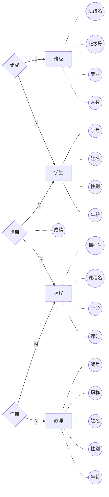
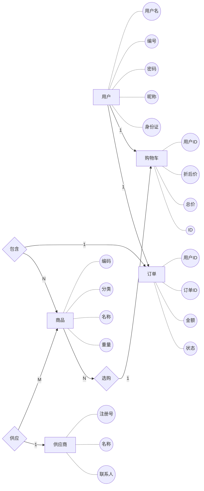
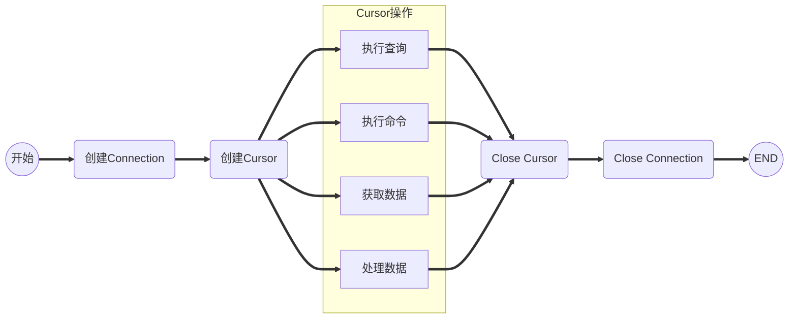

# 第一天：版本控制

## Git的安装与配置 

### 安装

首先，你可以试着输入`git`，看看系统有没有安装Git：

```
$ git
The program 'git' is currently not installed. You can install it by typing:
sudo apt-get install git
```

像上面的命令，有很多Linux会友好地告诉你Git没有安装，还会告诉你如何安装Git。

我们用Debian或Ubuntu Linux，通过一条`sudo apt-get install git`就可以直接完成Git的安装，非常简单。

老一点的Debian或Ubuntu Linux，要把命令改为`sudo apt-get install git-core`，因为以前有个软件也叫GIT（GNU Interactive Tools），结果Git就只能叫`git-core`了。

如果是其他Linux版本，可以直接通过源码安装。先从Git官网下载源码，然后解压，依次输入：`./config`，`make`，`sudo make install`这几个命令安装就好了。

### 设置

#### 用户信息

配置个人的用户名称和电子邮件地址：

```
$ git config --global user.name "runoob"
$ git config --global user.email test@runoob.com
```

 如果用了 **--global** 选项，那么更改的配置文件就是位于你用户主目录下的那个，以后你所有的项目都会默认使用这里配置的用户信息。

如果要在某个特定的项目中使用其他名字或者电邮，只要去掉 --global 选项重新配置即可，新的设定保存在当前项目的 .git/config 文件里。 

#### 文本编辑器

设置Git默认使用的文本编辑器, 一般可能会是 Vi 或者 Vim。如果你有其他偏好，比如 Emacs 的话，可以重新设置：:

```
$ git config --global core.editor emacs
```

#### 差异分析工具

 还有一个比较常用的是，在解决合并冲突时使用哪种差异分析工具。比如要改用 vimdiff 的话： 

```
$ git config --global merge.tool vimdiff
```

 Git 可以理解 kdiff3，tkdiff，meld，xxdiff，emerge，vimdiff，gvimdiff，ecmerge，和 opendiff 等合并工具的输出信息。

当然，你也可以指定使用自己开发的工具，具体怎么做可以参阅第七章。 

####  查看配置信息

 要检查已有的配置信息，可以使用 git config --list 命令： 

```
$ git config --list
```

###  工作流程

一般工作流程如下： 

- 克隆 Git 资源作为工作目录。
- 在克隆的资源上添加或修改文件。 
- 如果其他人修改了，你可以更新资源。
- 在提交前查看修改。
- 提交修改。
- 在修改完成后，如果发现错误，可以撤回提交并再次修改并提交。

### 创建仓库

仓库创建分两种形式：初始化方式和克隆方式

------

#### **git init**（初始化方式）

Git 使用 **git init** 命令来初始化一个 Git 仓库，Git 的很多命令都需要在 Git 的仓库中运行，所以 **git init** 是使用 Git 的第一个命令。

在执行完成 **git init** 命令后，Git 仓库会生成一个 .git 目录，该目录包含了资源的所有元数据，其他的项目目录保持不变（不像 SVN 会在每个子目录生成 .svn 目录，Git 只在仓库的根目录生成 .git 目录）。

**使用方法**

 使用当前目录作为Git仓库，我们只需使它初始化。 

```
git init
```

该命令执行完后会在当前目录生成一个 .git 目录。

 使用我们指定目录作为Git仓库。 

```
git init newrepo
```

初始化后，会在 newrepo 目录下会出现一个名为 .git 的目录，所有 Git 需要的数据和资源都存放在这个目录中。

如果当前目录下有几个文件想要纳入版本控制，需要先用 git add 命令告诉 Git 开始对这些文件进行跟踪，然后提交： 

```
$ git add *.c
$ git add README
$ git commit -m '初始化项目版本'
```

#### **git clone**（克隆方式）

我们使用 **git clone** 从现有 Git 仓库中拷贝项目（类似 **svn checkout**）。 

 克隆仓库的命令格式为：

```
git clone <repo>
```

如果我们需要克隆到指定的目录，可以使用以下命令格式：

```
git clone <repo> <directory>
```

**参数说明：**

- **repo:**Git 仓库。
- **directory:**本地目录。

比如，要克隆 Ruby 语言的 Git 代码仓库 Grit，可以用下面的命令： 

```
$ git clone git://github.com/schacon/grit.git
```

执行该命令后，会在当前目录下创建一个名为grit的目录，其中包含一个 .git 的目录，用于保存下载下来的所有版本记录。 

 如果要自己定义要新建的项目目录名称，可以在上面的命令末尾指定新的名字：

```
$ git clone git://github.com/schacon/grit.git mygrit
```

## GitHub的注册与使用

详情见课堂演示

## Clone与Fork

 fork：在github页面，点击fork按钮。将别人的仓库复制一份到自己的仓库。

 clone：将github中的仓库克隆到自己本地电脑中

1.区别

git clone 是在自己电脑（这里我是ubuntu）直接敲命令，结果是将github仓库中的项目克隆到自己本地电脑中了

fork是直接访问github网站，在项目页面中点击fork，然后自己github项目中就会多出一个复制的项目

2.用法

如果我们想要修改他人github项目的话，我们直接git clone代码到本地是不能pull的，所以我们使用fork，先把代码复制到自己的github仓库，然后git clone到本地修改，然后在提交pull（这里的pull是pull到自己github仓库了，我们自己的github仓库中的代码是fork源的一个分支），这时候我们想要把修改的代码提交给他人的话，就可以在自己github上pull，等其他人看到后就可以把代码做一个合并

## Git常用命令

### 基本命令

1. git add 将指定文件添加到缓存
2. git status 查看仓库状态。 -s 参数，以获得简短的结果输出。如果没加该参数会详细输出内容。
3. git diff 显示已写入缓存与已修改但尚未写入缓存的改动的区别。git diff 有两个主要的应用场景。
   - 尚未缓存的改动：**git diff** 
   - 查看已缓存的改动： **git diff --cached** 
   - 查看已缓存的与未缓存的所有改动：**git diff HEAD** 
   - 显示摘要而非整个 diff：**git diff --stat** 

1. git commit:使用 git add 命令将想要快照的内容写入缓存区，  而执行 git commit 将缓存区内容添加到仓库中。使用 -m 选项以在命令行中提供提交注释。 -a 选项不用提交缓存而直接提交仓库。
2. git reset HEAD 命令用于取消已缓存的内容。
3. git reset --hard commtid 强制回退至commtid 指定版本
4. git rm  在仓库中记录移除指定文件
5. git mv 命令用于移动或重命名一个文件、目录、软连接。
6. git checkout -- readme.txt  意思就是，把`readme.txt`文件在工作区的修改全部撤销
7. git log  查看提交记录
8. git reflog 查看修改记录

### 分支管理

 几乎每一种版本控制系统都以某种形式支持分支。使用分支意味着你可以从开发主线上分离开来，然后在不影响主线的同时继续工作。 

有人把 Git 的分支模型称为“必杀技特性”，而正是因为它，将 Git 从版本控制系统家族里区分出来。

 创建分支命令：

```
git branch (branchname)
```

 切换分支命令:

```
git checkout (branchname)
```

当你切换分支的时候，Git 会用该分支的最后提交的快照替换你的工作目录的内容， 所以多个分支不需要多个目录。

合并分支命令:

```
git merge 
```

可以多次合并到同一分支， 也可以选择在合并之后直接删除被并入的分支。 

### 列出分支

列出分支基本命令：

```
git branch
```

没有参数时，git branch 会列出本地的分支情况。 

### 删除分支

删除分支命令：

```
git branch -d (branchname)
```

### 分支合并

一旦某分支有了独立内容，我们需要它合并回到我们的主分支。 可以使用以下命令将任何分支合并到当前分支中去：

```
git merge (branchname)
```

**对于简单的合并，手工编辑，然后去掉这些冲突标记，最后像往常的提交一样先add再commit即可。**

标签、分支与源 

## 多人协作开发

## 1.**多人协助实现**

注意：裸仓服务器需要开启ssh服务

ssh服务开启参考：

1. 安装：apt-get install openssh-server
2. 开机自启：systemctl enable ssh
3. 启动：systemctl start ssh

分为如下几个步骤：

1.创建一个git裸服务器 （git init --bare）

2.从裸服务器将版本库克隆至本地（git clone ）

3.本地常规操作

4.推送版本至服务器 （git remote +  git push origin master）

5.从远程服务器拉取版本（git pull）

一般而言，我们需要在Linux服务器上来搭建我们的git版本服务器，每个公司都会有。

由项目负责人开始。

(1).**创建一个git裸服务器 （git init --bare）**由负责人来完成的。

(2).**从裸服务器将版本库克隆至本地（git clone ）**在git版本服务器，一般是不做任何开发工作的。如果要开发项目，就需要将版本库从服务器克隆到本地。

(3).**本地常规操作**

(4).**推送版本至服务器 （git remote +  git push origin master）**当在本地完成一个模块（功能），需要推送到服务器，供其他同事使用。

(5).**从远程服务器拉取版本（git pull）**在多人协助开发时，每个开发人员在推送自己的最新版本时，都需要确保当前版本是最新的，所以就需要先获取最新版本，也就是说需要从服务器拉取最新版本到本地。

# 第二天： MySQL基本使用
## 关系型数据库概念、MySQL的安装

### 什么是数据库 ？

- 数据库是数据的仓库。
- 与普通的“数据仓库”不同的是，数据库依据“数据结构”来组织数据，因为“数据结构”，所以我们看到的数据是比较“条理化”的（比如不会跟以前的普通文件存储式存储成一个文件那么不条理化，我们的数据库分成一个个库，分成一个个表，分成一条条记录，这些记录是多么分明）
- 也因为其“数据结构”式，所以有极高的查找速率（比如B-Tree查找法），（由于专精，可以根据自己的结构特性来快速查找，所以对于数据库的查找会比较快捷；不像普通文件系统的“查找”那么通用）
- 如果与EXCEL来比的话，能明显的看出数据库的好处，我们能给一个个“字段”添加“约束”（比如约束一列的值不能为空）
- 数据库与普通的文件系统的主要区别（起因）：数据库能快速查找对应的数据
- 常说的XX数据库，其实实质上是XX数据库管理系统。数据库管理系统是一个软件，是数据库管理的程序实现。

主流的数据库有：sqlserver，mysql，Oracle、SQLite、Access、MS SQL Server、Redis、MongoDB等，本周主要讲述的是mysql和Redis入门。

### 数据库管理是干什么用的？

> a. 将数据保存到文件或内存
> b. 接收特定的命令，然后对文件进行相应的操作PS：如果有了以上管理系统，无须自己再去创建文件和文件夹，而是直接传递 命令 给上述软件，让其来进行文件操作，他们统称为数据库管理系统（DBMS，Database Management System）

### 什么是关系型数据？

- 关系型数据库是依据关系模型来创建的数据库。
- 所谓关系模型就是“一对一、一对多、多对多”等关系模型，关系模型就是指二维表格模型,因而一个关系型数据库就是由二维表及其之间的联系组成的一个数据组织。
- 关系型数据可以很好地存储一些关系模型的数据，比如一个老师对应多个学生的数据（“多对多”），一本书对应多个作者（“一对多”），一本书对应一个出版日期（“一对一”）
- 关系模型是我们生活中能经常遇见的模型，存储这类数据一般用关系型数据库
- 关系模型包括数据结构（数据存储的问题，二维表）、操作指令集合（SQL语句）、完整性约束(表内数据约束、表与表之间的约束)。

### 扩展ER图：

E-R图也称实体-联系图(Entity Relationship Diagram)，提供了表示实体类型、属性和联系的方法，用来描述现实世界的概念模型。

如下图：



**ER图与关系数据库**

ER图画出来以后，如何映射到关系数据库中的表呢？这一步就非常简单了，分步骤进行创建：把实体映射为表、把关系映射为表。

**关系映射表时注意：**定义主键和外键主要是为了维护关系数据库的完整性、主键是能确定一条记录的唯一标识，比如，一条记录包括身份证号，姓名，年龄。身份证号是唯一能确定这个人的，其它都可能有重复，所以，身份证号是主键。
外键用于与另一张表的关联。是能确定另一张表记录的字段，用于保持数据的一致性。

### MYSQL数据库及安装：

MySQL 是一个关系型数据库管理系统，由瑞典 MySQL AB 公司开发，目前属于 Oracle 公司。MySQL 是一种关联数据库管理系统，关联数据库将数据保存在不同的表中，而不是将所有数据放在一个大仓库内，这样就增加了速度并提高了灵活性。 

- MySQL 是开源的，所以你不需要支付额外的费用。
- MySQL 支持大型的数据库。可以处理拥有上千万条记录的大型数据库。
- MySQL 使用标准的SQL数据语言形式。
- MySQL 可以运行于多个系统上，并且支持多种语言。这些编程语言包括C、C++、Python、Java、Perl、PHP、Eiffel、Ruby和Tcl等。
- MySQL 对PHP有很好的支持，PHP是目前最流行的Web开发语言。
- MySQL 支持大型数据库，支持5000万条记录的数据仓库，32位系统表文件最大可支持4GB，64位系统支持最大的表文件为8TB。
- MySQL 是可以定制的，采用了GPL协议，你可以修改源码来开发自己的 MySQL 系统。

### 安装

1. 在 Ubuntu 18.04 中，默认情况下，只有最新版本的 MySQL 包含在 APT 软件包存储库中,要安装它，只需更新服务器上的包索引并安装默认包 apt-get。

  ```
  #命令1
  sudo apt-get update
  #命令2
  sudo apt-get install mysql-server
  ```
2. 安装完mysql-server 会提示可以运行mysql_secure_installation。运行mysql_secure_installation会执行几个设置：
    --为root用户设置密码
    --删除匿名账号
    --取消root用户远程登录
    --删除test库和对test库的访问权限
    --刷新授权表使修改生效

   通过这几项的设置能够提高mysql库的安全。建议生产环境中mysql安装这完成后一定要运行一次mysql_secure_installation，相关操作如下:

  ```shell
[root@localhost ~]# mysql_secure_installation
NOTE: RUNNING ALL PARTS OF THIS SCRIPT IS RECOMMENDED FOR ALL MySQL
SERVERS IN PRODUCTION USE! PLEASE READ EACH STEP CAREFULLY!
In order to log into MySQL to secure it, we'll need the current
password for the root user. If you've just installed MySQL, and
you haven't set the root password yet, the password will be blank,
so you should just press enter here.
Enter current password for root (enter for none):<–初次运行直接回车
OK, successfully used password, moving on…
Setting the root password ensures that nobody can log into the MySQL
root user without the proper authorisation.
Set root password? [Y/n]    #是否设置root用户密码，输入y并回车或直接回车
New password:               #设置root用户的密码
Re-enter new password:      #再输入一次你设置的密码
Password updated successfully!
Reloading privilege tables..
… Success!
By default, a MySQL installation has an anonymous user, allowing anyone
to log into MySQL without having to have a user account created for
them. This is intended only for testing, and to make the installation
go a bit smoother. You should remove them before moving into a
production environment.
Remove anonymous users? [Y/n]   #是否删除匿名用户,生产环境建议删除，所以直接回车
… Success!
Normally, root should only be allowed to connect from 'localhost'. This
ensures that someone cannot guess at the root password from the network.
Disallow root login remotely? [Y/n] #是否禁止root远程登录,根据自己的需求选择Y/n并回车,建议禁止
… Success!
By default, MySQL comes with a database named 'test' that anyone can
access. This is also intended only for testing, and should be removed
before moving into a production environment.
Remove test database and access to it? [Y/n] #是否删除test数据库,直接回车
- Dropping test database…
… Success!
- Removing privileges on test database…
… Success!
Reloading the privilege tables will ensure that all changes made so far
will take effect immediately.
Reload privilege tables now? [Y/n] #是否重新加载权限表，直接回车
… Success!
Cleaning up…
All done! If you've completed all of the above steps, your MySQL
installation should now be secure.
Thanks for using MySQL!
[root@localhost ~]#
  ```

3. 数据库设置：

   参见mysql配置详解，注配置文件在/etc/my.cnf

4. 检查mysql服务状态：

  ```shell
  systemctl status mysql.service
  ```


## MySQL数据库基本使用

 在我们开始学习MySQL 数据库前，让我们先了解下RDBMS的一些术语：

- **数据库:** 数据库是一些关联表的集合。
- **数据表:** 表是数据的矩阵。在一个数据库中的表看起来像一个简单的电子表格。
- **列:** 一列(数据元素) 包含了相同的数据, 例如邮政编码的数据。
- **行：**一行（=元组，或记录）是一组相关的数据，例如一条用户订阅的数据。
- **冗余**：存储两倍数据，冗余降低了性能，但提高了数据的安全性。
- **主键**：主键是唯一的。一个数据表中只能包含一个主键。你可以使用主键来查询数据。
- **外键：**外键用于关联两个表。
- **复合键**：复合键（组合键）将多个列作为一个索引键，一般用于复合索引。
- **索引：**使用索引可快速访问数据库表中的特定信息。索引是对数据库表中一列或多列的值进行排序的一种结构。类似于书籍的目录。
- **参照完整性:** 参照的完整性要求关系中不允许引用不存在的实体。与实体完整性是关系模型必须满足的完整性约束条件，目的是保证数据的一致性。

**关于数据库引擎：**

MySQL支持数个存储引擎作为对不同表的类型的处理器。MySQL存储引擎包括处理事务安全表的引擎和处理非事务安全表的引擎：

-  MyISAM管理非事务表。它提供高速存储和检索，以及全文搜索能力。MyISAM在所有MySQL配置里被支持，它是默认的存储引擎，除非你配置MySQL默认使用另外一个引擎。
-  MEMORY存储引擎提供“内存中”表。MERGE存储引擎允许集合将被处理同样的MyISAM表作为一个单独的表。就像MyISAM一样，MEMORY和MERGE存储引擎处理非事务表，这两个引擎也都被默认包含在MySQL中。
    **注释：**MEMORY存储引擎正式地被确定为HEAP引擎。
-  InnoDB和BDB存储引擎提供事务安全表。BDB被包含在为支持它的操作系统发布的MySQL-Max二进制分发版里。InnoDB也默认被包括在所有MySQL 5.1二进制分发版里，你可以按照喜好通过配置MySQL来允许或禁止任一引擎。

在我们保证mysql服务启动的情况下：

**密码修改：**在终端命令行下

```shell
mysqladmin -u root -password ab12 #给root用户设置密码
mysqladmin -u root -p ab12 password djg345 #将root密码修改为djg345
```

**连接shell：**

在命令终端我们可以通过mysql命令连接进入mysql数据库的shell交互环境对其进行管理，命令如下：

```
mysql -u[usernme] -p[pwd] -h[host]  
```

**退出shell：**exit、quit、ctrl+d

### 库操作

0、显示当前服务器支持引擎：SHOW ENGINES;

1、创建数据库
命令：create database <数据库名>
例如：建立一个名为xhkdb的数据库
mysql> create database xhkdb;
mysql> CREATE DATABASE IF NOT EXISTS my_db default charset utf8 COLLATE utf8_general_ci;
2、显示所有的数据库
命令：show databases （注意：最后有个s）
mysql> show databases;
3、删除数据库
命令：drop database <数据库名>
例如：删除名为 xhkdb的数据库
mysql> drop database xhkdb;
4、连接数据库
命令：use <数据库名>
例如：如果xhkdb数据库存在，尝试存取它：
mysql> use xhkdb;
屏幕提示：Database changed
5、查看当前使用的数据库
mysql> select database();
6、当前数据库包含的表信息：
mysql> show tables; （注意：最后有个s）
7、授权
授权格式（GRANT）：grant 权限 on 数据库.* to 用户名@登录主机 identified by "密码";

取消授权（REVOKE ）：REVOKE privileges ON 数据库名[.表名] FROM user_name

| 权限关键字 | 权限说明                                                     |
| ---------- | ------------------------------------------------------------ |
|            | 数据库及表操作权限                                           |
| ALTER      | 允许使用ALTER TABLE语句。                                    |
| CREATE     | 允许创建数据库和表，但不允许创建索引。                       |
| DELETE     | 允许从表中删除现有记录。                                     |
| DROP       | 允许删除（抛弃）数据库和表，但不允许删除索引。               |
| INDEX      | 允许创建并删除索引。                                         |
| REFERENCES |                                                              |
| SELECT     | 允许使用SELECT语句从表中检索数据。对不涉及表的SELECT语句就不必要，如SELECT NOW()或SELECT 4/2。 |
| UPDATE     | 允许修改表中的已有的记录。                                   |
|            | 管理权限                                                     |
| FILE       | 允许读写服务器主机上的文件。该权限不应该随便授予，它很危险。<br/>虽然已经授予读写权限，但所写的文件必须不是现存的文件，这防止你迫使服务器重写重要文件，如/etc/passwd或属于别人的数据库的数据目录。
如果授权FILE权限，确保UNIX不以root用户运行服务器，因为root可在文件系统的任何地方创建新文件。如果我们以一个非特权用户运行服务器，服务器只能该给用户能访问的目录中创建文件。 |
| GRANT      | 允许将自己的权限授予别人，包括GRANT。                        |
| PROCESS    | 允许通过使用SHOW PROCESS语句或mysqladmin process命令查看服务器内正在运行的线程（进程）的信息。<br/>这个权限也允许你用KILL语句或mysqladmin kill命令杀死线程。我们同样可以看到或杀死你自己的线程。PROCESS权限赋予了你对任何线程做这些事情的权力。 |
| RELOAD     | 允许执行大量的服务器管理操作。<br/>我们可以发出FLUSH语句，你也能执行mysqladmin的reload、refresh、flush-hosts、flush-logs、flush-privileges和flush-tables等命令。 |
| SHUTDOWN   | 允许用mysqladmin shutdown关闭服务器。                        |
|            | 特殊权限                                                     |
| ALL        | 允许做任何事(和root一样)。                                   |
| USAGE      | 只允许登录–其它什么也不允许做。                              |

### 表操作（操作之前应连接某个数据库）

1、建表
命令：create table <表名> ( <字段名> <类型> [,..<字段名n> <类型n>]);

```sql
mysql> create table MyClass(
    id int(4) not null primary key auto_increment,
    name char(20) not null,
    sex int(4) not null default ’′,
    degree double(16,2)
);
```

2、获取表结构
命令：desc 表名，或者show columns from 表名

```sql
mysql>DESCRIBE MyClass
mysql> desc MyClass;
mysql> show columns from MyClass;
```

3、删除表
命令：drop table <表名>
例如：删除表名为 MyClass 的表

```sql
mysql> drop table MyClass;
```

4、删除表中所有数据

```sql
delete from 表名  #自增键不复位
truncate table 表名 #自增键复位，效率上truncate比delete快，但truncate删除后不记录mysql日志，不可以恢复数据。
```

5、插入数据
命令：insert into <表名> [( <字段名>[,..<字段名n > ])] values ( 值 )[, ( 值n )]
例如，往表 MyClass中插入二条记录, 这二条记录表示：编号为的名为Tom的成绩为.45, 编号为 的名为Joan 的成绩为.99，编号为 的名为Wang 的成绩为.5.

```sql
mysql> insert into MyClass values(1,’Tom’,96.45),(2,’Joan’,82.99), (2,’Wang’, 96.59);
```

6、查询表中的数据
1)、查询所有行
命令：select <字段，字段，...> from < 表名 > where < 表达式 >
例如：查看表 MyClass 中所有数据

```sql
mysql> select * from MyClass;
```
2）、查询前几行数据
例如：查看表 MyClass 中前行数据
```sql
mysql> select * from MyClass order by id limit 0,2;
#或者：
mysql> select * from MyClass limit 0,2;
```
7、删除表中数据
命令：delete from 表名 where 表达式
例如：删除表 MyClass中id为1 的记录

```sql
mysql> delete from MyClass where id=1;
```
8、修改表中数据：update 表名 set 字段=新值,…where 条件

```sql
mysql> update MyClass set name=’Mary’where id=1;
```
9、在表中增加字段：
命令：alter table 表名 add字段 类型 其他;
例如：在表MyClass中添加了一个字段passtest，类型为int(4)，默认值为

```sql
mysql> alter table MyClass add passtest int(4) default ’′
```
10、更改表名：
命令：rename table 原表名 to 新表名;
例如：在表MyClass名字更改为YouClass

```sql
mysql> rename table MyClass to YouClass;
#更新字段内容
#update 表名 set 字段名 = 新内容
#update 表名 set 字段名 = replace(字段名,’旧内容’,'新内容’)
```
#### MySQL字段修饰关键字(常用)

##### 字段数值属性

| 属性值             | 说明                                                         |
| ------------------ | ------------------------------------------------------------ |
| **auto_increment** | 自增属性：为新插入的行赋一个唯一的整数标识符。为列赋此属性将为每个新插入的行赋值为上一次插入的ID+1。MySQL要求将auto_increment属性用于作为主键的列。因此，每个表只允许有一个auto_increment列。 |
| binary             | binary属性只用于char和varchar值。当为列指定了该属性时，将以区分大小写的方式排序。与之相反，忽略binary属性时，将使用不区分大小写的方式排序。 |
| default            | default属性确保在没有任何值可用的情况下，赋予某个常量值，这个值必须是常量，因为MySQL不允许插入函数或表达式值。此外，此属性无法用于BLOB或TEXT列。如果已经为此列指定了NULL属性，没有指定默认值时默认值将为NULL，否则默认值将依赖于字段的数据类型。 |
| **index**          | 使得当前列为一个索引列，主要用来提升查询效率。索引一个列会为该列创建一个有序的键数组，每个键指向其相应的表行。以后针对输入条件可以搜索这个有序的键数组，与搜索整个未索引的表相比，这将在性能方面得到极大的提升。 |
| **not null**       | 非空限制：如果将一个列定义为not null，将不允许向该列插入null值。建议在重要情况下始终使用not null属性，因为它提供了一个基本验证，确保已经向查询传递了所有必要的值。 |
| **null**           | 为列指定null属性时，该列可以保持为空，而不论行中其它列是否已经被填充。记住，null精确的说法是“无”，而不是空字符串或0。 |
| **primary key**    | primary key属性用于确保指定行的唯一性。指定为主键的列中，值不能重复，也不能为空。 |
| FOREIGN KEY        | 外键约束                                                     |
|                    |                                                              |
|                    |                                                              |
| unique             | 被赋予unique属性的列将确保所有值都有不同的值，只是null值可以重复。 |
| zerofill           | zerofill属性可用于任何数值类型，用0填充所有剩余字段空间。例如，无符号int的默认宽度是10；因此，当“零填充”的int值为4时，将表示它为0000000004。 |
| comment            | 字段描述（字段注释）是用来描述字段的，能在查看数据表创建语句的时候显示出来（不会再select结果中显示出来），可以帮助我们了解某一个字段的意义。 |

##### 关于索引（主键）

如果所有其他因素都相同，要加速数据库查询，使用索引通常是最重要的一个步骤。索引一个列会为该列创建一个有序的键数组，每个键指向其相应的表行。以后针对输入条件可以搜索这个有序的键数组，与搜索整个未索引的表相比，这将在性能方面得到极大的提升。

**代码如下:**

create table employees ( 
​    id varchar(9) not null, 
​    firstname varchar(15) not null, 
​    lastname varchar(25) not null, 
​    email varchar(45) not null, 
​    phone varchar(10) not null, 
​    index lastname(lastname), 
​    primary key(id) 
);

 **我们也可以利用MySQL的create index命令在创建表之后增加索引：**

**代码如下:**

 create index lastname on employees (lastname(7));

**这一次只索引了名字的前7个字符，因为可能不需要其它字母来区分不同的名字。因为使用较小的索引时性能更好，所以应当在实践中尽量使用小的索引。**

##### 数值类型 

| 类型         | 大小                                     | 范围（有符号）                                               | 范围（无符号）                                               | 用途            |
| ------------ | ---------------------------------------- | ------------------------------------------------------------ | ------------------------------------------------------------ | --------------- |
| TINYINT      | 1 字节                                   | (-128，127)                                                  | (0，255)                                                     | 小整数值        |
| SMALLINT     | 2 字节                                   | (-32 768，32 767)                                            | (0，65 535)                                                  | 大整数值        |
| MEDIUMINT    | 3 字节                                   | (-8 388 608，8 388 607)                                      | (0，16 777 215)                                              | 大整数值        |
| INT或INTEGER | 4 字节                                   | (-2 147 483 648，2 147 483 647)                              | (0，4 294 967 295)                                           | 大整数值        |
| BIGINT       | 8 字节                                   | (-9 233 372 036 854 775 808，9 223 372 036 854 775 807)      | (0，18 446 744 073 709 551 615)                              | 极大整数值      |
| FLOAT        | 4 字节                                   | (-3.402 823 466 E+38，-1.175 494 351 E-38)，0，(1.175 494 351 E-38，3.402 823 466 351 E+38) | 0，(1.175 494 351 E-38，3.402 823 466 E+38)                  | 单精度 浮点数值 |
| DOUBLE       | 8 字节                                   | (-1.797 693 134 862 315 7 E+308，-2.225 073 858 507 201 4 E-308)，0，(2.225 073 858 507 201 4 E-308，1.797 693 134 862 315 7 E+308) | 0，(2.225 073 858 507 201 4 E-308，1.797 693 134 862 315 7 E+308) | 双精度 浮点数值 |
| DECIMAL      | 对DECIMAL(M,D) ，如果M>D，为M+2否则为D+2 | 依赖于M和D的值                                               | 依赖于M和D的值                                               | 小数值          |

##### 日期和时间类型

| 类型      | 大小 (字节) | 范围                                                         | 格式                | 用途                     |
| --------- | ----------- | ------------------------------------------------------------ | ------------------- | ------------------------ |
| DATE      | 3           | 1000-01-01/9999-12-31                                        | YYYY-MM-DD          | 日期值                   |
| TIME      | 3           | '-838:59:59'/'838:59:59'                                     | HH:MM:SS            | 时间值或持续时间         |
| YEAR      | 1           | 1901/2155                                                    | YYYY                | 年份值                   |
| DATETIME  | 8           | 1000-01-01 00:00:00/9999-12-31 23:59:59                      | YYYY-MM-DD HH:MM:SS | 混合日期和时间值         |
| TIMESTAMP | 4           | 1970-01-01 00:00:00/2038   结束时间是第 **2147483647** 秒，北京时间 **2038-1-19 11:14:07**，格林尼治时间 2038年1月19日 凌晨 03:14:07 | YYYYMMDD HHMMSS     | 混合日期和时间值，时间戳 |

##### 字符串类型

| 类型       | 大小                | 用途                            |
| ---------- | ------------------- | ------------------------------- |
| CHAR       | 0-255字节           | 定长字符串                      |
| VARCHAR    | 0-65535 字节        | 变长字符串                      |
| TINYBLOB   | 0-255字节           | 不超过 255 个字符的二进制字符串 |
| TINYTEXT   | 0-255字节           | 短文本字符串                    |
| BLOB       | 0-65 535字节        | 二进制形式的长文本数据          |
| TEXT       | 0-65 535字节        | 长文本数据                      |
| MEDIUMBLOB | 0-16 777 215字节    | 二进制形式的中等长度文本数据    |
| MEDIUMTEXT | 0-16 777 215字节    | 中等长度文本数据                |
| LONGBLOB   | 0-4 294 967 295字节 | 二进制形式的极大文本数据        |
| LONGTEXT   | 0-4 294 967 295字节 | 极大文本数据                    |

### 数据库的简单备份及恢复

#### **使用mysqldump命令备份**

mysqldump命令将数据库中的数据备份成一个文本文件。表的结构和表中的数据将存储在生成的文本文件中。

mysqldump命令的工作原理很简单。它先查出需要备份的表的结构，再在文本文件中生成一个CREATE语句。然后，将表中的所有记录转换成一条INSERT语句。然后通过这些语句，就能够创建表并插入数据。

**1、备份一个数据库**

mysqldump基本语法：

**mysqldump -u username -p dbname table1 table2 ...-> BackupName.sql**

其中：

- dbname参数表示数据库的名称；
- table1和table2参数表示需要备份的表的名称，为空则整个数据库备份；
- BackupName.sql参数表设计备份文件的名称，文件名前面可以加上一个绝对路径。通常将数据库被分成一个后缀名为sql的文件；

　　使用root用户备份test数据库下的person表

```shell
mysqldump -u root -p test person > /var/bak/backup.sql
```

**2、备份多个数据库**

语法：
**mysqldump -u username -p --databases dbname2 dbname2 > Backup.sql**

加上了--databases选项，然后后面跟多个数据库

```shell
mysqldump -u root -p --databases test mysql > D:\backup.sql
```

**3、备份所有数据库**

mysqldump命令备份所有数据库的语法如下：

**mysqldump -u username -p -all-databases > BackupName.sql**

示例：

```shell
mysqldump -u -root -p -all-databases > /var/bak/backup.sql
```

#### 数据还原

还原使用mysqldump命令备份的数据库的语法如下：

**mysql -u root -p [dbname] < backup.sq**

示例：

```
mysql -u root -p < C:\backup.sql
```

## 修改表结构

**语法：**

```sql
ALTER [IGNORE] TABLE tbl_name
    alter_specification [, alter_specification] ...
```

### 一： 修改表信息（常见示例）

1.修改表名 

```sql
alter table test_a rename to sys_app;
```

 2.修改表注释   

```sql
alter table sys_application comment '系统信息表';
```

### 二：修改字段信息（常见示例）

1.修改字段类型和注释

```mysql
alter table sys_application  modify column app_name varchar(20) COMMENT '应用的名称';
```

2.修改字段类型

```sql
alter table sys_application  modify column app_name text;
```

3.设置字段允许为空

```sql
alter table sys_application  modify column description varchar(255) null COMMENT '应用描述';
```

 4.增加一个字段，设好数据类型，且不为空，添加注释

```mysql
alert table sys_application add `url` varchar(255) not null comment '应用访问地址';  
```

 5.增加主键 

```mysql
alter table t_app add aid int(5) not null ,add primary key (aid);  
```

6.增加自增主键

```sql
alter table t_app add aid int(5) not null auto_increment ,add primary key (aid); 
```

7.修改为自增主键

```sql
alter table t_app  modify column aid int(5) auto_increment ;
```

8.修改字段名字(要重新指定该字段的类型)

```sql
alter table t_app change name app_name varchar(20) not null;
```

9.删除字段

```sql
alter table t_app drop aid; 
```

10.在某个字段后增加字段

```sql
alter table `t_app` add column gateway_id int  not null default 0 AFTER `aid`； #(在哪个字段后面添加)  
```

11.调整字段顺序 

```sql
alter table t_app  change gateway_id gateway_id int not null after aid ; #(注意gateway_id出现了2次)
```

12.创建外键

```mysql
ALTER TABLE news_info[子表名] ADD CONSTRAINT FK_news_info_news_type[约束名] FOREIGN KEY (info_id)[子表列] REFERENCES news_type[主表名] (id)[主表列] ; 
```

13.创建复合键

```mysql
alter table tb_name add primary key (字段1,字段2,字段3); 
```

# 第三天：SQL语法

## 数据插入语法：

向数据库中插入数据库使用insert into语法，该语句主要有两种形式：

**1. insert语句中指定所有字段名**

在insert 语句中列出表中的所有字段名，其值与其字段名、类型要一一对应！ 
 语法格式：

```mysql
INSERT INTO 表名 （字段名1，字段名2，...）
        VALUES(值1，值2，...);
```

**2.insert语句中不指定字段名。**

其实，他就是在不指定字段名的情况下，直接用values为其默认赋值。

注意： 
 正因为没有字段名，则values中值得顺序必须与字段在表中顺序一致。

基本语法：

```
INSERT INTO 表名 VALUES(值1，值2，....);
```

## 查询语法：

在mysql中使用select语句进行数据查询，其完整语法如下：

```mysql
SELECT[ALL|DISTINCT|DISTINCTROW|TOP]
{*|talbe.*|[table.]field1[AS alias1][,[table.]field2[AS alias2][,…]]}
FROM tableexpression[,…][IN externaldatabase]
[WHERE…]
[GROUP BY…]
[HAVING…]
[ORDER BY…]
[WITH OWNERACCESS OPTION]
```

**说明：**用中括号([])括起来的部分表示是可选的，用大括号({})括起来的部分是表示必须从中选择其中的一个。

1. > FROM子句
   > FROM 子句指定了SELECT语句中字段的来源。FROM子句后面是包含一个或多个的表达式(由逗号分开)，其中的表达式可为单一表名称、已保存的查询或由INNER JOIN、LEFT JOIN 或RIGHT JOIN 得到的复合结果。如果表或查询存储在外部数据库，在IN 子句之后指明其完整路径。
   > 例：下列SQL语句返回所有有定单的客户：
   > SELECT OrderID,Customer.customerID
   > FROM Orders Customers
   > WHERE Orders.CustomerID=Customers.CustomeersID

2. >ALL、DISTINCT、DISTINCTROW、TOP谓词
   >(1) ALL 返回满足SQL语句条件的所有记录。如果没有指明这个谓词，默认为ALL。
   >例：SELECT ALL FirstName,LastName
   >FROM Employees
   >(2) DISTINCT 如果有多个记录的选择字段的数据相同，只返回一个。
   >(3) DISTINCTROW 如果有重复的记录，只返回一个
   >(4) TOP显示查询头尾若干记录。也可返回记录的百分比，这是要用TOP N PERCENT子句（其中N 表示百分比，注意mysql不支持TOP谓词需要使用limit子句实现）
   >例：返回%定货额最大的定单
   >SELECT TOP 5 PERCENT*
   >FROM [ Order Details]
   >ORDER BY UnitPrice*Quantity*(1-Discount) DESC

3. >用AS 子句为字段取别名
   >如果想为返回的列取一个新的标题，或者，经过对字段的计算或总结之后，产生了一个新的值，希望把它放到一个新的列里显示，则用AS保留。
   >例：返回FirstName字段取别名为NickName
   >SELECT FirstName AS NickName ,LastName ,City
   >FROM Employees
   >例：返回新的一列显示库存价值
   >SELECT ProductName ,UnitPrice ,UnitsInStock ,UnitPrice*UnitsInStock AS valueInStock
   >FROM Products

### 关于连接

**交叉连接 -- 笛卡尔乘积  cross join**

```mysql
select * from tch_teacher cross join tch_contact
```

在mysql 中, cross join 后面是可以跟 on 和 where 的, 加上之后, 其实跟 inner join 是一样的

**内连接 -- inner join**

内连接在不加on的情况下, 也是去求笛卡尔乘积. 不加on的用法并不推荐使用, 容易造成内存溢出的情况. 加on的时候, 在连表的时候, 就会对数据进行筛选, 以此来缩减有效数据范围

```mysql
select * from tch_teacher inner join tch_contact 
```

**外连接 -- left/right join on** 

不加on是会报错的.

left join 称之为左连接, 连接以左侧表数据为准, 当右表没有数据与之匹配的时候, 则会用null填补

right join 称之为右连接, 与 left join 相反, 这个是以右表为准

```mysql
select * from tch_teacher left join tch_contact on tch_teacher.Id = tch_contact.TId;
```

**union查询**

除了把几个表通过内部关系拼成一个表结果, 还可以, 把多个表的查询表结果拼成一个表结果. 所使用的方法就是union.

这里要注意的是, 列的顺序. 如果害怕列的顺序不一致不好排查, 可以把表结果的列名都重命名为相同的.

```
select Id, Sex, BId, `No`, Name, CreateDate from tch_teacher

union

select 0 as Id, Sex, BId, `No`, Name, CreateDate from tch_teacher_temp
```

union是会对最后的表结果进行去重操作的, 如果我不想去重, 只想快速得到拼接的结果, 可以使用 union all 来拼接. 

### WHERE 子句指定查询条件

1. 比较运算符

   > 比较运算符含义
   > = 等于
   > 大于
   > < 小于
   > = 大于等于
   > <= 小于等于
   > <> 不等于
   > !> 不大于
   > !< 不小于

   例：返回年月的定单
   ```mysql
   SELECT OrderID, CustomerID, OrderDate
   FROM Orders
   WHERE OrderDate>#1/1/96# AND OrderDate<#1/30/96#
   ```
   **注意：**
   Mcirosoft JET SQL 中，日期用‘#’定界。日期也可以用Datevalue()函数来代替。在比较字符型的数据时，要加上单引号’’，尾空格在比较中被忽略。
   例：
   WHERE OrderDate>#96-1-1#
   也可以表示为：
   WHERE OrderDate>Datevalue(‘/1/96’)
   使用NOT 表达式求反。
   例：查看年月日以后的定单
   WHERE Not OrderDate<=#1/1/96#

2. 范围（BETWEEN 和NOT BETWEEN）

   >BETWEEN …AND…运算符指定了要搜索的一个闭区间。
   >例：返回年月到年月的定单。
   >WHERE OrderDate Between #1/1/96# And #2/1/96#

3. 列表（IN ，NOT IN）

   IN 运算符用来匹配列表中的任何一个值。IN子句可以代替用OR子句连接的一连串的条件。
   例：要找出住在London、Paris或Berlin的所有客户

   ```mysql
   SELECT CustomerID, CompanyName, ContactName, City
   FROM Customers
   WHERE City In(‘London’,’Paris’,’Berlin’)
   ```

4. 模式匹配

   LIKE运算符检验一个包含字符串数据的字段值是否匹配一指定模式。

   MySQL提供的模式匹配的其他类型是使用扩展正则表达式。当你对这类模式进行匹配测试时，使用REGEXP和NOT REGEXP操作符（或RLIKE和NOT RLIKE，它们是同义词）

   LIKE运算符里使用的通配符

   | 通配符       | 含义                                 |
   | ------------ | ------------------------------------ |
   |              | **REGEXP和NOT REGEXP操作符**         |
   | ？           | 任何一个单一的字符                   |
   | *            | 任意长度的字符                       |
   | #            | 0~9之间的单一数字                    |
   | [字符列表]   | 在字符列表里的任一值                 |
   | [！字符列表] | 不在字符列表里的任一值               |
   | -            | 指定字符范围，两边的值分别为其上下限 |
   |              | **like统配符号**                     |
   | %            | 匹配任意数目字符(包括零个字符)       |
   | _            | 匹配一个任意字符                     |

### 分组（聚合）

**分组和总结查询结果** 

在SQL的语法里，GROUP BY和HAVING子句用来对数据进行汇总。GROUP BY子句指明了按照哪几个字段来分组，而将记录分组后，用HAVING子句过滤这些记录。 
GROUP BY 子句的语法 

```mysql
SELECT fidldlist 
FROM table 
WHERE criteria 
[GROUP BY groupfieldlist [HAVING groupcriteria]] 
```

注：Microsoft Jet数据库 Jet 不能对备注或OLE对象字段分组。 
GROUP BY字段中的Null值以备分组但是不能被省略。 
在任何SQL合计函数中不计算Null值。 
GROUP BY子句后最多可以带有十个字段，排序优先级按从左到右的顺序排列。 
例：在‘WA’地区的雇员表中按头衔分组后，找出具有同等头衔的雇员数目大于1人的所有头衔。 
```mysql
SELECT Title ,Count(Title) as Total 
FROM Employees 
WHERE Region = ‘WA’ 
GROUP BY Title 
HAVING Count(Title)>1
```
**聚集函数 意义** 
SUM ( ) 求和 
AVG ( ) 平均值 
COUNT ( ) 表达式中记录的数目 
COUNT (* ) 计算记录的数目 
MAX 最大值 
MIN 最小值 
VAR 方差 
STDEV 标准误差 
FIRST 第一个值 
LAST 最后一个值 

关于group by使用，请注意以下规则：

​	**①** group by子句可以包含任意数目的列（使得对分组进行嵌套，为数据分组提供更细致的控制）；

​	**②**如果在group by子句中嵌套分组，数据将在最后规定的分组上进行汇总，即：建立分组时，指定的所有列都一起计算（所以不能从个别列取回数据）；

​	**③**group by子句中列出的每个列都必须是检索列或有效的表达式（但不能是聚集函数），如果在select中使用表达式，则必须在group by子句中指定相同的表达式（不能使用别名）；

​	**④**除了聚集计算语句外，select中每个列都必须在group by子句中给出；

​	**⑤**如果分组列中具有null值，则null将作为一个分组返回（如果列中有多行null值，他们将分为一组）；

​	**⑥**group by子句必须出现在where子句之后，order by子句之前；

**having过滤分组**

where子句都可以用having代替，区别在于where过滤行，having过滤分组；having支持所有的where操作符。

**having和where的区别：**

where在数据分组前进行过滤，having在数据分组后进行过滤；where排除的行不包括在分组中（这可能会改变计算值，从而影响having子句中基于这些值过滤掉的分组）

### 结果排序与分页结果

**order by 排序**

ORDER子句按一个或多个（最多16个）字段排序查询结果，可以是升序（ASC）也可以是降序（DESC），缺省是升序。ORDER子句通常放在SQL语句的最后。 
ORDER子句中定义了多个字段，则按照字段的先后顺序排序。 
例：

```mysql
SELECT ProductName,UnitPrice, UnitInStock 
FROM Products 
ORDER BY UnitInStock DESC , UnitPrice DESC, ProductName 
```
ORDER BY 子句中可以用字段在选择列表中的位置号代替字段名，可以混合字段名和位置号。 
例：下面的语句产生与上列相同的效果。
```mysql
SELECT ProductName,UnitPrice, UnitInStock 
FROM Products 
ORDER BY 1 DESC , 2 DESC,3 
```
**limit分页**

在我们使用查询语句的时候，经常要返回前几条或者中间某几行数据，这个时候怎么办呢？不用担心，**mysql**已经为我们提供了这样一个功能。

```mysql
SELECT * FROM table LIMIT [offset,] rows | rows OFFSET offset
```

LIMIT 子句可以被用于强制 SELECT 语句返回指定的记录数。LIMIT 接受一个或两个数字参数。参数必须是一个整数常量。如果给定两个参数，第一个参数指定第一个返回记录行的偏移量，第二个参数指定返回记录行的最大数目。初始记录行的偏移量是0(而不是 1)。

```mysql
mysql> SELECT * FROM table LIMIT 5,10; // 检索记录行 6-15   

//为了检索从某一个偏移量到记录集的结束所有的记录行，可以指定第二个参数为 -1：    
mysql> SELECT * FROM table LIMIT 95,-1; // 检索记录行 96-last.   
      
//如果只给定一个参数，它表示返回最大的记录行数目：    
mysql> SELECT * FROM table LIMIT 5; //检索前 5 个记录行   
//换句话说，LIMIT n 等价于 LIMIT 0,n。  
```

**limit优化**

当一个查询语句偏移量offset很大的时候，如select * from table limit 10000,10 , 最好不要直接使用limit，而是先获取到offset的id后，再直接使用limit size来获取数据。效果会好很多。

## 更新语法：

更新数据，即对表中存在的数据进行修改。 使用UPDATE 语句实现：

基本语法：

```mysql
UPDATE 表名
  SET  字段名1=值1[,字段名2=值2，...]
  [WHERE 条件表达式]
```

语法说明： 
字段名1，字段名2，用于指定更新的字段名称 
值1，值2，用于表示字段更新的新数据。 
where条件表达式，可选参数，用于指定更新数据需要满足的条件。

UPDATE语句在更新表中数据时可   部分、全部更新。即是否使用where子句进行了范围限制。

## 删除语法：

对表中存在的记录进行删除使用delete语句。

基本语法：

```mysql
DELETE FROM 表名 [ WHERE 条件表达式 ]  ;
12
```

说明:    表名指的是要执行删除操作的表。 where 条件表达式，可选参数，只要满足条件的记录会被删除！

**注意：使用delete语句必须加上where子句限制，避免误删除数据。**

## 事务

 MySQL 事务主要用于处理操作量大，复杂度高的数据。比如说，在人员管理系统中，你删除一个人员，你即需要删除人员的基本资料，也要删除和该人员相关的信息，如信箱，文章等等，这样，这些数据库操作语句就构成一个事务！ 

-  在 MySQL 中只有使用了 Innodb 数据库引擎的数据库或表才支持事务。
-  事务处理可以用来维护数据库的完整性，保证成批的 SQL 语句要么全部执行，要么全部不执行。
-  事务用来管理 insert,update,delete 语句

 一般来说，事务是必须满足4个条件（ACID）：：原子性（**A**tomicity，或称不可分割性）、一致性（**C**onsistency）、隔离性（**I**solation，又称独立性）、持久性（**D**urability）。 

- **原子性：**一个事务（transaction）中的所有操作，要么全部完成，要么全部不完成，不会结束在中间某个环节。事务在执行过程中发生错误，会被回滚（Rollback）到事务开始前的状态，就像这个事务从来没有执行过一样。
- **一致性：**在事务开始之前和事务结束以后，数据库的完整性没有被破坏。这表示写入的资料必须完全符合所有的预设规则，这包含资料的精确度、串联性以及后续数据库可以自发性地完成预定的工作。
- **隔离性：**数据库允许多个并发事务同时对其数据进行读写和修改的能力，隔离性可以防止多个事务并发执行时由于交叉执行而导致数据的不一致。事务隔离分为不同级别，包括读未提交（Read  uncommitted）、读提交（read committed）、可重复读（repeatable  read）和串行化（Serializable）。
- **持久性：**事务处理结束后，对数据的修改就是永久的，即便系统故障也不会丢失。

> 在 MySQL 命令行的默认设置下，事务都是自动提交的，即执行 SQL 语句后就会马上执行 COMMIT  操作。因此要显式地开启一个事务务须使用命令 BEGIN 或 START TRANSACTION，或者执行命令 SET  AUTOCOMMIT=0，用来禁止使用当前会话的自动提交。

### 事务控制语句：

- BEGIN或START TRANSACTION；显式地开启一个事务；
- COMMIT；也可以使用COMMIT WORK，不过二者是等价的。COMMIT会提交事务，并使已对数据库进行的所有修改成为永久性的；
- ROLLBACK；有可以使用ROLLBACK WORK，不过二者是等价的。回滚会结束用户的事务，并撤销正在进行的所有未提交的修改；
- SAVEPOINT identifier；SAVEPOINT允许在事务中创建一个保存点，一个事务中可以有多个SAVEPOINT；
- RELEASE SAVEPOINT identifier；删除一个事务的保存点，当没有指定的保存点时，执行该语句会抛出一个异常；
- ROLLBACK TO identifier；把事务回滚到标记点；
- SET TRANSACTION；用来设置事务的隔离级别。InnoDB存储引擎提供事务的隔离级别有READ UNCOMMITTED、READ COMMITTED、REPEATABLE READ和SERIALIZABLE。

### MYSQL 事务处理方法：

1、用 BEGIN, ROLLBACK, COMMIT来实现

- **BEGIN** 开始一个事务
- **ROLLBACK** 事务回滚
- **COMMIT**  事务确认

2、直接用 SET 来改变 MySQL 的自动提交模式: 

- **SET AUTOCOMMIT=0**   禁止自动提交
- **SET AUTOCOMMIT=1** 开启自动提交

### 事务处理示例：

```mysql
mysql> use RUNOOB;
Database changed
mysql> CREATE TABLE runoob_transaction_test( id int(5)) engine=innodb;  # 创建数据表
Query OK, 0 rows affected (0.04 sec)
mysql> select * from runoob_transaction_test;
Empty set (0.01 sec)
mysql> begin;  # 开始事务
Query OK, 0 rows affected (0.00 sec)
mysql> insert into runoob_transaction_test value(5);
Query OK, 1 rows affected (0.01 sec)
mysql> insert into runoob_transaction_test value(6);
Query OK, 1 rows affected (0.00 sec)
mysql> commit; # 提交事务
Query OK, 0 rows affected (0.01 sec)
mysql>  select * from runoob_transaction_test;
+------+
| id   |
+------+
| 5    |
| 6    |
+------+
2 rows in set (0.01 sec)
mysql> begin;    # 开始事务
Query OK, 0 rows affected (0.00 sec)
mysql>  insert into runoob_transaction_test values(7);
Query OK, 1 rows affected (0.00 sec)
mysql> rollback;   # 回滚
Query OK, 0 rows affected (0.00 sec)
mysql>   select * from runoob_transaction_test;   # 因为回滚所以数据没有插入
+------+
| id   |
+------+
| 5    |
| 6    |
+------+
2 rows in set (0.01 sec)
mysql>
```

# 第四天：MySQL进阶及Redis使用
## MySQL进阶

### pymysql的使用

PyMySQL 是在 Python3.x 版本中用于连接 MySQL 服务器的一个库，Python2中则使用mysqldb。

PyMySQL 遵循 Python 数据库 API v2.0 规范，并包含了 pure-Python MySQL 客户端库。

#### 安装

我们可以使用以下命令安装最新版的 PyMySQL：

```shell
$ pip3 install PyMySQL
```

如果你的系统不支持 pip 命令，可以使用以下方式安装：

1、使用 git 命令下载安装包安装(你也可以手动下载)：

```shell
$ git clone https://github.com/PyMySQL/PyMySQL
$ cd PyMySQL/
$ python3 setup.py install
```

2、如果需要制定版本号，可以使用 curl 命令来安装：

```shell
$ # X.X 为 PyMySQL 的版本号
$ curl -L https://github.com/PyMySQL/PyMySQL/tarball/pymysql-X.X | tar xz
$ cd PyMySQL*
$ python3 setup.py install
$ # 现在你可以删除 PyMySQL* 目录
```

#### pymysql使用流程



#### pymysql详解

使用pymysql模块的connect方法构建连接对象:

```python
conn = pymysql.connect(
    host=“你的数据库地址”,
    port=端口号
    user=“用户名”,
    password=“密码”,
    database=“数据库名”,
    charset=“utf8”)
```

使用connection连接对象的cursor方法创建操作游标:

```python
#创建一个元组型操作游标(返回结果集为元组类型)
cursor = conn.cursor() 
#得到一个可以执行SQL语句并且将结果作为字典返回的游标
cursor = conn.cursor(cursor=pymysql.cursors.DictCursor)
```

使用游标的execute方法执行一条sql语句

```python
#示例1:
# 定义要执行的SQL语句
sql = """
CREATE TABLE USER1 (
id INT auto_increment PRIMARY KEY ,
name CHAR(10) NOT NULL UNIQUE,
age TINYINT NOT NULL
)ENGINE=innodb DEFAULT CHARSET=utf8;
"""
# 执行SQL语句
cursor.execute(sql)

#示例2
# 得到一个可以执行SQL语句的光标对象
cursor = conn.cursor()
sql = "INSERT INTO USER1(name, age) VALUES (%s, %s);"
username = "Alex"
age = 18
# 执行SQL语句
cursor.execute(sql, [username, age])
```

**注意:**因为sql以字符串方式传入,在对台填入参数时不建议使用python的字符串格式化方式传入参数,以免发生注入漏洞. 而应该使用示例2的形式由pymysql内部实现格式化传入.

使用游标的executemany方法执行多条sql语句

```python
sql = "INSERT INTO USER1(name, age) VALUES (%s, %s);"
data = [("Alex", 18), ("Egon", 20), ("Yuan", 21)]
try:
    # 批量执行多条插入SQL语句
    cursor.executemany(sql, data)
    # 提交事务
    conn.commit()
except Exception as e:
    # 有异常，回滚事务
    conn.rollback()
```

单条数据查询fechone:

```python
# 查询数据的SQL语句
sql = "SELECT id,name,age from USER1 WHERE id=1;"
# 执行SQL语句
cursor.execute(sql)
# 获取单条查询数据
ret = cursor.fetchone()
```
全部数据查询fechall:
```python
# 查询数据的SQL语句
sql = "SELECT id,name,age from USER1;"
# 执行SQL语句
cursor.execute(sql)
# 获取多条查询数据
ret = cursor.fetchall()
```
进阶用法:

```python

# 提交之后，获取刚游标数据的ID
last_id = cursor.lastrowid
# 可以获取指定数量的数据
cursor.fetchmany(3)
# 光标按绝对位置移动1
cursor.scroll(1, mode="absolute")
# 光标按照相对位置(当前位置)移动1
cursor.scroll(1, mode="relative")
# 关闭光标对象
cursor.close()
# 关闭数据库连接
conn.close()
```

**备注:cursor对象执行sql之后返回的值为受到影响的数据条数.**

### MySQL索引

#### 什么是索引？为什么要建立索引？

索引用于快速找出在某个列中有一特定值的行，不使用索引，MySQL必须从第一条记录开始读完整个表，直到找出相关的行，表越大，查询数据所花费的时间就越多，如果表中查询的列有一个索引，MySQL能够快速到达一个位置去搜索数据文件，而不必查看所有数据，那么将会节省很大一部分时间。

例如：有一张person表，其中有2W条记录，记录着2W个人的信息。有一个Phone的字段记录每个人的电话号码，现在想要查询出电话号码为xxxx的人的信息。

如果没有索引，那么将从表中第一条记录一条条往下遍历，直到找到该条信息为止。

如果有了索引，那么会将该Phone字段，通过一定的方法进行存储，好让查询该字段上的信息时，能够快速找到对应的数据，而不必在遍历2W条数据了。其中MySQL中的索引的存储类型有两种：BTREE、HASH。  也就是用树或者Hash值来存储该字段，要知道其中详细是如何查找的，就需要会算法的知识了。我们现在只需要知道索引的作用，功能是什么就行。

#### MySQL中索引的优点和缺点和使用原则

**优点：**

1、所有的MySql列类型(字段类型)都可以被索引，也就是可以给任意字段设置索引

2、大大加快数据的查询速度

**缺点：**

1、创建索引和维护索引要耗费时间，并且随着数据量的增加所耗费的时间也会增加

2、索引也需要占空间，我们知道数据表中的数据也会有最大上线设置的，如果我们有大量的索引，索引文件可能会比数据文件更快达到上线值

3、当对表中的数据进行增加、删除、修改时，索引也需要动态的维护，降低了数据的维护速度。

**使用原则：**

通过上面说的优点和缺点，我们应该可以知道，并不是每个字段度设置索引就好，也不是索引越多越好，而是需要自己合理的使用。

1、对经常更新的表就避免对其进行过多的索引，对经常用于查询的字段应该创建索引，

2、数据量小的表最好不要使用索引，因为由于数据较少，可能查询全部数据花费的时间比遍历索引的时间还要短，索引就可能不会产生优化效果。

3、在一同值少的列上(字段上)不要建立索引，比如在学生表的"性别"字段上只有男，女两个不同值。相反的，在一个字段上不同值较多可是建立索引。

上面说的只是很片面的一些东西，索引肯定还有很多别的优点或者缺点，还有使用原则，先基本上理解索引，然后等以后真正用到了，就会慢慢知道别的作用。注意，学习这张，很重要的一点就是必须先得知道索引是什么，索引是干嘛的，有什么作用，为什么要索引等等，如果不知道，就重复往上面看看写的文字，好好理解一下。一个表中很够创建多个索引，这些索引度会被存放到一个索引文件中(专门存放索引的地方)

**索引的分类**　　

注意：索引是在存储引擎中实现的，也就是说不同的存储引擎，会使用不同的索引

MyISAM和InnoDB存储引擎：只支持BTREE索引， 也就是说默认使用BTREE，不能够更换

MEMORY/HEAP存储引擎：支持HASH和BTREE索引

索引我们分为四类来讲 单列索引(普通索引，唯一索引，主键索引)、组合索引、全文索引、空间索引、

1、单列索引：一个索引只包含单个列，但一个表中可以有多个单列索引。 这里不要搞混淆了。

2、普通索引：MySQL中基本索引类型，没有什么限制，允许在定义索引的列中插入重复值和空值，纯粹为了查询数据更快一点。

3、唯一索引：索引列中的值必须是唯一的，但是允许为空值，

4、主键索引：是一种特殊的唯一索引，不允许有空值。

5、组合索引:在表中的多个字段组合上创建的索引，只有在查询条件中使用了这些字段的左边字段时，索引才会被使用，使用组合索引时遵循最左前缀集合。这个如果还不明白，等后面举例讲解时在细说　

在表中的多个字段组合上创建的索引，只有在查询条件中使用了这些字段的左边字段时，索引才会被使用，使用组合索引时遵循最左前缀集合。这个如果还不明白，等后面举例讲解时在细说　

6、全文索引:全文索引，只有在MyISAM引擎上才能使用，只能在CHAR,VARCHAR,TEXT类型字段上使用全文索引，介绍了要求，说说什么是全文索引，就是在一堆文字中，通过其中的某个关键字等，就能找到该字段所属的记录行，比如有"你是个大煞笔，二货  ..."  通过大煞笔，可能就可以找到该条记录。这里说的是可能，因为全文索引的使用涉及了很多细节，我们只需要知道这个大概意思，如果感兴趣进一步深入使用它，那么看下面测试该索引时，会给出一个博文，供大家参考。

7、空间索引:空间索引是对空间数据类型的字段建立的索引，MySQL中的空间数据类型有四种，GEOMETRY、POINT、LINESTRING、POLYGON。在创建空间索引时，使用SPATIAL关键字。要求，引擎为MyISAM，创建空间索引的列，必须将其声明为NOT NULL。

### 存储引擎及锁机制

Mysql中不同的存储引擎支持不同的锁机制。比如MyISAM和MEMORY存储引擎采用的表级锁，BDB采用的是页面锁，也支持表级锁，InnoDB存储引擎既支持行级锁，也支持表级锁，默认情况下采用行级锁。

Mysql中锁特性如下：

表级锁：开销小，加锁块；不会出现死锁，锁定粒度大，发生锁冲突的概率最高，并发度最低。

行级锁：开销大，加锁慢；会出现死锁；锁定粒度最小，发生锁冲突的概率最低，并发性也最高。

页面锁：开销和加锁界于表锁和行锁之间，会出现死锁；锁定粒度界与表锁和行锁之间，并发一般。

## Redis使用

### Redis安装与配置

**安装并启动**

```
// 安装
$ sudo apt-get update
$ sudo apt-get install redis-server
// 启动
$ sudo /etc/init.d/redis-server start
```

**检查Redis是否运行**

```
$ redis-cli
# 该命令会打开如下Redis提示:
127.0.0.1:6379> 
# 输入ping
127.0.0.1:6379> ping
PONG
# 说明成功安装
```

**ubuntu安装Redis桌面管理器**

```
# 下载rdm的deb安装包
$ wget https://github.com/uglide/RedisDesktopManager/releases/download/0.8.3/redis-desktop-manager_0.8.3-120_amd64.deb --no-check-certificate
# 先安装libicu52，rdm依赖于libicu52
$ wget http://security.ubuntu.com/ubuntu/pool/main/i/icu/libicu52_52.1-8ubuntu0.2_amd64.deb
# 安装libicu52
$ sudo dpkb -i libicu52_52.1-8ubuntu0.2_amd64.deb
# 安装rdm
$ sudo dpkg -i redis-desktop-manager_0.8.3-120_amd64.deb
```

#### Redis配置

**查看配置项**

```
127.0.0.1:6379> CONFIG GET CONFIG_SETTING_NAME
# 如:
127.0.0.1:6379> CONFIG GET dbfilename
1) "dbfilename"
2) "dump.rdb"
# 获取所有配置项
127.0.0.1:6379> CONFIG GET *
```

**配置项详解**(注:配置文件位置一般为/etc/redis.conf )

redis.conf配置详解

>1. Redis默认不是以守护进程的方式运行，可以通过该配置项修改，使用yes启用守护进程
    daemonize no
>2. 当Redis以守护进程方式运行时，Redis默认会把pid写入/var/run/redis.pid文件，可以通过pidfile指定
    pidfile /var/run/redis.pid
>3. 指定Redis监听端口，默认端口为6379，作者在自己的一篇博文中解释了为什么选用6379作为默认端口，因为6379在手机按键上MERZ对应的号码，而MERZ取自意大利歌女Alessia Merz的名字
>    port 6379
>4. 绑定的主机地址
>    #bind 127.0.0.1
>5.当 客户端闲置多长时间后关闭连接，如果指定为0，表示关闭该功能，单位秒
>    timeout 0
>6. 指定日志记录级别，Redis总共支持四个级别：debug、verbose、notice、warning，默认为verbose
>    loglevel verbose
>7. 日志记录方式，默认为标准输出，如果配置Redis为守护进程方式运行，而这里又配置为日志记录方式为标准输出，则日志将会发送给/dev/null
>    logfile stdout
>8. 设置数据库的数量，默认数据库为0，可以使用SELECT <dbid>命令在连接上指定数据库id
>    databases 16
>9. 指定在多长时间内，有多少次更新操作，就将数据同步到数据文件，可以多个条件配合
>    save <seconds> <changes>
>    Redis默认配置文件中提供了三个条件：
>    save 900 1
>    save 300 10
>    save 60 10000
>    分别表示900秒（15分钟）内有1个更改，300秒（5分钟）内有10个更改以及60秒内有10000个更改。
>10. 指定存储至本地数据库时是否压缩数据，默认为yes，Redis采用LZF压缩，如果为了节省CPU时间，可以关闭该选项，但会导致数据库文件变的巨大
>    rdbcompression yes
>11. 指定本地数据库文件名，默认值为dump.rdb
>    dbfilename dump.rdb
>12. 指定本地数据库存放目录
>    dir ./redisdata
>13. 设置当本机为slav服务时，设置master服务的IP地址及端口，在Redis启动时，它会自动从master进行数据同步
>    slaveof <masterip> <masterport>
>14. 当master服务设置了密码保护时，slav服务连接master的密码
>    masterauth <master-password>
>15. 设置Redis连接密码，如果配置了连接密码，客户端在连接Redis时需要通过AUTH <password>命令提供密码，默认关闭
>    requirepass foobared
>16. 设置同一时间最大客户端连接数，默认10000，Redis可以同时打开的客户端连接数为Redis进程可以打开的最大文件描述符数，如果设置 maxclients 0，表示不作限制。当客户端连接数到达限制时，Redis会关闭新的连接并向客户端返回max number of clients reached错误信息
>    maxclients 10000
>17. 指定Redis最大内存限制，Redis在启动时会把数据加载到内存中，达到最大内存后，Redis会先尝试清除已到期或即将到期的Key，当此方法处理 后，仍然到达最大内存设置，将无法再进行写入操作，但仍然可以进行读取操作。Redis新的vm机制，会把Key存放内存，Value会存放在swap区
>    maxmemory <bytes>
>18. 指定是否在每次更新操作后进行日志记录，Redis在默认情况下是异步的把数据写入磁盘，如果不开启，可能会在断电时导致一段时间内的数据丢失。因为 redis本身同步数据文件是按上面save条件来同步的，所以有的数据会在一段时间内只存在于内存中。默认为no。该备份是非常耗时的,而且备份也不能很频繁,如果发生诸如拉闸限电、拔插头等状况,那么将造成比较大范围的数据丢失。所以redis提供了另外一种更加高效的数据库备份及灾难恢复方式。开 启append only 模式之后,redis 会把所接收到的每一次写操作请求都追加到appendonly.aof 文件中,当redis重新启动时,会从该文件恢复出之前的状态。但是这样会造成 appendonly.aof 文件过大,所以redis还支持了BGREWRITEAOF 指令,对appendonly.aof进行重新整理
>    appendonly yes
>19. 指定更新日志文件名，默认为appendonly.aof
>     appendfilename appendonly.aof
>20. 指定更新日志条件，共有3个可选值：
>    appendfsync  no：表示等操作系统进行数据缓存同步到磁盘（快）
>    appendfsync  always：表示每次更新操作后手动调用fsync()将数据写到磁盘（慢，安全）
> appendfsync   everysec：表示每秒同步一次（折衷，默认值）
>21. 指定是否启用虚拟内存机制，默认值为no，简单的介绍一下，VM机制将数据分页存放，由Redis将访问量较少的页即冷数据swap到磁盘上，访问多的页面由磁盘自动换出到内存中（在后面的文章我会仔细分析Redis的VM机制）
>     vm-enabled no
>22. 虚拟内存文件路径，默认值为/tmp/redis.swap，不可多个Redis实例共享
>     vm-swap-file /tmp/redis.swap
>23. 将所有大于vm-max-memory的数据存入虚拟内存,无论vm-max-memory设置多小,所有索引数据都是内存存储的(Redis的索引数据 就是keys),也就是说,当vm-max-memory设置为0的时候,其实是所有value都存在于磁盘。默认值为0
>     vm-max-memory 0
>24. Redis swap文件分成了很多的page，一个对象可以保存在多个page上面，但一个page上不能被多个对象共享，vm-page-size是要根据存储的 数据大小来设定的，作者建议如果存储很多小对象，page大小最好设置为32或者64bytes；如果存储很大大对象，则可以使用更大的page，如果不 确定，就使用默认值
>     vm-page-size 32
>25. 设置swap文件中的page数量，由于页表（一种表示页面空闲或使用的bitmap）是在放在内存中的，，在磁盘上每8个pages将消耗1byte的内存。
>     vm-pages 134217728
>26. 设置访问swap文件的线程数,最好不要超过机器的核数,如果设置为0,那么所有对swap文件的操作都是串行的，可能会造成比较长时间的延迟。默认值为4
>     vm-max-threads 4
>27. 设置在向客户端应答时，是否把较小的包合并为一个包发送，默认为开启
>    glueoutputbuf yes
>28. 指定在超过一定的数量或者最大的元素超过某一临界值时，采用一种特殊的哈希算法
>    hash-max-zipmap-entries 64
>    hash-max-zipmap-value 512
>29. 指定是否激活重置哈希，默认为开启（后面在介绍Redis的哈希算法时具体介绍）
>    activerehashing yes
>30. 指定包含其它的配置文件，可以在同一主机上多个Redis实例之间使用同一份配置文件，而同时各个实例又拥有自己的特定配置文件
>    include /path/to/local.conf

### Redis的数据类型及基本操作

redis是一个key-value存储系统。它支持存储的value类型相对更多，包括string(字符串)、list(链表)、set(集合)、zset(sortedset–有序集合)和hash（哈希类型）五种数据类型，存储形式均为字符串。

**①String类型**
 存储:set key value
 取值:get key
 删除:del key
 查看所有键:keys *

```
127.0.0.1:6379> set key1 "nihao"
OK
127.0.0.1:6379> set key2 "haha"
OK
127.0.0.1:6379> keys *
1) "key1"
2) "key2"
```

增1:incr key
 减1:decr key
 注意， 虽然redis存储形式都是字符串，但是自增减的时候要求value必须能解析成数值类型，比如你的value是”1ad”那就不行。
 示例：先添加键值对 str1 3,再自增就成了4

```
127.0.0.1:6379> set key3 "3"
OK
127.0.0.1:6379> get key3
"3"
127.0.0.1:6379> incr key3
(integer) 4
127.0.0.1:6379> get key3
"4"
```

**②Hash类型**
 相当于一个key对于一个map，map中还有key-value
 存储：hset key field value
 取值:hget key field

```
127.0.0.1:6379> hset zhangsan age 33
(integer) 1
127.0.0.1:6379> hset zhangsan weight 66
(integer) 1
127.0.0.1:6379> hget zhangsan age
"33"
127.0.0.1:6379> hget zhangsan weight
"66"
```

查看某个键对应的map里面的所有key:hkeys key
查看某个键对应的map里面的所有的value:hvals key
查看某个键的map:hgetall key

```
127.0.0.1:6379>hkeys zhangsan
 1)  "age"
 2)  "weight"
127.0.0.1:6379>hvals zhangsan
 1)  "33"
 2)  "66"
127.0.0.1:6379>hgetall zhangsan
 1)  "age"
 2)  "33"
 3)  "weight"
 4)  "66"
```

**③List类型**
 存储:push,分为lpush list v1 v2 v3 v4 …（左边添加），rpush list v1 v2 v3 v4 …（右边添加）

```
127.0.0.1:6379>lpush list1 1 2 3 4
"4"
```

取值:pop,分为lpop lpop list(左边取,移除list最左边的值) ，rpop rpop list（右边取，移除list最右边的值）

```
127.0.0.1:6379java5:0>lpop list1
"4"
```

查看list:lrange key 0  2

> lrange key 0  -1表示查看全部

```
127.0.0.1:6379>lrange list2 0 2
 1)  "wangwu"
 2)  "lisi"
 3)  "zhangsan"
```

存储,取值操作跟栈的存储,取值方法是一样的，而不是add，get,存储的值有序可以重复。用pop取值取完后该值就从list中移除了。

**④Set类型**
 Set中的元素是无序不重复的,出现重复会覆盖
 存储：sadd key v1 v2 v3 …

```
127.0.0.1:6379java5:0>sadd set1 hello world 123
"3"
```

移除：srem key v

```
127.0.0.1:6379java5:0>srem set1 123
"1"
```

查看set集合： smembers key

```
127.0.0.1:6379java5:0>smembers set1
 1)  "world"
 2)  "hello"
```

另外还提供了差集，交集，并集操作
 差集：sdiff seta setb（seta中有setb中没有的元素）

```
127.0.0.1:6379redis:0>sadd set1 hello world nihao haha
"4"
127.0.0.1:6379>sadd set2 hello2 world2 nihao haha
"4"
127.0.0.1:6379>sdiff set1 set2
 1)  "hello"
 2)  "world"
```

交集：sinter seta setb

```
127.0.0.1:6379>sinter set1 set2
 1)  "haha"
 2)  "nihao"
```

并集：sunion seta setb

```
127.0.0.1:6379>sunion set1 set2
 1)  "hello2"
 2)  "haha"
 3)  "world"
 4)  "hello"
 5)  "world2"
```

**⑤SortedSet,有序Set**
 存储：存储的时候要求对set进行排序，需要对存储的每个value值进行打分，默认排序是分数由低到高。zadd key 分数1 v1 分数2 v2 分数3 v3…

```
127.0.0.1:6379>zadd zset1 1 a 3 b 2 c 6 d 5 e 4 f
"6"
127.0.0.1:6379>zrange zset1 0 -1
 1)  "a"
 2)  "c"
 3)  "b"
 4)  "f"
 5)  "e"
 6)  "d"
```

取值：取指定的值 zrem key value（取出后，Set当中对应少一个）

```
127.0.0.1:6379>zrem zset1 b
"1"
127.0.0.1:6379>zrem zset1 a
"1"
127.0.0.1:6379>zrem zset1 c
"1"
```

取（遍历）所有的值(不包括分数)：zrange key 0 -1，降序取值用zrevrange key 0 -1

```
127.0.0.1:6379>zrange zset1 0 -1
 1)  "f"
 2)  "e"
 3)  "d"

127.0.0.1:6379>zrevrange zset1 0 -1
 1)  "d"
 2)  "e"
 3)  "f"
```

取所有的值(带分数):zrange(zrevrange) key 0 -1 withscores

```
127.0.0.1:6379>zrange zset1 0 -1 withscores
 1)  "f"
 2)  "4"
 3)  "e"
 4)  "5"
 5)  "d"
 6)  "6"
```

**⑥key命令**
 由于redis是内存存储数据，所以不能够存储过大的数据量，所以存储在redis中的数据，在不再需要的时候应该清除掉。比如，用户买完东西下订单，生成的订单信息存储了在redis中，但是用户一直没支付那么存储在redis中的订单信息就应该清除掉，这个时候就可以通过设置redis的过期时间来完成，一旦达到了过期时间就清除该信息。

设置key的过期时间：expired key 过期时间(秒)
 查看key的有效剩余时间：ttl key

```
127.0.0.1:6379>expire zone 60 // 以秒为单位
"0"
127.0.0.1:6379>ttl zone
"-2"
127.0.0.1:6379>expire zset1 30
"1"
127.0.0.1:6379>ttl zset1
"23"
127.0.0.1:6379>ttl zset1
"6"
127.0.0.1:6379>ttl zset1
"-2"
```

清除key的过期时间，持久化该key：persist key

> -1：表示持久化
>  -2：表示该key不存在

```
127.0.0.1:6379>expire set1 200
"1"
127.0.0.1:6379>ttl set1
"194"
127.0.0.1:6379>ttl set1
"172"
127.0.0.1:6379>persist set1
"1"
127.0.0.1:6379>ttl set1
"-1"
```

对于上面的基本操作，一般而言，至少得要掌握String类型，Hash类型以及key命令。

### 在python中使用redis

#### 1、redis连接

> redis提供两个类Redis和StrictRedis用于实现Redis的命令，StrictRedis用于实现大部分官方的命令，并使用官方的语法和命令，Redis是StrictRedis的子类，用于向后兼容旧版本的redis-py。

> redis连接实例是线程安全的，可以直接将redis连接实例设置为一个全局变量，直接使用。如果需要另一个Redis实例（or Redis数据库）时，就需要重新创建redis连接实例来获取一个新的连接。同理，python的redis没有实现select命令。

安装redis

```shell
pip install redis
```

连接redis，加上decode_responses=True，写入的键值对中的value为str类型，不加这个参数写入的则为字节类型。

```python
import redis   # 导入redis模块，通过python操作redis 也可以直接在redis主机的服务端操作缓存数据库

r = redis.Redis(host='localhost', port=6379, decode_responses=True)   # host是redis主机，需要redis服务端和客户端都启动 redis默认端口是6379
r.set('name', 'junxi')  # key是"foo" value是"bar" 将键值对存入redis缓存
print(r['name'])
print(r.get('name'))  # 取出键name对应的值
print(type(r.get('name')))
```

#### 2、连接池

> redis-py使用connection pool来管理对一个redis server的所有连接，避免每次建立、释放连接的开销。默认，每个Redis实例都会维护一个自己的连接池。
>  可以直接建立一个连接池，然后作为参数Redis，这样就可以实现多个Redis实例共享一个连接池

连接池

```python
import redis    # 导入redis模块，通过python操作redis 也可以直接在redis主机的服务端操作缓存数据库

pool = redis.ConnectionPool(host='localhost', port=6379, decode_responses=True)   # host是redis主机，需要redis服务端和客户端都起着 redis默认端口是6379
r = redis.Redis(connection_pool=pool)
r.set('gender', 'male')     # key是"gender" value是"male" 将键值对存入redis缓存
print(r.get('gender'))      # gender 取出键male对应的值
```

#### 3、redis基本命令 String

set(name, value, ex=None, px=None, nx=False, xx=False)

在Redis中设置值，默认，不存在则创建，存在则修改
 参数：
 ex，过期时间（秒）
 px，过期时间（毫秒）
 nx，如果设置为True，则只有name不存在时，当前set操作才执行
 xx，如果设置为True，则只有name存在时，当前set操作才执行

1.ex，过期时间（秒） 这里过期时间是3秒，3秒后p，键food的值就变成None

```python
import redis

pool = redis.ConnectionPool(host='localhost', port=6379, decode_responses=True)
r = redis.Redis(connection_pool=pool)
r.set('food', 'mutton', ex=3)    # key是"food" value是"mutton" 将键值对存入redis缓存
print(r.get('food'))  # mutton 取出键food对应的值
```

2.px，过期时间（豪秒） 这里过期时间是3豪秒，3毫秒后，键foo的值就变成None

```python
import redis

pool = redis.ConnectionPool(host='localhost', port=6379, decode_responses=True)
r = redis.Redis(connection_pool=pool)
r.set('food', 'beef', px=3)
print(r.get('food'))
```

3.nx，如果设置为True，则只有name不存在时，当前set操作才执行 （新建）

```python
import redis

pool = redis.ConnectionPool(host='localhost', port=6379, decode_responses=True)
r = redis.Redis(connection_pool=pool)
print(r.set('fruit', 'watermelon', nx=True))    # True--不存在
# 如果键fruit不存在，那么输出是True；如果键fruit已经存在，输出是None
```

4.xx，如果设置为True，则只有name存在时，当前set操作才执行 （修改）

```python
print((r.set('fruit', 'watermelon', xx=True)))   # True--已经存在
# 如果键fruit已经存在，那么输出是True；如果键fruit不存在，输出是None
```

5.setnx(name, value)
 设置值，只有name不存在时，执行设置操作（添加）

```python
print(r.setnx('fruit1', 'banana'))  # fruit1不存在，输出为True
```

6.setex(name, value, time)
 设置值
 参数：
 time，过期时间（数字秒 或 timedelta对象）

```python
import redis
import time

pool = redis.ConnectionPool(host='localhost', port=6379, decode_responses=True)
r = redis.Redis(connection_pool=pool)
r.setex("fruit2", "orange", 5)
time.sleep(5)
print(r.get('fruit2'))  # 5秒后，取值就从orange变成None
```

7.psetex(name, time_ms, value)
 设置值
 参数：
 time_ms，过期时间（数字毫秒 或 timedelta对象）

```python
r.psetex("fruit3", 5000, "apple")
time.sleep(5)
print(r.get('fruit3'))  # 5000毫秒后，取值就从apple变成None
```

8.mset(*args, **kwargs)
 批量设置值
 如：

```python
r.mget({'k1': 'v1', 'k2': 'v2'})
r.mset(k1="v1", k2="v2") # 这里k1 和k2 不能带引号 一次设置对个键值对
print(r.mget("k1", "k2"))   # 一次取出多个键对应的值
print(r.mget("k1"))
```

9.mget(keys, *args)
 批量获取
 如：

```python
print(r.mget('k1', 'k2'))
print(r.mget(['k1', 'k2']))
print(r.mget("fruit", "fruit1", "fruit2", "k1", "k2"))  # 将目前redis缓存中的键对应的值批量取出来
```

10.getset(name, value)
 设置新值并获取原来的值

```python
print(r.getset("food", "barbecue"))  # 设置的新值是barbecue 设置前的值是beef
```

11.getrange(key, start, end)
 获取子序列（根据字节获取，非字符）
 参数：
 name，Redis 的 name
 start，起始位置（字节）
 end，结束位置（字节）
 如： "君惜大大" ，0-3表示 "君"

```python
r.set("cn_name", "君惜大大") # 汉字
print(r.getrange("cn_name", 0, 2))   # 取索引号是0-2 前3位的字节 君 切片操作 （一个汉字3个字节 1个字母一个字节 每个字节8bit）
print(r.getrange("cn_name", 0, -1))  # 取所有的字节 君惜大大 切片操作
r.set("en_name","junxi") # 字母
print(r.getrange("en_name", 0, 2))  # 取索引号是0-2 前3位的字节 jun 切片操作 （一个汉字3个字节 1个字母一个字节 每个字节8bit）
print(r.getrange("en_name", 0, -1)) # 取所有的字节 junxi 切片操作
```

12.setrange(name, offset, value)
 修改字符串内容，从指定字符串索引开始向后替换（新值太长时，则向后添加）
 参数：
 offset，字符串的索引，字节（一个汉字三个字节）
 value，要设置的值

```python
r.setrange("en_name", 1, "ccc")
print(r.get("en_name"))    # jccci 原始值是junxi 从索引号是1开始替换成ccc 变成 jccci
```

13.setbit(name, offset, value)
 对name对应值的二进制表示的位进行操作
 参数：
 name，redis的name
 offset，位的索引（将值变换成二进制后再进行索引）
 value，值只能是 1 或 0

```python
#注：如果在Redis中有一个对应： n1 = "foo"，
#那么字符串foo的二进制表示为：01100110 01101111 01101111
#所以，如果执行 setbit('n1', 7, 1)，则就会将第7位设置为1，
#那么最终二进制则变成 01100111 01101111 01101111，即："goo"

#扩展，转换二进制表示：
source = "陈思维"
source = "foo"
for i in source:
num = ord(i)
print bin(num).replace('b','')
#特别的，如果source是汉字 "陈思维"怎么办？
#答：对于utf-8，每一个汉字占 3 个字节，那么 "陈思维" 则有 9个字节
#对于汉字，for循环时候会按照 字节 迭代，那么在迭代时，将每一个字节转换 十进制数，然后再将十进制数转换成二进制
#11100110 10101101 10100110 11100110 10110010 10011011 11101001 10111101 10010000
```

14.getbit(name, offset)
 获取name对应的值的二进制表示中的某位的值 （0或1）

```python
print(r.getbit("foo1", 0)) # 0 foo1 对应的二进制 4个字节 32位 第0位是0还是1
```

15.bitcount(key, start=None, end=None)
 获取name对应的值的二进制表示中 1 的个数
 参数：
 key，Redis的name
 start 字节起始位置
 end，字节结束位置

```python
print(r.get("foo"))  # goo1 01100111
print(r.bitcount("foo",0,1))  # 11 表示前2个字节中，1出现的个数
```

16.bitop(operation, dest, *keys)
 获取多个值，并将值做位运算，将最后的结果保存至新的name对应的值

参数：
 operation,AND（并） 、 OR（或） 、 NOT（非） 、 XOR（异或）
 dest, 新的Redis的name
 *keys,要查找的Redis的name

如：

```python
bitop("AND", 'new_name', 'n1', 'n2', 'n3')
获取Redis中n1,n2,n3对应的值，然后讲所有的值做位运算（求并集），然后将结果保存 new_name 对应的值中
r.set("foo","1")  # 0110001
r.set("foo1","2")  # 0110010
print(r.mget("foo","foo1"))  # ['goo1', 'baaanew']
print(r.bitop("AND","new","foo","foo1"))  # "new" 0 0110000
print(r.mget("foo","foo1","new"))

source = "12"
for i in source:
num = ord(i)
print(num)  # 打印每个字母字符或者汉字字符对应的ascii码值 f-102-0b100111-01100111
print(bin(num))  # 打印每个10进制ascii码值转换成二进制的值 0b1100110（0b表示二进制）
print bin(num).replace('b','')  # 将二进制0b1100110替换成01100110
```

17.strlen(name)
 返回name对应值的字节长度（一个汉字3个字节）

```python
print(r.strlen("foo"))  # 4 'goo1'的长度是4
```

18.incr(self, name, amount=1)
 自增 name对应的值，当name不存在时，则创建name＝amount，否则，则自增。
 参数：
 name,Redis的name
 amount,自增数（必须是整数）
 注：同incrby

```python
r.set("foo", 123)
print(r.mget("foo", "foo1", "foo2", "k1", "k2"))
r.incr("foo", amount=1)
print(r.mget("foo", "foo1", "foo2", "k1", "k2"))
```

应用场景 – 页面点击数
 假定我们对一系列页面需要记录点击次数。例如论坛的每个帖子都要记录点击次数，而点击次数比回帖的次数的多得多。如果使用关系数据库来存储点击，可能存在大量的行级锁争用。所以，点击数的增加使用redis的INCR命令最好不过了。
 当redis服务器启动时，可以从关系数据库读入点击数的初始值（12306这个页面被访问了34634次）

```python
r.set("visit:12306:totals", 34634)
print(r.get("visit:12306:totals"))
```

每当有一个页面点击，则使用INCR增加点击数即可。

```python
r.incr("visit:12306:totals")
r.incr("visit:12306:totals")
```

页面载入的时候则可直接获取这个值

```python
print(r.get("visit:12306:totals"))
```

19.incrbyfloat(self, name, amount=1.0)
 自增 name对应的值，当name不存在时，则创建name＝amount，否则，则自增。
 参数：
 name,Redis的name
 amount,自增数（浮点型）

```python
r.set("foo1", "123.0")
r.set("foo2", "221.0")
print(r.mget("foo1", "foo2"))
r.incrbyfloat("foo1", amount=2.0)
r.incrbyfloat("foo2", amount=3.0)
print(r.mget("foo1", "foo2"))
```

20.decr(self, name, amount=1)
 自减 name对应的值，当name不存在时，则创建name＝amount，否则，则自减。
 参数：
 name,Redis的name
 amount,自减数（整数)

```python
r.decr("foo4", amount=3) # 递减3
r.decr("foo1", amount=1) # 递减1
print(r.mget("foo1", "foo4"))
```

21.append(key, value)
 在redis name对应的值后面追加内容
 参数：
 key, redis的name
 value, 要追加的字符串

```python
r.append("name", "haha")    # 在name对应的值junxi后面追加字符串haha
print(r.mget("name"))
```

#### 4、redis基本命令 hash

1.单个增加--修改(单个取出)--没有就新增，有的话就修改
 hset(name, key, value)
 name对应的hash中设置一个键值对（不存在，则创建；否则，修改）
 参数：
 name，redis的name
 key，name对应的hash中的key
 value，name对应的hash中的value
 注：
 hsetnx(name, key, value),当name对应的hash中不存在当前key时则创建（相当于添加）

```python
import redis
import time

pool = redis.ConnectionPool(host='localhost', port=6379, decode_responses=True)
r = redis.Redis(connection_pool=pool)

r.hset("hash1", "k1", "v1")
r.hset("hash1", "k2", "v2")
print(r.hkeys("hash1")) # 取hash中所有的key
print(r.hget("hash1", "k1"))    # 单个取hash的key对应的值
print(r.hmget("hash1", "k1", "k2")) # 多个取hash的key对应的值
r.hsetnx("hash1", "k2", "v3") # 只能新建
print(r.hget("hash1", "k2"))
```

2 批量增加（取出）
 hmset(name, mapping)
 在name对应的hash中批量设置键值对
 参数：
 name，redis的name
 mapping，字典，如：{'k1':'v1', 'k2': 'v2'}
 如：

```python
r.hmset("hash2", {"k2": "v2", "k3": "v3"})
```

hget(name,key)
 在name对应的hash中获取根据key获取value
 hmget(name, keys, *args)
 在name对应的hash中获取多个key的值
 参数：
 name，reids对应的name
 keys，要获取key集合，如：['k1', 'k2', 'k3']
 *args，要获取的key，如：k1,k2,k3
 如：

```python
print(r.hget("hash2", "k2"))  # 单个取出"hash2"的key-k2对应的value
print(r.hmget("hash2", "k2", "k3"))  # 批量取出"hash2"的key-k2 k3对应的value --方式1
print(r.hmget("hash2", ["k2", "k3"]))  # 批量取出"hash2"的key-k2 k3对应的value --方式2
```

3.取出所有的键值对
 hgetall(name)
 获取name对应hash的所有键值

```python
print(r.hgetall("hash1"))
```

4.得到所有键值对的格式 hash长度
 hlen(name)
 获取name对应的hash中键值对的个数

```python
print(r.hlen("hash1"))
```

5.得到所有的keys（类似字典的取所有keys）
 hkeys(name)
 获取name对应的hash中所有的key的值

```python
print(r.hkeys("hash1"))
```

6.得到所有的value（类似字典的取所有value）
 hvals(name)
 获取name对应的hash中所有的value的值

```python
print(r.hvals("hash1"))
```

7.判断成员是否存在（类似字典的in）
 hexists(name, key)
 检查name对应的hash是否存在当前传入的key

```python
print(r.hexists("hash1", "k4"))  # False 不存在
print(r.hexists("hash1", "k1"))  # True 存在
```

8.删除键值对
 hdel(name,*keys)
 将name对应的hash中指定key的键值对删除

```python
print(r.hgetall("hash1"))
r.hset("hash1", "k2", "v222")   # 修改已有的key k2
r.hset("hash1", "k11", "v1")   # 新增键值对 k11
r.hdel("hash1", "k1")    # 删除一个键值对
print(r.hgetall("hash1"))
```

9.自增自减整数(将key对应的value--整数 自增1或者2，或者别的整数 负数就是自减)
 hincrby(name, key, amount=1)
 自增name对应的hash中的指定key的值，不存在则创建key=amount
 参数：
 name，redis中的name
 key， hash对应的key
 amount，自增数（整数）

```python
r.hset("hash1", "k3", 123)
r.hincrby("hash1", "k3", amount=-1)
print(r.hgetall("hash1"))
r.hincrby("hash1", "k4", amount=1)  # 不存在的话，value默认就是1
print(r.hgetall("hash1"))
```

10.自增自减浮点数(将key对应的value--浮点数 自增1.0或者2.0，或者别的浮点数 负数就是自减)
 hincrbyfloat(name, key, amount=1.0)
 自增name对应的hash中的指定key的值，不存在则创建key=amount
 参数：
 name，redis中的name
 key， hash对应的key
 amount，自增数（浮点数）
 自增name对应的hash中的指定key的值，不存在则创建key=amount

```python
r.hset("hash1", "k5", "1.0")
r.hincrbyfloat("hash1", "k5", amount=-1.0)    # 已经存在，递减-1.0
print(r.hgetall("hash1"))
r.hincrbyfloat("hash1", "k6", amount=-1.0)    # 不存在，value初始值是-1.0 每次递减1.0
print(r.hgetall("hash1"))
```

11.取值查看--分片读取
 hscan(name, cursor=0, match=None, count=None)
 增量式迭代获取，对于数据大的数据非常有用，hscan可以实现分片的获取数据，并非一次性将数据全部获取完，从而放置内存被撑爆
 参数：
 name，redis的name
 cursor，游标（基于游标分批取获取数据）
 match，匹配指定key，默认None 表示所有的key
 count，每次分片最少获取个数，默认None表示采用Redis的默认分片个数
 如：
 第一次：cursor1, data1 = r.hscan('xx', cursor=0, match=None, count=None)
 第二次：cursor2, data1 = r.hscan('xx', cursor=cursor1, match=None, count=None)
 ...
 直到返回值cursor的值为0时，表示数据已经通过分片获取完毕

```python
print(r.hscan("hash1"))
```

12.hscan_iter(name, match=None, count=None)
 利用yield封装hscan创建生成器，实现分批去redis中获取数据
 参数：
 match，匹配指定key，默认None 表示所有的key
 count，每次分片最少获取个数，默认None表示采用Redis的默认分片个数
 如：

```python
for item in r.hscan_iter('hash1'):
    print(item)
print(r.hscan_iter("hash1"))    # 生成器内存地址
```

#### 5、redis基本命令 list

1.增加（类似于list的append，只是这里是从左边新增加）--没有就新建
 lpush(name,values)
 在name对应的list中添加元素，每个新的元素都添加到列表的最左边
 如：

```python
import redis
import time

pool = redis.ConnectionPool(host='localhost', port=6379, decode_responses=True)
r = redis.Redis(connection_pool=pool)

r.lpush("list1", 11, 22, 33)
print(r.lrange('list1', 0, -1))
```

保存顺序为: 33,22,11

扩展：

```python
r.rpush("list2", 11, 22, 33)  # 表示从右向左操作
print(r.llen("list2"))  # 列表长度
print(r.lrange("list2", 0, 3))  # 切片取出值，范围是索引号0-3
```

2.增加（从右边增加）--没有就新建

```python
r.rpush("list2", 44, 55, 66)    # 在列表的右边，依次添加44,55,66
print(r.llen("list2"))  # 列表长度
print(r.lrange("list2", 0, -1)) # 切片取出值，范围是索引号0到-1(最后一个元素)
```

3.往已经有的name的列表的左边添加元素，没有的话无法创建
 lpushx(name,value)
 在name对应的list中添加元素，只有name已经存在时，值添加到列表的最左边
 更多：

```python
r.lpushx("list10", 10)   # 这里list10不存在
print(r.llen("list10"))  # 0
print(r.lrange("list10", 0, -1))  # []
r.lpushx("list2", 77)   # 这里"list2"之前已经存在，往列表最左边添加一个元素，一次只能添加一个
print(r.llen("list2"))  # 列表长度
print(r.lrange("list2", 0, -1)) # 切片取出值，范围是索引号0到-1(最后一个元素
```

4.往已经有的name的列表的右边添加元素，没有的话无法创建

```python
r.rpushx("list2", 99)   # 这里"foo_list1"之前已经存在，往列表最右边添加一个元素，一次只能添加一个
print(r.llen("list2"))  # 列表长度
print(r.lrange("list2", 0, -1)) # 切片取出值，范围是索引号0到-1(最后一个元素)
```

5.新增（固定索引号位置插入元素）
 linsert(name, where, refvalue, value))
 在name对应的列表的某一个值前或后插入一个新值
 参数：
 name，redis的name
 where，BEFORE或AFTER
 refvalue，标杆值，即：在它前后插入数据
 value，要插入的数据

```python
r.linsert("list2", "before", "11", "00")   # 往列表中左边第一个出现的元素"11"前插入元素"00"
print(r.lrange("list2", 0, -1))   # 切片取出值，范围是索引号0-最后一个元素
```

6.修改（指定索引号进行修改）
 r.lset(name, index, value)
 对name对应的list中的某一个索引位置重新赋值
 参数：
 name，redis的name
 index，list的索引位置
 value，要设置的值

```python
r.lset("list2", 0, -11)    # 把索引号是0的元素修改成-11
print(r.lrange("list2", 0, -1))
```

7.删除（指定值进行删除）
 r.lrem(name, value, num)
 在name对应的list中删除指定的值
 参数：
 name，redis的name
 value，要删除的值
 num， num=0，删除列表中所有的指定值；
 num=2,从前到后，删除2个； num=1,从前到后，删除左边第1个
 num=-2,从后向前，删除2个

```python
r.lrem("list2", "11", 1)    # 将列表中左边第一次出现的"11"删除
print(r.lrange("list2", 0, -1))
r.lrem("list2", "99", -1)    # 将列表中右边第一次出现的"99"删除
print(r.lrange("list2", 0, -1))
r.lrem("list2", "22", 0)    # 将列表中所有的"22"删除
print(r.lrange("list2", 0, -1))
```

8.删除并返回
 lpop(name)
 在name对应的列表的左侧获取第一个元素并在列表中移除，返回值则是第一个元素
 更多：
 rpop(name) 表示从右向左操作

```python
r.lpop("list2")    # 删除列表最左边的元素，并且返回删除的元素
print(r.lrange("list2", 0, -1))
r.rpop("list2")    # 删除列表最右边的元素，并且返回删除的元素
print(r.lrange("list2", 0, -1))
```

9.删除索引之外的值
 ltrim(name, start, end)
 在name对应的列表中移除没有在start-end索引之间的值
 参数：
 name，redis的name
 start，索引的起始位置
 end，索引结束位置

```python
r.ltrim("list2", 0, 2)    # 删除索引号是0-2之外的元素，值保留索引号是0-2的元素
print(r.lrange("list2", 0, -1))
```

10.取值（根据索引号取值）
 lindex(name, index)
 在name对应的列表中根据索引获取列表元素

```python
print(r.lindex("list2", 0))  # 取出索引号是0的值
```

11.移动  元素从一个列表移动到另外一个列表
 rpoplpush(src, dst)
 从一个列表取出最右边的元素，同时将其添加至另一个列表的最左边
 参数：
 src，要取数据的列表的name
 dst，要添加数据的列表的name

```python
r.rpoplpush("list1", "list2")
print(r.lrange("list2", 0, -1))
```

12.移动  元素从一个列表移动到另外一个列表 可以设置超时
 brpoplpush(src, dst, timeout=0)
 从一个列表的右侧移除一个元素并将其添加到另一个列表的左侧
 参数：
 src，取出并要移除元素的列表对应的name
 dst，要插入元素的列表对应的name
 timeout，当src对应的列表中没有数据时，阻塞等待其有数据的超时时间（秒），0 表示永远阻塞

```python
r.brpoplpush("list1", "list2", timeout=2)
print(r.lrange("list2", 0, -1))
```

13.一次移除多个列表
 blpop(keys, timeout)
 将多个列表排列，按照从左到右去pop对应列表的元素
 参数：
 keys，redis的name的集合
 timeout，超时时间，当元素所有列表的元素获取完之后，阻塞等待列表内有数据的时间（秒）, 0 表示永远阻塞
 更多：
 r.brpop(keys, timeout)  同blpop，将多个列表排列,按照从右像左去移除各个列表内的元素

```python
r.lpush("list10", 3, 4, 5)
r.lpush("list11", 3, 4, 5)
while True:
    r.blpop(["list10", "list11"], timeout=2)
    print(r.lrange("list10", 0, -1), r.lrange("list11", 0, -1))
```

14.自定义增量迭代
 由于redis类库中没有提供对列表元素的增量迭代，如果想要循环name对应的列表的所有元素，那么就需要：

1. 获取name对应的所有列表
2. 循环列表

但是，如果列表非常大，那么就有可能在第一步时就将程序的内容撑爆，所有有必要自定义一个增量迭代的功能：

```python
def list_iter(name):
    """
    自定义redis列表增量迭代
    :param name: redis中的name，即：迭代name对应的列表
    :return: yield 返回 列表元素
    """
    list_count = r.llen(name)
    for index in range(list_count):
        yield r.lindex(name, index)

# 使用
for item in list_iter('list2'): # 遍历这个列表
    print(item)
```

#### 6、redis基本命令 set

1.新增
 sadd(name,values)
 name对应的集合中添加元素

```python
r.sadd("set1", 33, 44, 55, 66)  # 往集合中添加元素
print(r.scard("set1"))  # 集合的长度是4
print(r.smembers("set1"))   # 获取集合中所有的成员
```

2.获取元素个数 类似于len
 scard(name)
 获取name对应的集合中元素个数

```python
print(r.scard("set1"))  # 集合的长度是4
```

3.获取集合中所有的成员
 smembers(name)
 获取name对应的集合的所有成员

```python
print(r.smembers("set1"))   # 获取集合中所有的成员
```

获取集合中所有的成员--元组形式
 sscan(name, cursor=0, match=None, count=None)

```python
print(r.sscan("set1"))
```

获取集合中所有的成员--迭代器的方式
 sscan_iter(name, match=None, count=None)
 同字符串的操作，用于增量迭代分批获取元素，避免内存消耗太大

```python
for i in r.sscan_iter("set1"):
    print(i)
```

4.差集
 sdiff(keys, *args)
 在第一个name对应的集合中且不在其他name对应的集合的元素集合

```python
r.sadd("set2", 11, 22, 33)
print(r.smembers("set1"))   # 获取集合中所有的成员
print(r.smembers("set2"))
print(r.sdiff("set1", "set2"))   # 在集合set1但是不在集合set2中
print(r.sdiff("set2", "set1"))   # 在集合set2但是不在集合set1中
```

5.差集--差集存在一个新的集合中
 sdiffstore(dest, keys, *args)
 获取第一个name对应的集合中且不在其他name对应的集合，再将其新加入到dest对应的集合中

```python
r.sdiffstore("set3", "set1", "set2")    # 在集合set1但是不在集合set2中
print(r.smembers("set3"))   # 获取集合3中所有的成员
```

6.交集
 sinter(keys, *args)
 获取多一个name对应集合的交集

```python
print(r.sinter("set1", "set2")) # 取2个集合的交集
```

7.交集--交集存在一个新的集合中
 sinterstore(dest, keys, *args)
 获取多一个name对应集合的并集，再将其加入到dest对应的集合中

```python
print(r.sinterstore("set3", "set1", "set2")) # 取2个集合的交集
print(r.smembers("set3"))
```

并集
 sunion(keys, *args)
 获取多个name对应的集合的并集

```python
print(r.sunion("set1", "set2")) # 取2个集合的并集
```

并集--并集存在一个新的集合
 sunionstore(dest,keys, *args)
 获取多一个name对应的集合的并集，并将结果保存到dest对应的集合中

```python
print(r.sunionstore("set3", "set1", "set2")) # 取2个集合的并集
print(r.smembers("set3"))
```

8.判断是否是集合的成员 类似in
 sismember(name, value)
 检查value是否是name对应的集合的成员，结果为True和False

```python
print(r.sismember("set1", 33))  # 33是集合的成员
print(r.sismember("set1", 23))  # 23不是集合的成员
```

9.移动
 smove(src, dst, value)
 将某个成员从一个集合中移动到另外一个集合

```python
r.smove("set1", "set2", 44)
print(r.smembers("set1"))
print(r.smembers("set2"))
```

10.删除--随机删除并且返回被删除值
 spop(name)
 从集合移除一个成员，并将其返回,说明一下，集合是无序的，所有是随机删除的

```python
print(r.spop("set2"))   # 这个删除的值是随机删除的，集合是无序的
print(r.smembers("set2"))
```

11.删除--指定值删除
 srem(name, values)
 在name对应的集合中删除某些值

```python
print(r.srem("set2", 11))   # 从集合中删除指定值 11
print(r.smembers("set2"))
```

#### 7、redis基本命令 有序set

Set操作，Set集合就是不允许重复的列表，本身是无序的
 有序集合，在集合的基础上，为每元素排序；元素的排序需要根据另外一个值来进行比较，
 所以，对于有序集合，每一个元素有两个值，即：值和分数，分数专门用来做排序。

1.新增
 zadd(name, *args, **kwargs)
 在name对应的有序集合中添加元素
 如：

```python
import redis
import time

pool = redis.ConnectionPool(host='localhost', port=6379, decode_responses=True)
r = redis.Redis(connection_pool=pool)

r.zadd("zset1", n1=11, n2=22)
r.zadd("zset2", 'm1', 22, 'm2', 44)
print(r.zcard("zset1")) # 集合长度
print(r.zcard("zset2")) # 集合长度
print(r.zrange("zset1", 0, -1))   # 获取有序集合中所有元素
print(r.zrange("zset2", 0, -1, withscores=True))   # 获取有序集合中所有元素和分数
```

2.获取有序集合元素个数 类似于len
 zcard(name)
 获取name对应的有序集合元素的数量

```python
print(r.zcard("zset1")) # 集合长度
```

3.获取有序集合的所有元素
 r.zrange( name, start, end, desc=False, withscores=False, score_cast_func=float)
 按照索引范围获取name对应的有序集合的元素
 参数：
 name，redis的name
 start，有序集合索引起始位置（非分数）
 end，有序集合索引结束位置（非分数）
 desc，排序规则，默认按照分数从小到大排序
 withscores，是否获取元素的分数，默认只获取元素的值
 score_cast_func，对分数进行数据转换的函数

3-1 从大到小排序(同zrange，集合是从大到小排序的)
 zrevrange(name, start, end, withscores=False, score_cast_func=float)

```python
print(r.zrevrange("zset1", 0, -1))    # 只获取元素，不显示分数
print(r.zrevrange("zset1", 0, -1, withscores=True)) # 获取有序集合中所有元素和分数,分数倒序
```

3-2 按照分数范围获取name对应的有序集合的元素
 zrangebyscore(name, min, max, start=None, num=None, withscores=False, score_cast_func=float)

```python
for i in range(1, 30):
   element = 'n' + str(i)
   r.zadd("zset3", element, i)
print(r.zrangebyscore("zset3", 15, 25)) # # 在分数是15-25之间，取出符合条件的元素
print(r.zrangebyscore("zset3", 12, 22, withscores=True))    # 在分数是12-22之间，取出符合条件的元素（带分数）
```

3-3 按照分数范围获取有序集合的元素并排序（默认从大到小排序）
 zrevrangebyscore(name, max, min, start=None, num=None, withscores=False, score_cast_func=float)

```python
print(r.zrevrangebyscore("zset3", 22, 11, withscores=True)) # 在分数是22-11之间，取出符合条件的元素 按照分数倒序
```

3-4 获取所有元素--默认按照分数顺序排序
 zscan(name, cursor=0, match=None, count=None, score_cast_func=float)

```python
print(r.zscan("zset3"))
```

3-5 获取所有元素--迭代器
 zscan_iter(name, match=None, count=None,score_cast_func=float)

```python
for i in r.zscan_iter("zset3"): # 遍历迭代器
    print(i)
```

4.zcount(name, min, max)
 获取name对应的有序集合中分数 在 [min,max] 之间的个数

```python
print(r.zrange("zset3", 0, -1, withscores=True))
print(r.zcount("zset3", 11, 22))
```

5.自增
 zincrby(name, value, amount)
 自增name对应的有序集合的 name 对应的分数

```python
r.zincrby("zset3", "n2", amount=2)    # 每次将n2的分数自增2
print(r.zrange("zset3", 0, -1, withscores=True))
```

6.获取值的索引号
 zrank(name, value)
 获取某个值在 name对应的有序集合中的索引（从 0 开始）
 更多：
 zrevrank(name, value)，从大到小排序

```python
print(r.zrank("zset3", "n1"))   # n1的索引号是0 这里按照分数顺序（从小到大）
print(r.zrank("zset3", "n6"))   # n6的索引号是1

print(r.zrevrank("zset3", "n1"))    # n1的索引号是29 这里安照分数倒序（从大到小）
```

7.删除--指定值删除
 zrem(name, values)
 删除name对应的有序集合中值是values的成员

```python
r.zrem("zset3", "n3")   # 删除有序集合中的元素n3 删除单个
print(r.zrange("zset3", 0, -1))
```

8.删除--根据排行范围删除，按照索引号来删除
 zremrangebyrank(name, min, max)
 根据排行范围删除

```python
r.zremrangebyrank("zset3", 0, 1)  # 删除有序集合中的索引号是0, 1的元素
print(r.zrange("zset3", 0, -1))
```

9.删除--根据分数范围删除
 zremrangebyscore(name, min, max)
 根据分数范围删除

```python
r.zremrangebyscore("zset3", 11, 22)   # 删除有序集合中的分数是11-22的元素
print(r.zrange("zset3", 0, -1))
```

10.获取值对应的分数
 zscore(name, value)
 获取name对应有序集合中 value 对应的分数

```python
print(r.zscore("zset3", "n27"))   # 获取元素n27对应的分数27
```

#### 8、其他常用操作

1.删除
 delete(*names)
 根据删除redis中的任意数据类型（string、hash、list、set、有序set）

```python
r.delete("gender")  # 删除key为gender的键值对
```

2.检查名字是否存在
 exists(name)
 检测redis的name是否存在，存在就是True，False 不存在

```python
print(r.exists("zset1"))
```

3.模糊匹配
 keys(pattern='*') 根据模型获取redis的name 更多： KEYS \* 匹配数据库中所有 key 。 KEYS h?llo 匹配 hello ， hallo 和 hxllo 等。 KEYS h*llo 匹配 hllo 和 heeeeello 等。
 KEYS h[ae]llo 匹配 hello 和 hallo ，但不匹配 hillo

```python
print(r.keys("foo*"))
```

4.设置超时时间
 expire(name ,time)
 为某个redis的某个name设置超时时间

```python
r.lpush("list5", 11, 22)
r.expire("list5", time=3)
print(r.lrange("list5", 0, -1))
time.sleep(3)
print(r.lrange("list5", 0, -1))
```

5.重命名
 rename(src, dst)
 对redis的name重命名

```python
r.lpush("list5", 11, 22)
r.rename("list5", "list5-1")
```

6.随机获取name
 randomkey()
 随机获取一个redis的name（不删除）

```python
print(r.randomkey())
```

7.获取类型
 type(name)
 获取name对应值的类型

```python
print(r.type("set1"))
print(r.type("hash2"))
```

8.查看所有元素
 scan(cursor=0, match=None, count=None)

```python
print(r.hscan("hash2"))
print(r.sscan("set3"))
print(r.zscan("zset2"))
print(r.getrange("foo1", 0, -1))
print(r.lrange("list2", 0, -1))
print(r.smembers("set3"))
print(r.zrange("zset3", 0, -1))
print(r.hgetall("hash1"))
```

9.查看所有元素--迭代器
 scan_iter(match=None, count=None)

```python
for i in r.hscan_iter("hash1"):
    print(i)

for i in r.sscan_iter("set3"):
    print(i)

for i in r.zscan_iter("zset3"):
    print(i)
```

**other 方法**

```python
print(r.get('name'))    # 查询key为name的值
r.delete("gender")  # 删除key为gender的键值对
print(r.keys()) # 查询所有的Key
print(r.dbsize())   # 当前redis包含多少条数据
r.save()    # 执行"检查点"操作，将数据写回磁盘。保存时阻塞
# r.flushdb()        # 清空r中的所有数据
```

#### **管道（pipeline）**

 redis默认在执行每次请求都会创建（连接池申请连接）和断开（归还连接池）一次连接操作，
 如果想要在一次请求中指定多个命令，则可以使用pipline实现一次请求指定多个命令，并且默认情况下一次pipline 是原子性操作。

管道（pipeline）是redis在提供单个请求中缓冲多条服务器命令的基类的子类。它通过减少服务器-客户端之间反复的TCP数据库包，从而大大提高了执行批量命令的功能。

```python
import redis
import time

pool = redis.ConnectionPool(host='localhost', port=6379, decode_responses=True)
r = redis.Redis(connection_pool=pool)

# pipe = r.pipeline(transaction=False)    # 默认的情况下，管道里执行的命令可以保证执行的原子性，执行pipe = r.pipeline(transaction=False)可以禁用这一特性。
# pipe = r.pipeline(transaction=True)
pipe = r.pipeline() # 创建一个管道

pipe.set('name', 'jack')
pipe.set('role', 'sb')
pipe.sadd('faz', 'baz')
pipe.incr('num')    # 如果num不存在则vaule为1，如果存在，则value自增1
pipe.execute()

print(r.get("name"))
print(r.get("role"))
print(r.get("num"))
```

管道的命令可以写在一起，如：

```python
pipe.set('hello', 'redis').sadd('faz', 'baz').incr('num').execute()
print(r.get("name"))
print(r.get("role"))
print(r.get("num"))
```


# 第五天：复习考试

