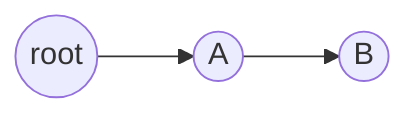
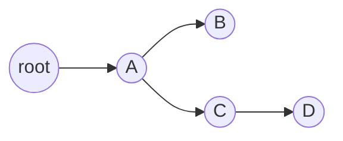

# 第一天：多线程

并行：多个CPU同时执行多个任务，就好像有两个程序，这两个程序是真的在两个不同的CPU内同时被执行。

并发：CPU交替处理多个任务，还是有两个程序，但是只有一个CPU，会交替处理这两个程序，而不是同时执行，只不过因为CPU执行的速度过快，而会使得人们感到是在“同时”执行，执行的先后取决于各个程序对于时间片资源的争夺。

## 进程与线程

### 进程（process）

狭义定义：进程就是一段程序的执行过程。

广义定义：进程是一个具有一定独立功能的程序关于某个数据集合的一次运行活动。它是操作系统动态执行的基本单元，在传统的操作系统中，进程既是基本的分配单元，也是基本的执行单元。

简单的来讲进程的概念主要有两点：第一，进程是一个实体。每一个进程都有它自己的地址空间，一般情况下，包括文本区域（text region）、数据区域（data region）和堆栈（stack region）。文本区域存储处理器执行的代码；数据区域存储变量和进程执行期间使用的动态分配的内存；堆栈区域存储着活动过程调用的指令和本地变量。第二，进程是一个“执行中的程序”。程序是一个没有生命的实体，只有处理器赋予程序生命时，它才能成为一个活动的实体，我们称其为进程。

进程状态：进程有三个状态，就绪、运行和阻塞。就绪状态其实就是获取了除cpu外的所有资源，只要处理器分配资源就可以马上执行。就绪状态有排队序列什么的，排队原则不再赘述。运行态就是获得了处理器分配的资源，程序开始执行。阻塞态，当程序条件不够时候，需要等待条件满足时候才能执行，如等待i/o操作时候，此刻的状态就叫阻塞态。

在python中进程的实现主要依赖multiprocessing 模块实现 ，其中Process类实现进程实例，Queue类可以用来实现进程间的通讯，Pool类实现进程池管理。

### 程序

说起进程，就不得不说下程序。先看定义：程序是指令和数据的有序集合，其本身没有任何运行的含义，是一个静态的概念。而进程则是在处理机上的一次执行过程，它是一个动态的概念。这个不难理解，其实进程是包含程序的，进程的执行离不开程序，进程中的文本区域就是代码区，也就是程序。

### 线程

通常在一个进程中可以包含若干个线程，当然一个进程中至少有一个线程，不然没有存在的意义。线程可以利用进程所拥有的资源，在引入线程的操作系统中，通常都是把进程作为分配资源的基本单位，而把线程作为独立运行和独立调度的基本单位，由于线程比进程更小，基本上不拥有系统资源，故对它的调度所付出的开销就会小得多，能更高效的提高系统多个程序间并发执行的程度。

### 多线程

在一个程序中，这些独立运行的程序片段叫作“线程”（Thread），利用它编程的概念就叫作“多线程处理”。多线程是为了同步完成多项任务，不是为了提高运行效率，而是为了提高资源使用效率来提高系统的效率。线程是在同一时间需要完成多项任务的时候实现的。

最简单的比喻多线程就像火车的每一节车厢，而进程则是火车。车厢离开火车是无法跑动的，同理火车也不可能只有一节车厢。多线程的出现就是为了提高效率。

### 进程与线程的区别：

进程和线程的主要差别在于它们是不同的操作系统资源管理方式。进程有独立的地址空间，一个进程崩溃后，在保护模式下不会对其它进程产生影响，而线程只是一个进程中的不同执行路径。线程有自己的堆栈和局部变量，但线程之间没有单独的地址空间，一个线程死掉就等于整个进程死掉，所以多进程的程序要比多线程的程序健壮，但在进程切换时，耗费资源较大，效率要差一些。但对于一些要求同时进行并且又要共享某些变量的并发操作，只能用线程，不能用进程。

1) 简而言之,一个程序至少有一个进程,一个进程至少有一个线程.

2) 线程的划分尺度小于进程，使得多线程程序的并发性高。

3) 另外，进程在执行过程中拥有独立的内存单元，而多个线程共享内存，从而极大地提高了程序的运行效率。

4) 线程在执行过程中与进程还是有区别的。每个独立的线程有一个程序运行的入口、顺序执行序列和程序的出口。但是线程不能够独立执行，必须依存在应用程序中，由应用程序提供多个线程执行控制。

5) 从逻辑角度来看，多线程的意义在于一个应用程序中，有多个执行部分可以同时执行。但操作系统并没有将多个线程看做多个独立的应用，来实现进程的调度和管理以及资源分配。这就是进程和线程的重要区别。

### 优缺点及应用原则

线程和进程在使用上各有优缺点：线程执行开销小，但不利于资源的管理和保护；而进程正相反。同时，线程适合于在SMP(多核处理机)机器上运行，而进程则可以跨机器迁移。

1）需要频繁创建销毁的优先用线程（进程的创建和销毁开销过大）

2）需要进行大量计算的优先使用线程（CPU频繁切换）

3）强相关的处理用线程，弱相关的处理用进程

4）可能要扩展到多机分布的用进程，多核分布的用线程

都满足需求的情况下，用你最熟悉、最拿手的方式

### GIL

首先需要明确的一点是GIL并不是Python的特性，它是在实现Python解析器(CPython)时所引入的一个概念。就好比C++是一套语言（语法）标准，但是可以用不同的编译器来编译成可执行代码。有名的编译器例如GCC，INTEL
C++，Visual C++等。Python也一样，同样一段代码可以通过CPython，PyPy，Psyco等不同的Python执行环境来执行。像其中的JPython就没有GIL。然而因为CPython是大部分环境下默认的Python执行环境。所以在很多人的概念里CPython就是Python，也就想当然的把GIL归结为Python语言的缺陷。所以这里要先明确一点：GIL并不是Python的特性，Python完全可以不依赖于GIL。

在多线程环境中，Python 虚拟机按以下方式执行：

1. 设置GIL

2. 切换到一个线程去运行

3. 运行：
   a. 指定数量的字节码指令，或者

   b. 线程主动让出控制（可以调用time.sleep(0)）

4. 把线程设置为睡眠状态

5. 解锁GIL

6. 再次重复以上所有步骤 

 在cpython解释器中存在一个GIL(全局解释器锁),他的作用就是保证同一时刻只有一个线程可以执行代码,因此造成了我们使用多线程的时候无法实现真正的并行（最佳的替代方案是多进程方案）。

**全局解释器锁GIL设计理念与限制**

GIL的设计简化了CPython的实现，使得对象模型，包括关键的内建类型如字典，都是隐含可以并发访问的。锁住全局解释器使得比较容易的实现对多线程的支持，但也损失了多处理器主机的并行计算能力。

但是，不论标准的，还是第三方的扩展模块，都被设计成在进行密集计算任务是，释放GIL。

还有，就是在做I/O操作时，GIL总是会被释放。对所有面向I/O 的(会调用内建的操作系统C 代码的)程序来说，GIL 会在这个I/O  调用之前被释放，以允许其它的线程在这个线程等待I/O 的时候运行。如果是纯计算的程序，没有 I/O 操作，解释器会每隔 100  次操作就释放这把锁，让别的线程有机会执行（这个次数可以通过 sys.setcheckinterval 来调整）如果某线程并未使用很多I/O  操作，它会在自己的时间片内一直占用处理器（和GIL）。也就是说，I/O 密集型的Python  程序比计算密集型的程序更能充分利用多线程环境的好处。

## 线程的实现

多任务可以由多进程完成，也可以由一个进程内的多线程完成。我们前面提到了进程是由若干线程组成的，一个进程至少有一个线程。由于线程是操作系统直接支持的执行单元，因此，高级语言通常都内置多线程的支持，Python也不例外，并且，Python的线程是真正的Posix Thread，而不是模拟出来的线程。Python的标准库提供了两个模块：\_thread和threading，\_thread是低级模块，threading是高级模块，对_thread进行了封装。绝大多数情况下，我们只需要使用threading这个高级模块。

下面是一个简单的例子：

启动一个线程就是把一个函数传入并创建Thread实例，然后调用start()开始执行：

```python
import time, threading
# 新线程执行的代码:

def loop():
    print(‘线程 %s 正在执行...’ % threading.current_thread().name)
    n = 0
    while n < 5:
        n = n + 1
        print(‘线程 %s >>> %s’ % (threading.current_thread().name, n))
        time.sleep(1)
    print(‘线程 %s 结束.’ % threading.current_thread().name)

print(‘线程 %s is 正在执行...’ % threading.current_thread().name)
t = threading.Thread(target=loop, name=’LoopThread’)
t.start()
t.join()
print(‘线程 %s 结束.’ % threading.current_thread().name)
```

代码解释：

由于任何进程默认就会启动一个线程，我们把该线程称为主线程，主线程又可以启动新的线程，Python的threading模块有个current_thread()函数，它永远返回当前线程的实例。主线程实例的名字叫MainThread，子线程的名字在创建时指定，我们用LoopThread命名子线程。名字仅仅在打印时用来显示，完全没有其他意义，如果不起名字Python就自动给线程命名为Thread-1，Thread-2……

在上面的例子中使用threading模块中的Thread类构建一个线程的实例，然后使用该实例的start方法将线程运行起来，使用join方法阻塞主线程。

参考资料：

threading常用方法:
|方法|说明|
|---|---|
|threading.current\_Thread()|返回当前的线程变量。|
|threading.enumerate()|返回一个包含正在运行的线程的list。 正在运行指线程启动后、结束前，不包括启动前和终止后的线程。|
|threading.activeCount()| 返回正在运行的线程数量，与len(threading.enumerate())有相同的结果。|
|run()| 用以表示线程活动的方法。|
|start()|启动线程活动。|
|join([time])| 等待至线程中止。 这阻塞调用线程直至线程的join() 方法被调用中止-正常退出或者抛出未处理的异常-或者是可选的超时发生。|
|isAlive()| 返回线程是否活动的。|
|getName()| 返回线程名。|
|setName()|设置线程名。|

## 线程锁与线程安全

### 线程锁的实现及应用

多线程和多进程最大的不同在于，多进程中，同一个变量，各自有一份拷贝存在每个进程中，互不影响，而多线程中，所有变量都由所有线程共享，所以，任何一个变量都可以被任何一个线程修改，因此，线程之间共享数据最大的危险在于多个线程同时改一个变量，把内容给改乱了。

来看看多个线程同时操作一个变量怎么把内容给改乱了，代码见如下：

```python
import time, threading

# 假定这是你的银行存款:
balance = 0

def change_it(n):
    # 先存后取，结果应该为0:
    global balance
    balance = balance + n
    balance = balance - n

def run_thread(n):
    for i in range(100000):
        change_it(n)

t1 = threading.Thread(target=run_thread, args=(5,))
t2 = threading.Thread(target=run_thread, args=(8,))
t1.start()
t2.start()
t1.join()
t2.join()
print(balance)
```

我们定义了一个共享变量balance，初始值为0，并且启动两个线程，先存后取，理论上结果应该为0，但是，由于线程的调度是由操作系统决定的，当t1、t2交替执行时，只要循环次数足够多，balance的结果就不一定是0了。

原因是因为高级语言的一条语句在CPU执行时是若干条语句，即使一个简单的计算：

balance = balance + n

也分两步：

    计算balance + n，存入临时变量中；
    将临时变量的值赋给balance。

也就是可以看成：

>x = balance + n
>balance = x

由于x是局部变量，两个线程各自都有自己的x，当代码正常执行时：

>初始值 balance = 0
>
>t1: x1 = balance + 5 # x1 = 0 + 5 = 5
>t1: balance = x1     # balance = 5
>t1: x1 = balance - 5 # x1 = 5 - 5 = 0
>t1: balance = x1     # balance = 0
>
>t2: x2 = balance + 8 # x2 = 0 + 8 = 8
>t2: balance = x2     # balance = 8
>t2: x2 = balance - 8 # x2 = 8 - 8 = 0
>t2: balance = x2     # balance = 0
>
>结果 balance = 0

但是t1和t2是交替运行的，如果操作系统以下面的顺序执行t1、t2：

> 初始值 balance = 0
>
> t1: x1 = balance + 5  # x1 = 0 + 5 = 5
>
> t2: x2 = balance + 8  # x2 = 0 + 8 = 8
> t2: balance = x2      # balance = 8
>
> t1: balance = x1      # balance = 5
> t1: x1 = balance - 5  # x1 = 5 - 5 = 0
> t1: balance = x1      # balance = 0
>
> t2: x2 = balance - 8  # x2 = 0 - 8 = -8
> t2: balance = x2   # balance = -8

结果 balance = -8

究其原因，是因为修改balance需要多条语句，而执行这几条语句时，线程可能中断，从而导致多个线程把同一个对象的内容改乱了。

两个线程同时一存一取，就可能导致余额不对，你肯定不希望你的银行存款莫名其妙地变成了负数，所以，我们必须确保一个线程在修改balance的时候，别的线程一定不能改。

如果我们要确保balance计算正确，就要给change_it()上一把锁，当某个线程开始执行change_it()时，我们说，该线程因为获得了锁，因此其他线程不能同时执行change_it()，只能等待，直到锁被释放后，获得该锁以后才能改。由于锁只有一个，无论多少线程，同一时刻最多只有一个线程持有该锁，所以，不会造成修改的冲突。创建一个锁就是通过threading.Lock()来实现：

```python
balance = 0
lock = threading.Lock()

def run_thread(n):
    for i in range(100000):
        # 先要获取锁:
        lock.acquire()
        try:
            # 放心地改吧:
            change_it(n)
        finally:
            # 改完了一定要释放锁:
            lock.release()
```

当多个线程同时执行lock.acquire()时，只有一个线程能成功地获取锁，然后继续执行代码，其他线程就继续等待直到获得锁为止。

获得锁的线程用完后一定要释放锁，否则那些苦苦等待锁的线程将永远等待下去，成为死线程。所以我们用try...finally来确保锁一定会被释放。

锁的好处就是确保了某段关键代码只能由一个线程从头到尾完整地执行，坏处当然也很多，首先是阻止了多线程并发执行，包含锁的某段代码实际上只能以单线程模式执行，效率就大大地下降了。其次，由于可以存在多个锁，不同的线程持有不同的锁，并试图获取对方持有的锁时，可能会造成死锁，导致多个线程全部挂起，既不能执行，也无法结束，只能靠操作系统强制终止。

#### 扩展（乐观锁与悲观锁）：

悲观锁：不相信其他人不会修改，传统的关系型数据库里边就用到了很多这种锁机制，如mysql, 每次查询、修改数据操作之前就会上锁，整个数据处理过程中，将数据处于锁定状态，自己更新数据后再释放锁，可以有效防止库存冲突问题

乐观锁：相信其他人不会修改，所以查询、修改数据库时不会上锁，所以再数据进行提交更新的时候，才会正式对数据的冲突与否进行检测，如果发现冲突了，则返回错误的信息，让用户决定如何 去做

### 线程变量管理

在多线程环境下，每个线程都有自己的数据。一个线程使用自己的局部变量比使用全局变量好，因为局部变量只有线程自己能看见，不会影响其他线程，而全局变量的修改必须加锁。

但是局部变量也有问题，就是在函数调用的时候，传递起来很麻烦：

```python
def process_student(name):
    std = Student(name)
    # std是局部变量，但是每个函数都要用它，因此必须传进去：
    do_task_1(std)
    do_task_2(std)

def do_task_1(std):
    do_subtask_1(std)
    do_subtask_2(std)

def do_task_2(std):
    do_subtask_2(std)
    do_subtask_2(std)
```

每个函数一层一层调用都这么传参数那还得了？用全局变量？也不行，因为每个线程处理不同的`Student`对象，不能共享。

如果用一个全局`dict`存放所有的`Student`对象，然后以`thread`自身作为`key`获得线程对应的`Student`对象如何？

```python
global_dict = {}

def std_thread(name):
    std = Student(name)
    # 把std放到全局变量global_dict中：
    global_dict[threading.current_thread()] = std
    do_task_1()
    do_task_2()

def do_task_1():
    # 不传入std，而是根据当前线程查找：
    std = global_dict[threading.current_thread()]
    ...

def do_task_2():
    # 任何函数都可以查找出当前线程的std变量：
    std = global_dict[threading.current_thread()]
    ...
```

这种方式理论上是可行的，它最大的优点是消除了`std`对象在每层函数中的传递问题，但是，每个函数获取`std`的代码有点丑。

有没有更简单的方式？

`ThreadLocal`应运而生，不用查找`dict`，`ThreadLocal`帮你自动做这件事：

```python
import threading

# 创建全局ThreadLocal对象:
local_school = threading.local()

def process_student():
    # 获取当前线程关联的student:
    std = local_school.student
    print('Hello, %s (in %s)' % (std, threading.current_thread().name))

def process_thread(name):
    # 绑定ThreadLocal的student:
    local_school.student = name
    process_student()

t1 = threading.Thread(target= process_thread, args=('张三',), name='线程-A')
t2 = threading.Thread(target= process_thread, args=('李四',), name='线程-B')
t1.start()
t2.start()
t1.join()
t2.join()
```

执行结果：

>Hello, Alice (in Thread-A)
>Hello, Bob (in Thread-B)

全局变量`local_school`就是一个`ThreadLocal`对象，每个`Thread`对它都可以读写`student`属性，但互不影响。你可以把`local_school`看成全局变量，但每个属性如`local_school.student`都是线程的局部变量，可以任意读写而互不干扰，也不用管理锁的问题，`ThreadLocal`内部会处理。

可以理解为全局变量`local_school`是一个`dict`，不但可以用`local_school.student`，还可以绑定其他变量，如`local_school.teacher`等等。

`ThreadLocal`最常用的地方就是为每个线程绑定一个数据库连接，HTTP请求，用户身份信息等，这样一个线程的所有调用到的处理函数都可以非常方便地访问这些资源。`ThreadLocal`变量虽然是全局变量，但每个线程都只能读写自己线程的独立副本，互不干扰。`ThreadLocal`解决了参数在一个线程中各个函数之间互相传递的问题。

### 线程队列实现

在线程操作过程中我们一般将一些线程用作信息的生产，而另一些线程用作信息的消费。这时候使用线程队列就可以很好的实现生产与消费的隔离。

Python的Queue模块中提供了同步的、线程安全的队列类，包括FIFO（先入先出)队列Queue，LIFO（后入先出）队列LifoQueue，和优先级队列PriorityQueue。这些队列都实现了锁原语，能够在多线程中直接使用。可以使用队列来实现线程间的同步。

Queue模块中的常用方法:

- Queue.qsize() 返回队列的大小
- Queue.empty() 如果队列为空，返回True,反之False
- Queue.full() 如果队列满了，返回True,反之False
- Queue.full 与 maxsize 大小对应
- Queue.get([block[, timeout]])获取队列，timeout等待时间
- Queue.get_nowait() 相当Queue.get(False)
- Queue.put(item) 写入队列，timeout等待时间
- Queue.put_nowait(item) 相当Queue.put(item, False)
- Queue.task_done() 在完成一项工作之后，Queue.task_done()函数向任务已经完成的队列发送一个信号
- Queue.join() 实际上意味着等到队列为空，再执行别的操作

下面是一个关于线程队列的简单实现示例：

```python
from queue import Queue  # Queue在3.x中改成了queue
import random
import threading
import time

class Producer(threading.Thread):
    '''
    Producer thread 制作线程
    '''
    
    def __init__(self, t_name, queue):  # 传入线程名、实例化队列
        threading.Thread.__init__(self, name=t_name)  # t_name即是threadName
        self.data = queue
    '''
    run方法 和start方法:
    它们都是从Thread继承而来的，run()方法将在线程开启后执行，
    可以把相关的逻辑写到run方法中（通常把run方法称为活动[Activity]）；
    start()方法用于启动线程。
    '''
    
    def run(self):
        for i in range(5):  # 生成0-4五条队列
            print("%s: %s is producing %d to the queue!" % (time.ctime(), self.getName(), i))  # 当前时间t生成编号d并加入队列
            self.data.put(i)  # 写入队列编号
            time.sleep(random.randrange(10) / 5)  # 随机休息一会
        print("%s: %s producing finished!" % (time.ctime(), self.getName))  # 编号d队列完成制作


class Consumer(threading.Thread):
    '''
    Consumer thread 消费线程
    '''
    
    def __init__(self, t_name, queue):
        threading.Thread.__init__(self, name=t_name)
        self.data = queue
        
    def run(self):
        for i in range(5):
            val = self.data.get()
            print("%s: %s is consuming. %d in the queue is consumed!" % (time.ctime(), self.getName(), val))  # 编号d队列已经被消费
            time.sleep(random.randrange(10))
        print("%s: %s consuming finished!" % (time.ctime(), self.getName()))  # 编号d队列完成消费

def main():
    '''
    Main thread 主线程
    '''
    queue = Queue()  # 队列实例化
    producer = Producer(‘Pro.’, queue)  # 调用对象，并传如参数线程名、实例化队列
    consumer = Consumer(‘Con.’, queue)  # 同上，在制造的同时进行消费
    producer.start()  # 开始制造
    consumer.start()  # 开始消费
    '''
    join（）的作用是，在子线程完成运行之前，这个子线程的父线程将一直被阻塞。
    join()方法的位置是在for循环外的，也就是说必须等待for循环里的两个进程都结束后，才去执行主进程。
    '''
    producer.join()
    consumer.join()
    print(‘All threads terminate!’)

if __name__ == '__main__':
    main()
```

## 扩展：线程池实现

从前面的知识我们了解到 既然多线程可以缩短程序运行时间，那么，是不是线程数量越多越好呢？
很显然，并不是，每一个线程的从生成到消亡也是需要时间和资源的，太多的线程会占用过多的系统资源（内存开销，cpu开销），而且生成太多的线程时间也是可观的，很可能会得不偿失，这里给出一个最佳线程数量的计算方式：

**最佳线程数的获取：**

1、通过用户慢慢递增来进行性能压测，观察QPS（即每秒的响应请求数，也即是最大吞吐能力。），响应时间

2、根据公式计算:服务器端最佳线程数量=((线程等待时间+线程cpu时间)/线程cpu时间) * cpu数量

3、单用户压测，查看CPU的消耗，然后直接乘以百分比，再进行压测，一般这个值的附近应该就是最佳线程数量。

**为什么要使用线程池？**

对于任务数量不断增加的程序，每有一个任务就生成一个线程，最终会导致线程数量的失控，例如，整站爬虫，假设初始只有一个链接a，那么，这个时候只启动一个线程，运行之后，得到这个链接对应页面上的b，c，d，，，等等新的链接，作为新任务，这个时候，就要为这些新的链接生成新的线程，线程数量暴涨。在之后的运行中，线程数量还会不停的增加，完全无法控制。所以，对于任务数量不端增加的程序，固定线程数量的线程池是必要的。

在python3中我们可以主要使用concurrent.futures模块，这个模块是python3中自带的模块，但是，python2.7以上版本也可以安装使用，具体使用方式如下：

```python
from concurrent.futures import ThreadPoolExecutor
import time

def sayhello(a):
    print("hello: "+a)
    time.sleep(2)

def main():
    seed=["a","b","c"]
    start1=time.time()
    for each in seed:
        sayhello(each)
    end1=time.time()
    print("time1: "+str(end1-start1))
    start2=time.time()
    with ThreadPoolExecutor(3) as executor:#使用ThreadPoolExecutor实现一个有3个线程管理单元的线程池
        for each in seed:
            executor.submit(sayhello,each)#使用submit方法向池子中加入线程运行代码
    end2=time.time()
    print("time2: "+str(end2-start2))
    start3=time.time()
    with ThreadPoolExecutor(3) as executor1:
        executor1.map(sayhello,seed)#使用map方法向池子中加入线程运行代码，map方法实现序列参数的映射
    end3=time.time()
    print("time3: "+str(end3-start3))

if __name__ == '__main__':
    main()
```

注意：concurrent.futures.ThreadPoolExecutor，在提交任务的时候，有两种方式，一种是submit（）函数，另一种是map（）函数，两者的主要区别在于：

1. map可以保证输出的顺序, submit输出的顺序是乱的

2. 如果你要提交的任务的函数是一样的，就可以简化成map。但是假如提交的任务函数是不一样的，或者执行的过程之可能出现异常（使用map执行过程中发现问题会直接抛出错误）就要用到submit（）

3. submit和map的参数是不同的，submit每次都需要提交一个目标函数和对应的参数，map只需要提交一次目标函数，目标函数的参数放在一个迭代器（列表，字典）里就可以。

# 第二天：协程

## 生成器

通过列表生成式，我们可以直接创建一个列表。但是，受到内存限制，列表容量肯定是有限的。而且，创建一个包含100万个元素的列表，不仅占用很大的存储空间，如果我们仅仅需要访问前面几个元素，那后面绝大多数元素占用的空间都白白浪费了。

所以，如果列表元素可以按照某种算法推算出来，那我们是否可以在循环的过程中不断推算出后续的元素呢？这样就不必创建完整的list，从而节省大量的空间。在Python中，这种一边循环一边计算的机制，称为生成器：generator。

要创建一个generator，有很多种方法。第一种方法很简单，只要把一个列表生成式的`[]`改成`()`，就创建了一个generator：

```python
>>> L = [x * x for x in range(10)]
>>> L
[0, 1, 4, 9, 16, 25, 36, 49, 64, 81]
>>> g = (x * x for x in range(10))
>>> g
<generator object <genexpr> at 0x1022ef630>
```

创建`L`和`g`的区别仅在于最外层的`[]`和`()`，`L`是一个list，而`g`是一个generator。

我们可以直接打印出list的每一个元素，但我们怎么打印出generator的每一个元素呢？如果要一个一个打印出来，可以通过`next()`函数获得generator的下一个返回值：

```python
>>> next(g)
0
>>> next(g)
1
>>> next(g)
4
>>> next(g)
9
... ...
```

generator保存的是算法，每次调用`next(g)`，就计算出`g`的下一个元素的值，直到计算到最后一个元素，没有更多的元素时，抛出`StopIteration`的错误。

当然，上面这种不断调用`next(g)`实在是太变态了，正确的方法是使用`for`循环，因为generator也是可迭代对象。

generator非常强大。如果推算的算法比较复杂，用类似列表生成式的`for`循环无法实现的时候，还可以用函数来实现。比如，著名的斐波拉契数列（Fibonacci），除第一个和第二个数外，任意一个数都可由前两个数相加得到：1, 1, 2, 3, 5, 8, 13, 21, 34, ...

斐波拉契数列用列表生成式写不出来，但是，用函数把它打印出来却很容易，如下函数：

```python
def fib(max):
    n, a, b = 0, 0, 1
    while n < max:
        print(b)
        a, b = b, a + b
        n = n + 1
    return 'done'
```

仔细观察，可以看出，`fib`函数实际上是定义了斐波拉契数列的推算规则，可以从第一个元素开始，推算出后续任意的元素，这种逻辑其实非常类似generator。也就是说，上面的函数和generator仅一步之遥。要把`fib`函数变成generator，只需要把`print(b)`改为`yield b`就可以了：

```python
def fib(max):
    n, a, b = 0, 0, 1
    while n < max:
        yield b
        a, b = b, a + b
        n = n + 1
    return 'done'
```

这就是定义generator的另一种方法。如果一个函数定义中包含`yield`关键字，那么这个函数就不再是一个普通函数，而是一个generator：

```python
>>> f = fib(6)
>>> f
<generator object fib at 0x104feaaa0>
```

这里，最难理解的就是generator和函数的执行流程不一样。函数是顺序执行，遇到`return`语句或者最后一行函数语句就返回。而变成generator的函数，在每次调用`next()`的时候执行，遇到`yield`语句返回，再次执行时从上次返回的`yield`语句处继续执行。

**扩展：**send()函数最重要的作用在于它可以给yield对应的赋值语句赋值，比如上面那一段代码中的

```python
def fun():
    for i in range(20):
        x = yield i
        print('good',x)
        
if __name__ == '__main__':
    a=fun()
    a.__next__()
    x=a.send(5)
    print(x)
```

我们运行上面的代码可以得知 ，yield语句会返回其后值并获取由send方法传递入函数的值。

需要特别注意的是，尽管是生成器。但是next函数的调用次数可能是有限的。

## 迭代器

通过前面的学习我们知道，可以直接作用于`for`循环的数据类型有以下几种：

一类是集合数据类型，如`list`、`tuple`、`dict`、`set`、`str`等；

一类是`generator`，包括生成器和带`yield`的generator function。

这些可以直接作用于`for`循环的对象统称为可迭代对象：`Iterable`。

可以使用`isinstance()`判断一个对象是否是`Iterable`对象：

```python
>>> from collections import Iterable
>>> isinstance([], Iterable)
True
>>> isinstance({}, Iterable)
True
>>> isinstance('abc', Iterable)
True
>>> isinstance((x for x in range(10)), Iterable)
True
>>> isinstance(100, Iterable)
False
```

而生成器不但可以作用于`for`循环，还可以被`next()`函数不断调用并返回下一个值，直到最后抛出`StopIteration`错误表示无法继续返回下一个值了。

可以被`next()`函数调用并不断返回下一个值的对象称为迭代器：`Iterator`。

可以使用`isinstance()`判断一个对象是否是`Iterator`对象：

```python
>>> from collections import Iterator
>>> isinstance((x for x in range(10)), Iterator)
True
>>> isinstance([], Iterator)
False
>>> isinstance({}, Iterator)
False
>>> isinstance('abc', Iterator)
False
```

生成器都是`Iterator`对象，但`list`、`dict`、`str`虽然是`Iterable`，却不是`Iterator`。

把`list`、`dict`、`str`等`Iterable`变成`Iterator`可以使用`iter()`函数：

```python
>>> isinstance(iter([]), Iterator)
True
>>> isinstance(iter('abc'), Iterator)
True
```

你可能会问，为什么`list`、`dict`、`str`等数据类型不是`Iterator`？

这是因为Python的`Iterator`对象表示的是一个数据流，Iterator对象可以被`next()`函数调用并不断返回下一个数据，直到没有数据时抛出`StopIteration`错误。可以把这个数据流看做是一个有序序列，但我们却不能提前知道序列的长度，只能不断通过`next()`函数实现按需计算下一个数据，所以`Iterator`的计算是惰性的，只有在需要返回下一个数据时它才会计算。

`Iterator`甚至可以表示一个无限大的数据流，例如全体自然数。而使用list是永远不可能存储全体自然数的。

**小结**

凡是可作用于`for`循环的对象都是`Iterable`类型；
凡是可作用于`next()`函数的对象都是`Iterator`类型，它们表示一个惰性计算的序列；
集合数据类型如`list`、`dict`、`str`等是`Iterable`但不是`Iterator`，不过可以通过`iter()`函数获得一个`Iterator`对象。

## 协程概念及原理

协程，又称微线程，纤程。英文名Coroutine。

协程的概念很早就提出来了，但直到最近几年才在某些语言（如Lua）中得到广泛应用。

子程序，或者称为函数，在所有语言中都是层级调用，比如A调用B，B在执行过程中又调用了C，C执行完毕返回，B执行完毕返回，最后是A执行完毕。

所以子程序调用是通过栈实现的，一个线程就是执行一个子程序。

子程序调用总是一个入口，一次返回，调用顺序是明确的。而协程的调用和子程序不同。

协程看上去也是子程序，但执行过程中，在子程序内部可中断，然后转而执行别的子程序，在适当的时候再返回来接着执行。

注意，在一个子程序中中断，去执行其他子程序，不是函数调用，有点类似CPU的中断。比如子程序A、B：

```
def A():
    print('1')
    print('2')
    print('3')

def B():
    print('x')
    print('y')
    print('z')
```

假设由协程执行，在执行A的过程中，可以随时中断，去执行B，B也可能在执行过程中中断再去执行A，结果可能是：

```
1
2
x
y
3
z
```

但是在A中是没有调用B的，所以协程的调用比函数调用理解起来要难一些。

看起来A、B的执行有点像多线程，但协程的特点在于是一个线程执行，那和多线程比，协程有何优势？

最大的优势就是协程极高的执行效率。因为子程序切换不是线程切换，而是由程序自身控制，因此，没有线程切换的开销，和多线程比，线程数量越多，协程的性能优势就越明显。

第二大优势就是不需要多线程的锁机制，因为只有一个线程，也不存在同时写变量冲突，在协程中控制共享资源不加锁，只需要判断状态就好了，所以执行效率比多线程高很多。

因为协程是一个线程执行，那怎么利用多核CPU呢？最简单的方法是多进程+协程，既充分利用多核，又充分发挥协程的高效率，可获得极高的性能。

Python对协程的支持是通过generator实现的。

在generator中，我们不但可以通过`for`循环来迭代，还可以不断调用`next()`函数获取由`yield`语句返回的下一个值。但是Python的`yield`不但可以返回一个值，它还可以接收调用者发出的参数。

来看例子：

传统的生产者-消费者模型是一个线程写消息，一个线程取消息，通过锁机制控制队列和等待，但一不小心就可能死锁。如果改用协程，生产者生产消息后，直接通过`yield`跳转到消费者开始执行，待消费者执行完毕后，切换回生产者继续生产，效率极高：

```python
def consumer():
    r = ''
    while True:
        n = yield r
        if not n:
            return
        print('[CONSUMER] Consuming %s...' % n)
        r = '200 OK'

def produce(c):
    c.send(None)
    n = 0
    while n < 5:
        n = n + 1
        print('[PRODUCER] Producing %s...' % n)
        r = c.send(n)
        print('[PRODUCER] Consumer return: %s' % r)
    c.close()

c = consumer()
produce(c)
```

执行结果：

```
[PRODUCER] Producing 1...
[CONSUMER] Consuming 1...
[PRODUCER] Consumer return: 200 OK
[PRODUCER] Producing 2...
[CONSUMER] Consuming 2...
[PRODUCER] Consumer return: 200 OK
[PRODUCER] Producing 3...
[CONSUMER] Consuming 3...
[PRODUCER] Consumer return: 200 OK
[PRODUCER] Producing 4...
[CONSUMER] Consuming 4...
[PRODUCER] Consumer return: 200 OK
[PRODUCER] Producing 5...
[CONSUMER] Consuming 5...
[PRODUCER] Consumer return: 200 OK
```

注意到`consumer`函数是一个`generator`，把一个`consumer`传入`produce`后：

1. 首先调用`c.send(None)`启动生成器；
2. 然后，一旦生产了东西，通过`c.send(n)`切换到`consumer`执行；
3. `consumer`通过`yield`拿到消息，处理，又通过`yield`把结果传回；
4. `produce`拿到`consumer`处理的结果，继续生产下一条消息；
5. `produce`决定不生产了，通过`c.close()`关闭`consumer`，整个过程结束。

整个流程无锁，由一个线程执行，`produce`和`consumer`协作完成任务，所以称为“协程”，而非线程的抢占式多任务。

## 协程库（gevent）

Python通过`yield`提供了对协程的基本支持，但是不完全。而第三方的gevent为Python提供了比较完善的协程支持。gevent是第三方库，通过greenlet实现协程，其基本思想是：

当一个greenlet遇到IO操作时，比如访问网络，就自动切换到其他的greenlet，等到IO操作完成，再在适当的时候切换回来继续执行。由于IO操作非常耗时，经常使程序处于等待状态，有了gevent为我们自动切换协程，就保证总有greenlet在运行，而不是等待IO。

要使用gevent库上线首先需要使用pip命令进行安装：pip install gevent

由于切换是在IO操作时自动完成，所以gevent需要修改Python自带的一些标准库，这一过程在启动时通过monkey patch完成：

```python
from gevent import monkey; monkey.patch_socket()
import gevent

def f(n):
    for i in range(n):
        print(gevent.getcurrent, i)#getcurrent属性获取当前的greenlet对象

g1 = gevent.spawn(f, 5)
g2 = gevent.spawn(f, 5)
g3 = gevent.spawn(f, 5)
g1.join()
g2.join()
g3.join()
```

运行上面的代码可以看到，3个greenlet是依次运行而不是交替运行。

要让greenlet交替运行，可以通过`gevent.sleep()`交出控制权：

```python
def f(n):
    for i in range(n):
        print(gevent.getcurrent, i)
        gevent.sleep(0)
```

当然，实际代码里，我们不会用`gevent.sleep()`去切换协程，而是在执行到IO操作时，gevent自动切换，代码如下：

```python
from gevent import monkey; monkey.patch_all()
import gevent
import urllib

def f(url):
    print('GET: %s' % url)
    resp = urllib.request.urlopen(url)#利用urllib模块中的urlopen方法请求网络
    data = resp.read() #读取请求像影响
    print('%d bytes received from %s.' % (len(data), url))

gevent.joinall([
        gevent.spawn(f, 'https://www.python.org/'),
        gevent.spawn(f, 'https://www.yahoo.com/'),
        gevent.spawn(f, 'https://github.com/'),
])
```

## 案例

多张图片下载

参考代码：

```python
#利用协程下载多张图片
import urllib.request
#1、导包 
from gevent import monkey
monkey.patch_socket()#遇到socket请求进行切换
import gevent
#2、定义协程逻辑代码段
def f(url,file_name):
    print('图片%s下载等待'%file_name)
    response = urllib.request.urlopen(url)#使用url请求网络地址
    with open(file_name,'wb') as f:#以二进制模式的写模式打开一个文件
        f.write(response.read())
    print('图片%s下载完毕'%file_name)
#3、使用joinall方法开启多个协程   
gevent.joinall([
        gevent.spawn(f, 'https://ss1.baidu.com/6ONXsjip0QIZ8tyhnq/it/u=1412665150,1976403819&fm=173\
        &app=25&f=JPEG?w=550&h=403&s=E81A4F98489B7BE73AB90C410300E0E0','1A.jpg'),
        gevent.spawn(f, 'https://ss0.baidu.com/6ONWsjip0QIZ8tyhnq/it/u=3948574962,1154075058&fm=173\
        &app=25&f=JPEG?w=550&h=366&s=AE84BC450ABECC4F5638FC890300E093','2B.jpg'),
        gevent.spawn(f, 'https://ss2.baidu.com/6ONYsjip0QIZ8tyhnq/it/u=478345823,4266814189&fm=173\
        &app=25&f=JPEG?w=550&h=383&s=3DA4D9140CAB232C641688D3030040BB','3C.jpg'),
])
```


# 第三天：高阶函数及程序调试

## python2与python3区别

 Python的3.0版本，常被称为Python 3000，或简称Py3k。相对于Python的早期版本，这是一个较大的升级。 

为了不带入过多的累赘，Python 3.0在设计的时候没有考虑向下相容。

 许多针对早期Python版本设计的程式都无法在Python 3.0上正常执行。

 为了照顾现有程式，Python 2.6作为一个过渡版本，基本使用了Python 2.x的语法和库，同时考虑了向Python 3.0的迁移，允许使用部分Python 3.0的语法与函数。

 新的Python程式建议使用Python 3.0版本的语法。

 除非执行环境无法安装Python 3.0或者程式本身使用了不支援Python 3.0的第三方库。目前不支援Python 3.0的第三方库有Twisted, py2exe, PIL等。

 大多数第三方库都正在努力地相容Python 3.0版本。即使无法立即使用Python 3.0，也建议编写相容Python 3.0版本的程式，然后使用Python 2.6, Python 2.7来执行。

Python 3.0的变化主要在以下几个方面:

1. print语句没有了，取而代之的是print()函数。 Python 2.6与Python 2.7部分地支持这种形式的print语法。

2.  Python 2 有 ASCII str() 类型，unicode() 是单独的，不是 byte 类型。 

   现在， 在 Python 3，我们最终有了 Unicode (utf-8) 字符串，以及一个字节类：byte 和 bytearrays。

   由于 Python3.X 源码文件默认使用utf-8编码，这就使得以下代码是合法的： 

   ```
   >>> 中国 = 'china' 
   >>>print(中国) 
   china
   ```

3. 除法运算：

4. 在 Python 3 中处理异常也轻微的改变了，在 Python 3 中我们现在使用 as 作为关键词。捕获异常的语法由 **except exc, var** 改为 **except exc as var**。

5. 在 Python 3 中，range() 是像 xrange() 那样实现以至于一个专门的 xrange() 函数都不再存在（在 Python 3 中 xrange() 会抛出命名异常）。

6. Python 3.x中去掉了<>, 只有!=一种写法，还好，我从来没有使用<>的习惯

7. Python 3.x 中去掉了``这种写法，只允许使用repr函数。

8. 数据类型 

    1）Py3.X去除了long类型，现在只有一种整型——int，但它的行为就像2.X版本的long 

    2）新增了bytes类型，对应于2.X版本的八位串

    3）dict的.keys()、.items 和.values()方法返回迭代器，而之前的iterkeys()等函数都被废弃。同时去掉的还有 
      dict.has_key()，可以使用in语句进行替代 。

9. httplib, BaseHTTPServer, CGIHTTPServer, SimpleHTTPServer, Cookie, cookielib被合并到http包内。

10. 取消了exec语句，只剩下exec()函数。

11. StringIO模块现在被合并到新的io模组内。 new, md5, gopherlib等模块被删除。

12. 多个模块被改名

    | 旧的名字     | 新的名字     |
    | ------------ | ------------ |
    | _winreg      | winreg       |
    | ConfigParser | configparser |
    | copy_reg     | copyreg      |
    | Queue        | queue        |
    | SocketServer | socketserver |
    | repr         | reprlib      |

## 高阶函数

在python中提供了一些高阶函数可以使得我们对序列类型的数据使用函数进行一些高级处理，比如排序，变换累加，过滤等操作。

### 映射器（map）

`map()`函数接收两个参数，一个是函数，一个是序列，`map`将传入的函数依次作用到序列的每个元素，并把结果作为新的list返回。举例说明，比如我们有一个函数f(x)=x2，要把这个函数作用在一个list `[1, 2, 3, 4, 5, 6, 7, 8, 9]`上，就可以用`map()`实现如下：

```ascii
   f(x) = x * x

                  │
                  │
  ┌───┬───┬───┬───┼───┬───┬───┬───┐
  │   │   │   │   │   │   │   │   │
  ▼   ▼   ▼   ▼   ▼   ▼   ▼   ▼   ▼

[ 1   2   3   4   5   6   7   8   9 ]

  │   │   │   │   │   │   │   │   │
  │   │   │   │   │   │   │   │   │
  ▼   ▼   ▼   ▼   ▼   ▼   ▼   ▼   ▼

[ 1   4   9  16  25  36  49  64  81 ]
```

```python
>>> def f(x):
...     return x * x
...
>>> map(f, [1, 2, 3, 4, 5, 6, 7, 8, 9])
[1, 4, 9, 16, 25, 36, 49, 64, 81]
```

`map()`传入的第一个参数是`f`，即函数对象本身。

你可能会想，不需要`map()`函数，写一个循环，也可以计算出结果：

```python
L = []
for n in [1, 2, 3, 4, 5, 6, 7, 8, 9]:
    L.append(f(n))
print L
```

的确可以，但是，从上面的循环代码，能一眼看明白“把f(x)作用在list的每一个元素并把结果生成一个新的list”吗？

所以，`map()`作为高阶函数，事实上它把运算规则抽象了，因此，我们不但可以计算简单的f(x)=x2，还可以计算任意复杂的函数，比如，把这个list所有数字转为字符串：

```python
>>> map(str, [1, 2, 3, 4, 5, 6, 7, 8, 9])
['1', '2', '3', '4', '5', '6', '7', '8', '9']
```

### 过滤器（filter）

Python内建的`filter()`函数用于过滤序列。

和`map()`类似，`filter()`也接收一个函数和一个序列。和`map()`不同的时，`filter()`把传入的函数依次作用于每个元素，然后根据返回值是`True`还是`False`决定保留还是丢弃该元素。

例如，在一个list中，删掉偶数，只保留奇数，可以这么写：

```python
def is_odd(n):
    return n % 2 == 1

filter(is_odd, [1, 2, 4, 5, 6, 9, 10, 15])
# 结果: [1, 5, 9, 15]
```

把一个序列中的空字符串删掉，可以这么写：

```python
def not_empty(s):
    return s and s.strip()

filter(not_empty, ['A', '', 'B', None, 'C', '  '])
# 结果: ['A', 'B', 'C']
```

可见用`filter()`这个高阶函数，关键在于正确实现一个“筛选”函数。

注意到`filter()`函数返回的是一个`Iterator`，也就是一个惰性序列，所以要强迫`filter()`完成计算结果，需要用`list()`函数获得所有结果并返回list。

### 累积器（reduce）

reduce函数在python3中被整合到了functools模块当中。

reduce把一个函数作用在一个序列[x1, x2, x3...]上，这个函数必须接收两个参数，reduce把结果继续和序列的下一个元素做累积计算，其效果就是：

```python
reduce(f, [x1, x2, x3, x4]) = f(f(f(x1, x2), x3), x4)
```

比方说对一个序列求和，就可以用reduce实现：

```python
>>> def add(x, y):
...     return x + y
...
>>> reduce(add, [1, 3, 5, 7, 9])
25
```

当然求和运算可以直接用Python内建函数`sum()`，没必要动用reduce。

但是如果要把序列`[1, 3, 5, 7, 9]`变换成整数13579，reduce就可以派上用场：

```python
>>> def fn(x, y):
...     return x * 10 + y
...
>>> reduce(fn, [1, 3, 5, 7, 9])
13579
```

这个例子本身没多大用处，但是，如果考虑到字符串`str`也是一个序列，对上面的例子稍加改动，配合`map()`，我们就可以写出把`str`转换为`int`的函数：

```python
>>> def fn(x, y):
...     return x * 10 + y
...
>>> def char2num(s):
...     return {'0': 0, '1': 1, '2': 2, '3': 3, '4': 4, '5': 5, '6': 6, '7': 7, '8': 8, '9': 9}[s]
...
>>> reduce(fn, map(char2num, '13579'))
13579
```

整理成一个`str2int`的函数就是：

```python
def str2int(s):
    def fn(x, y):
        return x * 10 + y
    def char2num(s):
        return {'0': 0, '1': 1, '2': 2, '3': 3, '4': 4, '5': 5, '6': 6, '7': 7, '8': 8, '9': 9}[s]
    return reduce(fn, map(char2num, s))
```

还可以用lambda函数进一步简化成：

```python
def char2num(s):
    return {'0': 0, '1': 1, '2': 2, '3': 3, '4': 4, '5': 5, '6': 6, '7': 7, '8': 8, '9': 9}[s]

def str2int(s):
    return reduce(lambda x,y: x*10+y, map(char2num, s))
```

也就是说，假设Python没有提供`int()`函数，你完全可以自己写一个把字符串转化为整数的函数，而且只需要几行代码！

### 排序器（sorted）

序也是在程序中经常用到的算法。无论使用冒泡排序还是快速排序，排序的核心是比较两个元素的大小。如果是数字，我们可以直接比较，但如果是字符串或者两个dict呢？直接比较数学上的大小是没有意义的，因此，比较的过程必须通过函数抽象出来。通常规定，对于两个元素`x`和`y`，如果认为`x < y`，则返回`-1`，如果认为`x == y`，则返回`0`，如果认为`x > y`，则返回`1`，这样，排序算法就不用关心具体的比较过程，而是根据比较结果直接排序。

Python内置的`sorted()`函数就可以对list进行排序：

```python
>>> sorted([36, 5, 12, 9, 21])
[5, 9, 12, 21, 36]
```

此外，`sorted()`函数也是一个高阶函数，它还可以接收一个比较函数来实现自定义的排序。比如，如果要倒序排序，我们就可以自定义一个`reversed_cmp`函数：

```python
def reversed_cmp(x, y):
    if x > y:
        return -1
    if x < y:
        return 1
    return 0
```

传入自定义的比较函数`reversed_cmp`，就可以实现倒序排序：

```python
>>> sorted([36, 5, 12, 9, 21], reversed_cmp)
[36, 21, 12, 9, 5]
```

我们再看一个字符串排序的例子：

```python
>>> sorted(['bob', 'about', 'Zoo', 'Credit'])
['Credit', 'Zoo', 'about', 'bob']
```

默认情况下，对字符串排序，是按照ASCII的大小比较的，由于`'Z' < 'a'`，结果，大写字母`Z`会排在小写字母`a`的前面。

现在，我们提出排序应该忽略大小写，按照字母序排序。要实现这个算法，不必对现有代码大加改动，只要我们能定义出忽略大小写的比较算法就可以：

```python
def cmp_ignore_case(s1, s2):
    u1 = s1.upper()
    u2 = s2.upper()
    if u1 < u2:
        return -1
    if u1 > u2:
        return 1
    return 0
```

忽略大小写来比较两个字符串，实际上就是先把字符串都变成大写（或者都变成小写），再比较。

这样，我们给`sorted`传入上述比较函数，即可实现忽略大小写的排序：

```python
>>> sorted(['bob', 'about', 'Zoo', 'Credit'], cmp_ignore_case)
['about', 'bob', 'Credit', 'Zoo']
```

从上述例子可以看出，高阶函数的抽象能力是非常强大的，而且，核心代码可以保持得非常简洁。

### 并行遍历（zip）

内置的zip函数可以让我们使用for循环来并行使用多个序列。在基本运算中，zip会取得一个或多个序列为参数，然后返回元组的列表，将这些序列中的并排的元素配成对。

示例一：

```python
L1 = [1,2,3,4]
L2 = [5,6,7,8]
```

要合并这些列表中的元素，可以使用zip来创建一个元组对的列表。与range一样，zip是一个可迭代对象，因此，必须将其包含在一个list调用中一边一次性显示所有结果。

```python
zip(L1,L2)
list(zip(L1,L2)) #注释掉这一行，运行结果依然如次
for (x,y) in zip(L1,L2):
    print(x,’+’,y,’=’,x + y)
```

运行结果为：

```python
1 + 5 = 6
2 + 6 = 8
3 + 7 = 10
4 + 8 = 12
```

示例二：

```python
L1 = [1,2,3,4]
L2 = [5,6,7,8]
L3 = [9,10,11,12]
zip(L1,L2,L3)
list(zip(L1,L2,L3))
for (x,y,z) in zip(L1,L2,L3):
    print(x,’+’,y,’+’,z,’=’,x + y + z)
```

 

结果为：

```
1 + 5 + 9 = 15
2 + 6 + 10 = 18
3 + 7 + 11 = 21
4 + 8 + 12 = 24
```

严格来讲，zip比这个例子更一般化。可以有接受任何类型的序列（就是任何可迭代的对象，包括文件），可以有两个以上的参数。当参数长度不同时，zip会以最短序列的长度为准来截断所得到的的元组。

## 程序调试

Debug 对于任何开发人员都是一项非常重要的技能，它能够帮助我们准确的定位错误，发现程序中的 bug。python 提供了一系列 debug 的工具和包，可供我们选择。本文将主要阐述如何利用 python debug 相关工具进行 debug。

### 断言

第一种方法简单直接粗暴有效，就是用`print()`把可能有问题的变量打印出来看看：

```python
def foo(s):
    n = int(s)
    print('>>> n = %d' % n)
    return 10 / n

def main():
    foo('0')

main()
```

执行后在输出中查找打印的变量值：

```python
$ python err.py
>>> n = 0
Traceback (most recent call last):
  ...
ZeroDivisionError: integer division or modulo by zero
```

用`print()`最大的坏处是将来还得删掉它，想想程序里到处都是`print()`，运行结果也会包含很多垃圾信息。所以，我们又有下面断言的方法。

凡是用`print()`来辅助查看的地方，都可以用断言（assert）来替代：

```python
def foo(s):
    n = int(s)
    assert n != 0, 'n is zero!'
    return 10 / n

def main():
    foo('0')
```

`assert`的意思是，表达式`n != 0`应该是`True`，否则，根据程序运行的逻辑，后面的代码肯定会出错。

如果断言失败，`assert`语句本身就会抛出`AssertionError`：

```python
$ python err.py
Traceback (most recent call last):
  ...
AssertionError: n is zero!
```

程序中如果到处充斥着`assert`，和`print()`相比也好不到哪去。不过，启动Python解释器时可以用`-O`参数来关闭`assert`：

```python
$ python -O err.py
Traceback (most recent call last):
  ...
ZeroDivisionError: division by zero
```

关闭后，我们可以把所有的`assert`语句当成`pass`来看。

### pdb断点

pdb 是 python 自带的一个包，为 python 程序提供了一种交互的源代码调试功能，主要特性包括设置断点、单步调试、进入函数调试、查看当前代码、查看栈片段、动态改变变量的值等。pdb 提供了一些常用的调试命令，详情见下表 。

**pdb 常用命令**

| 命令                | 解释                       |
| ------------------- | -------------------------- |
|pdb.set_trace()|在程序内部设置短断点|
| break 或 b 设置断点 | 设置断点                   |
| continue 或 c       | 继续执行程序               |
| list 或 l           | 查看当前行的代码段         |
| step 或 s           | 进入函数                   |
| return 或 r         | 执行代码直到从当前函数返回 |
| exit 或 q           | 中止并退出                 |
| next 或 n           | 执行下一行                 |
| pp                  | 打印变量的值               |
| help                | 帮助                       |

**使用函数的例子**

```python
import pdb 
 def combine(s1,s2):      
    s3 = s1 + s2 + s1    
    s3 = '"' + s3 +'"'   
    return s3            
 a = "aaa"
 pdb.set_trace() 
 b = "bbb"
 c = "ccc"
 final = combine(a,b) 
 print final
```

如果直接使用 n 进行 debug 则到 final=combine(a,b) 这句的时候会将其当做普通的赋值语句处理，进入到 print  final。如果想要对函数进行 debug 如何处理呢 ? 可以直接使用 s  进入函数块。函数里面的单步调试与上面的介绍类似。如果不想在函数里单步调试可以在断点处直接按 r 退出到调用的地方。

**对函数进行 debug**

```python
[root@rcc-pok-idg-2255 ~]# python epdb2.py 
 > /root/epdb2.py(10)?() 
 -> b = "bbb"
 (Pdb) n 
 > /root/epdb2.py(11)?() 
 -> c = "ccc"
 (Pdb) n 
 > /root/epdb2.py(12)?() 
 -> final = combine(a,b) 
 (Pdb) s 
 --Call-- 
 > /root/epdb2.py(3)combine() 
 -> def combine(s1,s2):      # define subroutine combine, which... 
 (Pdb) n 
 > /root/epdb2.py(4)combine() 
 -> s3 = s1 + s2 + s1    # sandwiches s2 between copies of s1, ... 
 (Pdb) list 
  1     import pdb 
  2 
  3     def combine(s1,s2):      # define subroutine combine, which... 
  4  ->     s3 = s1 + s2 + s1    # sandwiches s2 between copies of s1, ... 
  5         s3 = '"' + s3 +'"'   # encloses it in double quotes,... 
  6         return s3            # and returns it. 
  7 
  8     a = "aaa"
  9     pdb.set_trace() 
 10     b = "bbb"
 11     c = "ccc"
 (Pdb) n 
 > /root/epdb2.py(5)combine() 
 -> s3 = '"' + s3 +'"'   # encloses it in double quotes,... 
 (Pdb) n 
 > /root/epdb2.py(6)combine() 
 -> return s3            # and returns it. 
 (Pdb) n 
 --Return-- 
 > /root/epdb2.py(6)combine()->'"aaabbbaaa"'
 -> return s3            # and returns it. 
 (Pdb) n 
 > /root/epdb2.py(13)?() 
 -> print final 
 (Pdb)
```

在调试的时候动态改变值 。在调试的时候可以动态改变变量的值，具体如下实例。需要注意的是下面有个错误，原因是 b 已经被赋值了，如果想重新改变 b 的赋值，则应该使用！ B。

**在调试的时候动态改变值**

```shell
[root@rcc-pok-idg-2255 ~]# python epdb2.py 
 > /root/epdb2.py(10)?() 
 -> b = "bbb"
 (Pdb) var = "1234"
 (Pdb) b = "avfe"
 *** The specified object '= "avfe"' is not a function 
 or was not found along sys.path. 
 (Pdb) !b="afdfd"
 (Pdb)
```

pdb 调试有个明显的缺陷就是对于多线程，远程调试等支持得不够好，同时没有较为直观的界面显示，不太适合大型的 python 项目。而在较大的 python 项目中，这些调试需求比较常见，因此需要使用更为高级的调试工具。

### logging日志

日志信息是软件开发过程中进行调试的一种非常有用的方式，特别是在大型软件开发过程需要很多相关人员进行协作的情况下。开发人员通过在代码中加入一些特定的能够记录软件运行过程中的各种事件信息能够有利于甄别代码中存在的问题。这些信息可能包括时间，描述信息以及错误或者异常发生时候的特定上下文信息。  最原始的 debug 方法是通过在代码中嵌入 print  语句，通过输出一些相关的信息来定位程序的问题。但这种方法有一定的缺陷，正常的程序输出和 debug  信息混合在一起，给分析带来一定困难，当程序调试结束不再需要 debug 输出的时候，通常没有很简单的方法将 print  的信息屏蔽掉或者定位到文件。python 中自带的 logging 模块可以比较方便的解决这些问题，它提供日志功能，将 logger 的  level 分为六个级别，可以通过 Logger.setLevel(lvl) 来设置。默认的级别为 warning。

**日志的级别**

| Level |值   | 使用情形 |
| -----|--- | ---|
| NOTSET | 0  | 日志记录,一般仅仅用来记录运行状况     |
| DEBUG | 10  | 详细的信息，在追踪问题的时候使用                             |
| INFO  | 20  | 正常的信息                                                   |
| WARNING| 30 | 一些不可预见的问题发生，或者将要发生，如磁盘空间低等，但不影响程序的运行 |
| ERROR  | 40 | 由于某些严重的问题，程序中的一些功能受到影响                 |
| CRITICAL| 50| 严重的错误，或者程序本身不能够继续运行                       |

logging lib 包含 4 个主要对象

- logger:logger 是程序信息输出的接口。它分散在不同的代码中使得程序可以在运行的时候记录相应的信息，并根据设置的日志级别或  filter 来决定哪些信息需要输出并将这些信息分发到其关联的 handler。常用的方法有  Logger.setLevel()，Logger.addHandler() ，Logger.removeHandler()  ，Logger.addFilter() ，Logger.debug(), Logger.info(), Logger.warning(),  Logger.error()，getLogger() 等。logger 支持层次继承关系，子 logger 的名称通常是父  logger.name 的方式。如果不创建 logger 的实例，则使用默认的 root logger，通过  logging.getLogger() 或者 logging.getLogger("") 得到 root logger 实例。
- Handler:Handler 用来处理信息的输出，可以将信息输出到控制台，文件或者网络。可以通过  Logger.addHandler() 来给 logger 对象添加 handler，常用的 handler 有 StreamHandler 和  FileHandler 类。StreamHandler 发送错误信息到流，而 FileHandler 类用于向文件输出日志信息，这两个  handler 定义在 logging 的核心模块中。其他的 hander 定义在 logging.handles 模块中，如：HTTPHandler,SocketHandler。
- Formatter:Formatter 则决定了 log 信息的格式 , 格式使用类似于 %(< dictionary key  >)s 的形式来定义，如'%(asctime)s - %(levelname)s - %(message)s'，支持的 key 可以在  python 自带的文档 LogRecord attributes 中查看。
- Filter:Filter 用来决定哪些信息需要输出。可以被 handler 和 logger 使用，支持层次关系，比如如果设置了  filter 为名称为 A.B 的 logger，则该 logger 和其子 logger 的信息会被输出，如 A.B,A.B.C.

**logger**

logger是一个树结构，默认有个根root，其他logger都是其上的枝桠，比如创建一个name=’A.B’的logger，其实际结构就是 :



再创建一个name=’A.C.D’的logger，结构变为：


下面的代码片段简要说明了logger、Handler、Formatter、Filter之间的关系及使用：
```python
LOG1=logging.getLogger('b.c') 
filehandler = logging.FileHandler('test.log','a') 
formatter = logging.Formatter('%(name)s %(asctime)s %(levelname)s %(message)s') 
filehandler.setFormatter(formatter) 
filter=logging.Filter('b') 
filehandler.addFilter(filter) 
LOG1.addHandler(filehandler) 
```

日志简单配置示例：

```python
import logging
logger = logging.getLogger('test')
logging.basicConfig()  # basicConfig是logging提供的简单的配置方法，不用basicConfig则需要手动添加handler

logger.setLevel(logging.INFO)  # 输出所有大于等于INFO级别的log
logger.info('I am <info> message.')
logger.debug('I am <debug> message.')  # 不输出
```

输出：
```
INFO:test:I am <info> message.
```

要注意的是： root 的默认级别是 WARNING！， 而且logger实际输出时的level是取决于EffectiveLevel，即从该级往上走，遇到的第一个level不为0的logger的level，也就是说如果你创建了logger，而没有为其设置level，那它默认是NOTSET，程序会往上层找，直到root，而root级别是WARNING，所以可能会导致没有输出日志。

**handler日志输出目的地**
我们写日志一个很重要的问题就是把日志输出到什么地方去，我们可能希望某些日志在console打印出来，可能希望有更详细的日志输出到log文件里去。怎么控制这些输出就需要用handler了。
```python
import logging
logger = logging.getLogger('test')
logger.addHandler(logging.StreamHandler())  # 添加StreamHandler
logger.setLevel(logging.INFO)  # 输出所有大于INFO级别的log
logger.info('I am <info> message.')
logger.debug('I am <debug> message.')  # 不输出
```

我们把上面的例子稍微改动了一下，可以看到输出如下，输出到了console里。在pycharm中都是显示在输出窗口中。只不过缺少了INFO:的级别类型
```
I am <info> message.
```

这就是logging提供的最基本的一个handler，其他各种handler都是从这个handler继承发展来的。理论上可以把日志输出到各种流中，stderr、文件、socket等都可以。当然logging已经将各种流handler封装好了。
```python
import logging
logger = logging.getLogger('test')
logger.addHandler(logging.StreamHandler())
logger.addHandler(logging.FileHandler('test.log'))  # 再添一个FileHandler
logger.setLevel(logging.INFO)  # 输出所有大于INFO级别的log
logger.info('I am <info> message.')
logger.debug('I am <debug> message.')  # 不输出
```

可以看到，info不仅仅输出到了console中，还在当前文件夹下创建了一个test.log文件并输出到了该文件中。在logging.handlers中还封装了一堆更高级的handlers，可以了解下，尤其是RotatingFileHandler和TimedRotatingFileHandler，可以把你的日志按一定规则分割成多份。你也可以自己封装handler哦，网上有人这么干的。

上面我们看到了logger的级别，可以控制这个logger要输出什么级别的log。但这里我们发现可以在logger里添加handler，控制输出log到哪里，明显发现，其实我们想要在不同的handler里输出不同级别的日志。

比如我们想要在console里输出warning以上的日志，在log文件里输出debug以上的日志，该怎么办呢？

handler也是有级别的。
```python
import logging
logger = logging.getLogger('test')
logger.setLevel(logging.INFO)  # 输出所有大于INFO级别的log

# 添加StreamHandler，并设置级别为WARNING
stream_hdl = logging.StreamHandler()
stream_hdl.setLevel(logging.WARNING)
logger.addHandler(stream_hdl)
# 添加FileHandler，并设置级别为DEBUG
file_hdl = logging.FileHandler('test.log')
file_hdl.setLevel(logging.DEBUG)
logger.addHandler(file_hdl)

logger.info('I am <info> message.')
logger.debug('I am <debug> message.')  # 不输出
```

logger实例的log()函数，例如info()和debug()函数先针对logger实例的级别进行过滤，不超过logger实例级别的log()函数，不会被加载到logger实例中。

在这段代码中logger实例的等级为INFO，所以info()和debug()函数只有info函数会被记录到logger实例中。

logger实例中记录的log()函数再被StreamHandler和FileHandler根据各自的级别进行筛选。

这段代码中StreamHandler级别为WARNING，而FileHandler的级别为DEBUG，所以记录在logger实例中的info()函数只在FileHandler中输出，也就是只有在test.log函数中输出。
```
I am <info> message.
```

**formatter : 输出日志的格式**

细心的话可以发现，我们后来自己添加的handler输出的log是没有格式的，就仅仅是输出而已。但basicConfig()输出的log是有格式的（虽然很丑）。

不同在于basicConfig()中的handler是带有formatter的。我们要添加formatter就需要用到logging中的另一个类Formatter
```python
import logging
logger = logging.getLogger('test')
logger.setLevel(logging.DEBUG)  # 输出所有大于INFO级别的log
fmt = logging.Formatter('%(name)s - %(levelname)s - %(asctime)s - %(message)s')
# 添加StreamHandler，并设置级别为WARNING
stream_hdl = logging.StreamHandler()
stream_hdl.setLevel(logging.DEBUG)
stream_hdl.setFormatter(fmt)
logger.addHandler(stream_hdl)
# 添加FileHandler，并设置级别为DEBUG
file_hdl = logging.FileHandler('test.log')
file_hdl.setLevel(logging.DEBUG)
file_hdl.setFormatter(fmt)
logger.addHandler(file_hdl)

logger.info('I am <info> message.')
logger.debug('I am <debug> message.')  # 不输出
```

是不是漂亮多了，logging的formatter可以输出的不止这几个信息，还有很多：

>%(name)s ——logger实例的名称
>%(levelno)s ——等级编号，为(DEBUG, INFO, WARNING, ERROR, CRITICAL)对应的编号
>%(levelname)s ——等级名称，为 (“DEBUG”, “INFO”, “WARNING”, “ERROR”, “CRITICAL”)中的一个
>%(pathname)s ——触发log的文件的全路径
>%(filename)s ——触发log的文件的文件名
>%(module)s ——触发log的模块名
>%(lineno)d ——触发log的代码行数
>%(funcName)s ——函数名
>%(created)f ——log记录的创建时间
>%(asctime)s ——log记录的文本时间
>%(msecs)d ——创建时间对应的毫秒级时间戳
>%(relativeCreated)d ——应用启动到当前记录被加载之间的时间差
>%(thread)d ——线程id
>%(threadName)s ——线程名称
>%(process)d ——进程id
>%(message)s ——日志记录的消息显示

**日志调试示例**
logging.conf 日志配置文件，可以使用上面手动配置的方式实现等效效果。

``` 
[loggers] 
keys=root,simpleExample 

[handlers] 
keys=consoleHandler 

[formatters] 
keys=simpleFormatter 

[logger_root] 
level=DEBUG 
handlers=consoleHandler 

[logger_simpleExample] 
level=DEBUG 
handlers=consoleHandler 
qualname=simpleExample 
propagate=0 

[handler_consoleHandler] 
class="StreamHandler" 
level=DEBUG 
formatter=simpleFormatter 
args=(sys.stdout,) 

[formatter_simpleFormatter] 
format=%(asctime)s - %(name)s - %(levelname) - %(message)s 
datefmt= 
```
配置文件简要说明：

1）配置文件中一定要包含loggers、handlers、formatters这些section，它们通过keys这个option来指定该配置文件中已经定义好的loggers、handlers和formatters，多个值之间用逗号分隔；另外loggers这个section中的keys一定要包含root这个值；

2）loggers、handlers、formatters中所指定的日志器、处理器和格式器都需要在下面以单独的section进行定义。seciton的命名规则为[logger_loggerName]、[formatter_formatterName]、[handler_handlerName]

3）定义logger的section必须指定level和handlers这两个option，level的可取值为DEBUG、INFO、WARNING、ERROR、CRITICAL、NOTSET，其中NOTSET表示所有级别的日志消息都要记录，包括用户定义级别；handlers的值是以逗号分隔的handler名字列表，这里出现的handler必须出现在[handlers]这个section中，并且相应的handler必须在配置文件中有对应的section定义；

4）对于非root  logger来说，除了level和handlers这两个option之外，还需要一些额外的option，其中qualname是必须提供的option，它表示在logger层级中的名字，在应用代码中通过这个名字得到logger；propagate是可选项，其默认是为1，表示消息将会传递给高层次logger的handler，通常我们需要指定其值为0，这个可以看下下面的例子；另外，对于非root  logger的level如果设置为NOTSET，系统将会查找高层次的logger来决定此logger的有效level。

5）定义handler的section中必须指定class和args这两个option，level和formatter为可选option；class表示用于创建handler的类名，args表示传递给class所指定的handler类初始化方法参数，它必须是一个元组（tuple）的形式，即便只有一个参数值也需要是一个元组的形式；level与logger中的level一样，而formatter指定的是该处理器所使用的格式器，这里指定的格式器名称必须出现在formatters这个section中，且在配置文件中必须要有这个formatter的section定义；如果不指定formatter则该handler将会以消息本身作为日志消息进行记录，而不添加额外的时间、日志器名称等信息；

6）定义formatter的sectioin中的option都是可选的，其中包括format用于指定格式字符串，默认为消息字符串本身；datefmt用于指定asctime的时间格式，默认为'%Y-%m-%d  %H:%M:%S'；class用于指定格式器类名，默认为logging.Formatter；

代码示例: 

```python
#!/usr/bin/python 
import thread 
import time 
import logging 
import logging.config 
logging.config.fileConfig('logging.conf') #载入配置文件
# create logger 
logger = logging.getLogger('simpleExample') 
# Define a function for the thread 
def print_time( threadName, delay): 
    logger.debug('thread 1 call print_time function body') 
    count = 0 
    logger.debug('count:%s',count)
```

### IDE调试

对于开发人员这种方式更为推荐，对于现代的专业的程序编辑器几乎支持代码的断点调式。其功能非常好用，大家可以针对自己喜欢的编辑器进行程序的调试学习。

### 扩展：gdb调试

GDB是一个强大的unix/linux下命令行调试工具。使用详情参考资料GBD调试工具

## 单元测试

### 核心概念

**TestCase（测试用例）:** 所有测试用例的基类，它是软件 测试中最基本的组成单元。

​	一个test case就是一个测试用例，是一个完整的测试流程，包括测试前环境的搭建setUp，执行测试代码(run)，以及测试后环境的还原(tearDown)。测试用例是一个完整的测试单元，可以对某一问题进行验证。

**TestSuite（测试套件）:**多个测试用例test case集合就是TestSuite，TestSuite可以嵌套TestSuite

**TestLoder：**是用来加载 TestCase到TestSuite中，其中有几个loadTestsFrom_()方法，就是从各个地方寻找TestCase，创建他们的实例，然后add到TestSuite中，再返回一个TestSuite实例。

**TextTestRunner：**是来执行测试用例的，其中的run（test）会执行TestSuite/TestCase中的run(result)方法。

 **TextTestResult：**测试结果会保存到TextTestResult实例中，包括运行了多少用例，成功与失败多少等信息。

**TestFixture:**又叫测试脚手，测试代码的运行环境，指测试准备前和执行后要做的工作，包括setUp和tearDown方法。

### 测试流程

1. 写好TestCase：一个继承自unittest.TestCase的class，就是一个测试测试用例，其中有多个以test开头的方法，那么每一个这样的方法，在load的时候会生成一个TestCase实例。如果一个class中有四个test开头的方法，最后load到suite中时则有四个测试用例
2. 由TestLoder加载TestCase到TestSuite。
3. 然后由TextTestRunner来运行TestSuite，运行的结果保存在TextTestResult中。

说明：

1. 通过命令行或者unittest.main()执行时，main会调用TextTestRunner中的run来执行，或者可以直接通过TextTestRunner来执行用例
2. Runner执行时，默认将结果输出到控制台，我们可以设置其输出到文件，在文件中查看 结果，也可以通过HTMLTestRunner将结果输出到HTML)

### 实现说明

本说明给予对一下代码的测试，`mydict.py`代码如下：

```python
class Dict(dict):

    def __init__(self, **kw):
        super(Dict, self).__init__(**kw)

    def __getattr__(self, key):
        try:
            return self[key]
        except KeyError:
            raise AttributeError(r"'Dict' object has no attribute '%s'" % key)

    def __setattr__(self, key, value):
        self[key] = value
```

#### 编写测试用例

为了编写单元测试，我们需要引入Python自带的`unittest`模块，编写`mydict_test.py`如下：

```python
import unittest

from mydict import Dict

class TestDict(unittest.TestCase):

    def test_init(self):
        d = Dict(a=1, b='test')
        self.assertEquals(d.a, 1)
        self.assertEquals(d.b, 'test')
        self.assertTrue(isinstance(d, dict))

    def test_key(self):
        d = Dict()
        d['key'] = 'value'
        self.assertEquals(d.key, 'value')

    def test_attr(self):
        d = Dict()
        d.key = 'value'
        self.assertTrue('key' in d)
        self.assertEquals(d['key'], 'value')

    def test_keyerror(self):
        d = Dict()
        with self.assertRaises(KeyError):
            value = d['empty']

    def test_attrerror(self):
        d = Dict()
        with self.assertRaises(AttributeError):
            value = d.empty
            
       
if __name__ == '__main__':
    unittest.main()    
```

1. 编写单元测试时，我们需要编写一个测试类，从`unittest.TestCase`继承。
2. 以`test`开头的方法就是测试方法，不以`test`开头的方法不被认为是测试方法，测试的时候不会被执行。
3. 对每一类测试都需要编写一个`test_xxx()`方法。由于`unittest.TestCase`提供了很多内置的条件判断，我们只需要调用这些方法就可以断言输出是否是我们所期望的。最常用的断言就是`assertEquals()`：

```
self.assertEquals(abs(-1), 1) # 断言函数返回的结果与1相等

```

​	另一种重要的断言就是期待抛出指定类型的Error，比如通过`d['empty']`访问不存在的key时，断言会抛出`KeyError`：

```
with self.assertRaises(KeyError):
    value = d['empty']

```

​	而通过`d.empty`访问不存在的key时，我们期待抛出`AttributeError`：

```
with self.assertRaises(AttributeError):
    value = d.empty

```

1. 在unittest.main()中加 `verbosity` 参数可以控制输出的错误报告的详细程度，默认是 `1`，如果设为 `0`，则不输出每一用例的执行结果，

#### 组织TestSuite

解决问题

1. 确定测试用例的顺序，哪个先执行哪个后执行？
2. 如果测试文件有多个，怎么进行组织？

解决方法：

​	利用TestLoder对TestCase进行加载：

1. 利用addTest方法依次加入。

   ```python
   if __name__ == '__main__':
       suite = unittest.TestSuite()
       
       suite.addTest(TestDict('test_init'))
       suite.addTest(TestDict('test_key'))
       suite.addTest(TestDict('test_attr'))
       suite.addTest(TestDict('test_keyerror'))
       
       textr = unittest.TextTestRunner(verbosity=2)
       textr.run(suite)
   ```

2. 利用addTests方法加入TestCase列表。

```python
  if __name__ == '__main__':
      suite = unittest.TestSuite()
      
      testCase=[TestDict('test_init'),TestDict('test_key'),TestDict('test_attr')]
      suite.addTests(testCase_s)
      
      textr = unittest.TextTestRunner(verbosity=2)
      textr.run(suite)
```

1. 利用addTests方法加入TestLoader（loadTestsFromName）。

   ```python
   if __name__ == '__main__':
       suite = unittest.TestSuite()
       
       testCase_s=unittest.TestLoader().loadTestsFromName('模块名.用例类名')
       suite.addTests(testCase_s)
       
       textr = unittest.TextTestRunner(verbosity=2)
       textr.run(suite)
   ```

2. 利用addTests方法加入TestLoader（loadTestsFromNames）

   ```python
   if __name__ == '__main__':
       suite = unittest.TestSuite()
       
       testCase_s=unittest.TestLoader().loadTestsFromNames(['模块名1.用例类名1','模块名2.用例类名3','模块名1.用例类名2'])
       suite.addTests(testCase_s)
       
       textr = unittest.TextTestRunner(verbosity=2)
       textr.run(suite)
   ```

3. 利用addTests方法加入TestLoader（loadTestsFromTestCase）

   ```python
   if __name__ == '__main__':
       suite = unittest.TestSuite()
       
       testCase_s=unittest.TestLoader().loadTestsFromTestCase('用例类名')
       suite.addTests(testCase_s)
       
       textr = unittest.TextTestRunner(verbosity=2)
       textr.run(suite)
   ```

#### 生成结果到文件

```python
if __name__ == '__main__':
    #
    suite = unittest.TestSuite()
    
    testCase_s=[TestDict('test_attrerror'),TestDict('test_keyerror'),TestDict('test_attr'),TestDict('test_key')]
    suite.addTests(testCase_s)
    with open('test.txt','w') as f:
        textr = unittest.TextTestRunner(stream=f,verbosity=2)
        textr.run(suite)
```

#### 运行环境test fixture

test fixture又叫脚手架，主要使用利用setUp和tearDown两个方法实现测试前置环境的搭建及拆除的，注意这连个方法是类方法，需要用到类装饰器：@classmethod

`setUp()` 和 `tearDown()` 两个方法（其实是重写了TestCase的这两个方法），这两个方法在每个测试方法执行前以及执行后执行一次，setUp用来为测试准备环境，tearDown用来清理环境，已备之后的测试。

备注：setUp和tearDown的真是名字叫做（setUpClass和tearDownClass）

#### 生成HTML报告

我们可以使用HTMLTestRunner模块生成HTML报告，HTMLTestRunner是一个第三方的unittest HTML报告库，首先我们下载HTMLTestRunner.py（下载地址：http://tungwaiyip.info/software/HTMLTestRunner.html），并放到当前目录下或者放入其他我们可以引用到的地方即可。

前提：导入HTMLTestRunner模块--将HTMLTestRunner.py放入python环境变量目录（通过sys.path查看)

步骤1. 创建Testsuite对象 -- unittest.test()

步骤2. 将用例加入到Testsuite -- suite.addTest(GetUserTest(‘test_get_user’))

步骤3. 创建文件保存测试结果，设置报告内容 -- 注意必须是二进制wb

步骤4. 以报告模版运行testSuite

注意：不能用pycharm的unittest模式运行，否则无法生成报告。 直接运行代码。

代码示例：

```python
import unittest,HTMLTestRunner

if __name__=='__main__':
    suite = unittest.TestSuite()
    suite.addTest(GetUserTest('test_get_user'))
    suite.addTest(GetUserTest('test_get_user2'))
    fr = open('res.html','wb')
    report = HTMLTestRunner.HTMLTestRunner(stream=fr,title='测试报告',description='测试报告详情')
    report.run(suite)

if __name__=='__main__':
    # suite = unittest.makeSuite(GetUserTest) #运行类下面的test所有用例
    suite = unittest.defaultTestLoader.discover('.','unit*.py') #运行当前目录下，以unit开头的所有用例

    fr = open('res1.html','wb')
    runner = HTMLTestRunner.HTMLTestRunner(stream=fr,title='测试报告',description='测试报告详情')
    runner.run(suite)
```

参考：https://www.cnblogs.com/yoyoketang/p/6680503.html

# 第四天：排列组合与正则表达式

正则表达式，又称规则表达式。（英语：Regular Expression，在代码中常简写为regex、regexp或RE），计算机科学的一个概念。正则表通常被用来检索、替换那些符合某个模式(规则)的文本。

许多程序设计语言都支持利用正则表达式进行字符串操作。python也不例外。python通过内置模块re对指责表达式提供了支持。

## 正则语法

模式字符串使用特殊的语法来表示一个正则表达式：

字母和数字表示他们自身。一个正则表达式模式中的字母和数字匹配同样的字符串。

多数字母和数字前加一个反斜杠时会拥有不同的含义。

标点符号只有被转义时才匹配自身，否则它们表示特殊的含义。

反斜杠本身需要使用反斜杠转义。

由于正则表达式通常都包含反斜杠，所以你最好使用原始字符串来表示它们。模式元素(如 r'/t'，等价于'//t')匹配相应的特殊字符。

下表列出了正则表达式模式语法中的特殊元素。如果你使用模式的同时提供了可选的标志参数，某些模式元素的含义会改变。

| 元字符 | 描述                                                         |
| ------ | ------------------------------------------------------------ |
| \      | 将下一个字符标记符、或一个向后引用、或一个八进制转义符。例如，“\\n”匹配\n。“\n”匹配换行符。序列“\\”匹配“\”而“\(”则匹配“(”。即相当于多种编程语言中都有的“转义字符”的概念。 |
| ^      | 匹配输入字符串的开始位置。如果设置了RegExp对象的Multiline属性，^也匹配“\n”或“\r”之后的位置。 |
| $      | 匹配输入字符串的结束位置。如果设置了RegExp对象的Multiline属性，$也匹配“\n”或“\r”之前的位置。 |
| *      | 匹配前面的子表达式任意次。例如，zo*能匹配“z”，也能匹配“zo”以及“zoo”。*等价于o{0,} |
| +      | 匹配前面的子表达式一次或多次(大于等于1次）。例如，“zo+”能匹配“zo”以及“zoo”，但不能匹配“z”。+等价于{1,}。 |
| ?      | 匹配前面的子表达式零次或一次。例如，“do(es)?”可以匹配“do”或“does”中的“do”。?等价于{0,1}。 |
| {n}    | n是一个非负整数。匹配确定的n次。例如，“o{2}”不能匹配“Bob”中的“o”，但是能匹配“food”中的两个o。 |
| {n,}   | n是一个非负整数。至少匹配n次。例如，“o{2,}”不能匹配“Bob”中的“o”，但能匹配“foooood”中的所有o。“o{1,}”等价于“o+”。“o{0,}”则等价于“o*”。 |
| {n,m}  | m和n均为非负整数，其中n<=m。最少匹配n次且最多匹配m次。例如，“o{1,3}”将匹配“fooooood”中的前三个o为一组，后三个o为一组。“o{0,1}”等价于“o?”。请注意在逗号和两个数之间不能有空格。 |
| ?           | 当该字符紧跟在任何一个其他限制符（*,+,?，{n}，{n,}，{n,m}）后面时，匹配模式是非贪婪的。非贪婪模式尽可能少的匹配所搜索的字符串，而默认的贪婪模式则尽可能多的匹配所搜索的字符串。例如，对于字符串“oooo”，“o+”将尽可能多的匹配“o”，得到结果[“oooo”]，而“o+?”将尽可能少的匹配“o”，得到结果 ['o',   'o', 'o', 'o'] |
| .点         | 匹配除“\r\n”之外的任何单个字符。要匹配包括“\r\n”在内的任何字符，请使用像“[\s\S]”的模式。 |
| (pattern)   | 匹配pattern并获取这一匹配。所获取的匹配可以从产生的Matches集合得到，在VBScript中使用SubMatches集合，在JScript中则使用$0…$9属性。要匹配圆括号字符，请使用“\(”或“\)”。 |
| (?:pattern) | 非获取匹配，匹配pattern但不获取匹配结果，不进行存储供以后使用。这在使用或字符“(\|)”来组合一个模式的各个部分时很有用。例如“industr(?:y\|ies)”就是一个比“industry\|industries”更简略的表达式。 |
| (?=pattern) | 非获取匹配，正向肯定预查，在任何匹配pattern的字符串开始处匹配查找字符串，该匹配不需要获取供以后使用。例如，“Windows(?=95\|98\|NT\|2000)”能匹配“Windows2000”中的“Windows”，但不能匹配“Windows3.1”中的“Windows”。预查不消耗字符，也就是说，在一个匹配发生后，在最后一次匹配之后立即开始下一次匹配的搜索，而不是从包含预查的字符之后开始。 |
| (?!pattern) | 非获取匹配，正向否定预查，在任何不匹配pattern的字符串开始处匹配查找字符串，该匹配不需要获取供以后使用。例如“Windows(?!95\|98\|NT\|2000)”能匹配“Windows3.1”中的“Windows”，但不能匹配“Windows2000”中的“Windows”。 |
| (?<=pattern) | 非获取匹配，反向肯定预查，与正向肯定预查类似，只是方向相反。例如，“(?<=95\|98\|NT\|2000)Windows”能匹配“2000Windows”中的“Windows”，但不能匹配“3.1Windows”中的“Windows”。 |
| (?<!pattern) | 非获取匹配，反向否定预查，与正向否定预查类似，只是方向相反。例如“(?<!95\|98\|NT\|2000)Windows”能匹配“3.1Windows”中的“Windows”，但不能匹配“2000Windows”中的“Windows”。这个地方不正确，有问题   此处用或任意一项都不能超过2位，如“(?<!95\|98\|NT\|20)Windows正确，“(?<!95\|980\|NT\|20)Windows   报错，若是单独使用则无限制，如(?<!2000)Windows   正确匹配 |
| x\|y         | 匹配x或y。例如，“z\|food”能匹配“z”或“food”(此处请谨慎)。“[zf]ood”则匹配“zood”或“food”。 |
| [xyz]        | 字符集合。匹配所包含的任意一个字符。例如，“[abc]”可以匹配“plain”中的“a”。 |
| [^xyz]       | 负值字符集合。匹配未包含的任意字符。例如，“[^abc]”可以匹配“plain”中的“plin”。 |
| [a-z]        | 字符范围。匹配指定范围内的任意字符。例如，“[a-z]”可以匹配“a”到“z”范围内的任意小写字母字符。   注意:只有连字符在字符组内部时,并且出现在两个字符之间时,才能表示字符的范围; 如果出字符组的开头,则只能表示连字符本身. |
| [^a-z]       | 负值字符范围。匹配任何不在指定范围内的任意字符。例如，“[^a-z]”可以匹配任何不在“a”到“z”范围内的任意字符。 |
| \b     | 匹配一个单词边界，也就是指单词和空格间的位置（即正则表达式的“匹配”有两种概念，一种是匹配字符，一种是匹配位置，这里的\b就是匹配位置的）。例如，“er\b”可以匹配“never”中的“er”，但不能匹配“verb”中的“er”。 |
| \B     | 匹配非单词边界。“er\B”能匹配“verb”中的“er”，但不能匹配“never”中的“er”。 |
| \cx    | 匹配由x指明的控制字符。例如，\cM匹配一个Control-M或回车符。x的值必须为A-Z或a-z之一。否则，将c视为一个原义的“c”字符。 |
| \d     | 匹配一个数字字符。等价于[0-9]。grep 要加上-P，perl正则支持   |
| \D     | 匹配一个非数字字符。等价于[^0-9]。grep要加上-P，perl正则支持 |
| \f     | 匹配一个换页符。等价于\x0c和\cL。                            |
| \n     | 匹配一个换行符。等价于\x0a和\cJ。                            |
| \r     | 匹配一个回车符。等价于\x0d和\cM。                            |
| \s     | 匹配任何不可见字符，包括空格、制表符、换页符等等。等价于[ \f\n\r\t\v]。 |
| \S     | 匹配任何可见字符。等价于[^   \f\n\r\t\v]。                   |
| \t     | 匹配一个制表符。等价于\x09和\cI。                            |
| \v     | 匹配一个垂直制表符。等价于\x0b和\cK。                        |
| \w     | 匹配包括下划线的任何单词字符。类似但不等价于“[A-Za-z0-9_]”，这里的"单词"字符使用Unicode字符集。 |
| \W     | 匹配任何非单词字符。等价于“[^A-Za-z0-9_]”。                  |
| \xn    | 匹配n，其中n为十六进制转义值。十六进制转义值必须为确定的两个数字长。例如，“\x41”匹配“A”。“\x041”则等价于“\x04&1”。正则表达式中可以使用ASCII编码。 |
| \num   | 匹配num，其中num是一个正整数。对所获取的匹配的引用。例如，“(.)\1”匹配两个连续的相同字符。 |
| \n     | 标识一个八进制转义值或一个向后引用。如果\n之前至少n个获取的子表达式，则n为向后引用。否则，如果n为八进制数字（0-7），则n为一个八进制转义值。 |
| \nm    | 标识一个八进制转义值或一个向后引用。如果\nm之前至少有nm个获得子表达式，则nm为向后引用。如果\nm之前至少有n个获取，则n为一个后跟文字m的向后引用。如果前面的条件都不满足，若n和m均为八进制数字（0-7），则\nm将匹配八进制转义值nm。 |
| \nml   | 如果n为八进制数字（0-7），且m和l均为八进制数字（0-7），则匹配八进制转义值nml。 |
| \un    | 匹配n，其中n是一个用四个十六进制数字表示的Unicode字符。例如，\u00A9匹配版权符号（&copy;）。 |
| \p{P}  | 小写   p 是 property 的意思，表示 Unicode   属性，用于   Unicode   正表达式的前缀。中括号内的“P”表示Unicode 字符集七个字符属性之一：标点字符。   其他六个属性：   L：字母；   M：标记符号（一般不会单独出现）；   Z：分隔符（比如空格、换行等）；   S：符号（比如数学符号、货币符号等）；   N：数字（比如阿拉伯数字、罗马数字等）；   C：其他字符。   *注：此语法部分语言不支持，例：javascript。 |
| \<   \> | 匹配词（word）的开始（\<）和结束（\>）。例如正则表达式\<the\>能够匹配字符串"for   the wise"中的"the"，但是不能匹配字符串"otherwise"中的"the"。注意：这个元字符不是所有的软件都支持的。 |
| ( )     | 将( 和 ) 之间的表达式定义为“组”（group），并且将匹配这个表达式的字符保存到一个临时区域（一个正则表达式中最多可以保存9个），它们可以用 \1 到\9 的符号来引用。 |
| \|      | 将两个匹配条件进行逻辑“或”（Or）运算。例如正则表达式(him\|her) 匹配"it   belongs to him"和"it   belongs to her"，但是不能匹配"it   belongs to them."。注意：这个元字符不是所有的软件都支持的。 |

## re模块使用

使用re的一般步骤是先将正则表达式的字符串形式编译为Pattern实例，然后使用Pattern实例处理文本并获得匹配结果（一个Match实例），最后使用Match实例获得信息，进行其他的操作。下面代码是一个简单的应用示例：

```python
#encoding: UTF-8 
import re 

# 将正则表达式编译成Pattern对象 
pattern = re.compile(r’hello’)
# 使用Pattern匹配文本，获得匹配结果，无法匹配时将返回None 
match = pattern.match(‘hello world!’) 
if match: # 使用Match获得分组信息 
    print (match.group())    
```

**compile**

re.compile(strPattern[, flag]):

这个方法是Pattern类的工厂方法，用于将字符串形式的正则表达式编译为Pattern对象。 第二个参数flag是匹配模式，取值可以使用按位或运算符'|'表示同时生效，比如re.I | re.M。另外，你也可以在regex字符串中指定模式，比如re.compile('pattern', re.I | re.M)与re.compile('(?im)pattern')是等价的。 

可选值有：

re.I(re.IGNORECASE): 忽略大小写（括号内是完整写法，下同）

re.M(MULTILINE): 多行模式，改变'^'和'$'的行为

re.S(DOTALL): 点任意匹配模式，改变'.'的行为

re.L(LOCALE): 使预定字符类 \w \W \b \B \s \S 取决于当前区域设定

re.U(UNICODE): 使预定字符类 \w \W \b \B \s \S \d \D 取决于unicode定义的字符属性

re.X(VERBOSE): 详细模式。这个模式下正则表达式可以是多行，忽略空白字符，并可以加入注释

例如，以下两个正则表达式是等价的：

```python
a = re.compile(r“”“\d+ 

  \. 

  \d* “””, re.X) 

b = re.compile(r“\d+\.\d*”)
```

​    re提供了众多模块方法用于完成正则表达式的功能。这些方法可以使用Pattern实例的相应方法替代，唯一的好处是少写一行re.compile()代码，但同时也无法复用编译后的Pattern对象。这些方法将在Pattern类的实例方法部分一起介绍。如上面这个例子可以简写为：

```python
m = re.match(r’hello’, ‘hello world!’) 
print m.group()
```

**反斜杠的困扰**

正则表达式使用反斜杆（\）来转义特殊字符，使其可以匹配字符本身，而不是指定其他特殊的含义。这可能会和python字面意义上的字符串转义相冲突，这也许有些令人费解。比如，要匹配一个反斜杆本身，你也许要用‘\\\\’来做为正则表达式的字符串，因为正则表达式要是\\，而字符串里，每个反斜杆都要写成\\。
 你也可以在字符串前加上 r 这个前缀来避免部分疑惑，因为 r 开头的python字符串是 原生字符串(raw字符串)，所以里面的所有字符都不会被转义，比如r'\n'这个字符串就是一个反斜杆加上一字母n，而'\n'我们知道这是个换行符。因此，上面的'\\\\'你也可以写成r'\\'，这样，应该就好理解很多了。

### Match

re.match(pattern, string[, flags]):
这个方法将会从string（我们要匹配的字符串）的开头开始，尝试匹配pattern，一直向后匹配，如果遇到无法匹配的字符，立即返回 None，如果匹配未结束已经到达string的末尾，也会返回None。两个结果均表示匹配失败，否则匹配pattern成功，同时匹配终止，不再对 string向后匹配。下面我们通过一个例子理解一下:

```python
#encoding=utf-8
#导入re模块
import re
  
# 将正则表达式编译成Pattern对象，注意hello前面的r的意思是“原生字符串”
pattern = re.compile(r'\w{3,5}-\d{3}')
  
# 使用re.match匹配文本，获得匹配结果，无法匹配时将返回None
result1 = re.match(pattern,'hello-123')
result2 = re.match(pattern,'hello-345o CQC!')
result3 = re.match(pattern,'he-123 CQC!')
result4 = re.match(pattern,'hello-1 CQC!')
'''
result1 = pattern.match('hello')
result2 = pattern.match('helloo CQC!')
result3 = pattern.match('helo CQC!')
result4 = pattern.match('hello CQC!')
'''
  
#如果1匹配成功
if result1:
  # 使用Match获得分组信息
  print(result1.group())
else:
  print('1匹配失败！')
  
#如果2匹配成功
if result2:
  # 使用Match获得分组信息
  print(result2.group())
else:
  print('2匹配失败！')
  
#如果3匹配成功
if result3:
  # 使用Match获得分组信息
  print(result3.group())
else:
  print('3匹配失败！')
  
#如果4匹配成功
if result4:
  # 使用Match获得分组信息
  print (result4.group())
else:
  print('4匹配失败！')

```

匹配分析

1. 第一个匹配，pattern正则表达式为'hello'，我们匹配的目标字符串string也为hello，从头至尾完全匹配，匹配成功。

2. 第二个匹配，string为helloo CQC，从string头开始匹配pattern完全可以匹配，pattern匹配结束，同时匹配终止，后面的o CQC不再匹配，返回匹配成功的信息。

3. 第三个匹配，string为helo CQC，从string头开始匹配pattern，发现到 ‘o' 时无法完成匹配，匹配终止，返回None

4. 第四个匹配，同第二个匹配原理，即使遇到了空格符也不会受影响。

我们还看到最后打印出了result.group()，这个是什么意思呢？下面我们说一下关于match对象的的属性和方法
 Match对象是一次匹配的结果，包含了很多关于此次匹配的信息，可以使用Match提供的可读属性或方法来获取这些信息。

Match对象是一次匹配的结果，包含了很多关于此次匹配的信息，可以使用Match提供的可读属性或方法来获取这些信息。

**属性：**

•string: 匹配时使用的文本。

•re: 匹配时使用的Pattern对象。

•pos: 文本中正则表达式开始搜索的索引。值与Pattern.match()和Pattern.seach()方法的同名参数相同。

•endpos: 文本中正则表达式结束搜索的索引。值与Pattern.match()和Pattern.seach()方法的同名参数相同。

•lastindex: 最后一个被捕获的分组在文本中的索引。如果没有被捕获的分组，将为None。

•lastgroup: 最后一个被捕获的分组的别名。如果这个分组没有别名或者没有被捕获的分组，将为None。

**方法：**

start([group]): 
 返回指定的组截获的子串在string中的起始索引（子串第一个字符的索引）。group默认值为0。

end([group]): 
 返回指定的组截获的子串在string中的结束索引（子串最后一个字符的索引+1）。group默认值为0。

span([group]): 
 返回(start(group), end(group))。

expand(template): 
 将匹配到的分组代入template中然后返回。template中可以使用\id或\g<id>、\g<name>引用分组，但不能使用编号0。\id与\g<id>是等价的；但\10将被认为是第10个分组，如果你想表达\1之后是字符'0'，只能使用\g<1>0。

示例代码：

```python
import re 
m = re.match(r'(\w+) (\w+)(?P<sign>.*)', 'hello world!') 
print ("m.string:", m.string) 
print ("m.re:", m.re) 
print "m.pos:", m.pos 
print "m.endpos:", m.endpos 
print "m.lastindex:", m.lastindex 
print "m.lastgroup:", m.lastgroup 
print "m.group(1,2):", m.group(1, 2) 
print "m.groups():", m.groups() 
print "m.groupdict():", m.groupdict() 
print "m.start(2):", m.start(2) 
print "m.end(2):", m.end(2) 
print "m.span(2):", m.span(2) 
print r"m.expand(r'\2 \1\3'):", m.expand(r'\2 \1\3')

```

### search

re.search(pattern, string[, flags])

search方法与match方法极其类似，区别在于match()函数只检测re是不是在string的开始位置匹配，search()会扫描整个string查找匹配，match（）只有在0位置匹配成功的话才有返回，如果不是开始位置匹配成功的话，match()就返回None。同样，search方法的返回对象同样match()返回对象的方法和属性。

```python
#导入re模块

import re
# 将正则表达式编译成Pattern对象
pattern = re.compile(r’world’)
# 使用search()查找匹配的子串，不存在能匹配的子串时将返回None
# 这个例子中使用match()无法成功匹配
match = re.search(pattern,’hello world!’)

if match:
    # 使用Match获得分组信息
    print match.group()
```

### split

re.split(pattern, string[, maxsplit])

按照能够匹配的子串将string分割后返回列表。maxsplit用于指定最大分割次数，不指定将全部分割。

```python
#导入re模块
import re 

pattern = re.compile(r'\d+')
print re.split(pattern,'one1two2three3four4')
```
### findall

re.findall(pattern, string[, flags]) 
搜索string，以列表形式返回全部能匹配的子串。

```python
import re 
pattern = re.compile(r'\d+')
print re.findall(pattern,'one1two2three3four4')
```
### sub

re.sub(pattern, repl, string[, count])
使用repl替换string中每一个匹配的子串后返回替换后的字符串。当repl是一个字符串时，可以使用\id或\g、\g引用分组，但不能使用编号0。当repl是一个方法时，这个方法应当只接受一个参数（Match对象），并返回一个字符串用于替换（返回的字符串中不能再引用分组）。count用于指定最多替换次数，不指定时全部替换。

```python
import re,sys

pattern = re.compile(r'(\w+) (\w+)')
s = 'i say, hello world!'

#sys.exit()  
print(re.sub(pattern,r'\2 \1', s))
 
def func(m):
    return m.group(1).title() + '-' + m.group(2).title()
#I-Say,Hello-World!  
print(re.sub(pattern,func, s))
```

### subn

re.subn(pattern, repl, string[, count])
返回 (sub(repl, string[, count]), 替换次数)

```python
import re
  
pattern = re.compile(r'(\w+) (\w+)')
s = 'i say, hello world!'
  
print re.subn(pattern,r'\2 \1', s)
  
def func(m):
    return m.group(1).title() + ' ' + m.group(2).title()
  
print re.subn(pattern,func, s)
```
作业：任意一个html页面中图片地址取出（所有）

例如 \ 

取出 src之后的xxxx

## 排列、组合、排列组合的应用 密码破解

### 1.排列

itertools.permutations(iterable,n)
参数一：要排列的序列，
参数二：要选取的个数
返回的是一个迭代对象，迭代器中的每一个元素都是一个元组
```python
import itertools
    
#概念：从n个不同元素中取出m（m≤n）个元素，按照一定的顺序排成一列，叫做从n个元素中取出m个元素的一个排列(Arrangement)。特别地，当m=n时，这个排列被称作全排列(Permutation)
    
'''
1 2 3 4
假设从中取出3个数字
123
132
213
231
321
312
'''
#需求：从[1,2,3,4]4个数中随机取出3个数进行排列
mylist = list(itertools.permutations([1,2,3,4], 3))
print(mylist)
print(len(mylist))
'''
规律总结：
    
4 - 3   24
4 - 2   12
4 - 1   4

排列的可能性次数：n! / (n-m)!
'''
```
### 2.组合

itertools.combinations(iterable,n)
参数一：可迭代对象
参数二：要选取的个数
返回值：返回一二迭代器,迭代器中的每一个元素都是一个元组

```python
import itertools
#概念：从m个不同的元素中，任取n（n≤m）个元素为一组，叫作从m个不同元素中取出n个元素的进行组合
    
'''
1 2 3 4 5 中选4个数的组合方式有几种？
'''
mylist = list(itertools.combinations([1,2,3,4,5], 4))
print(mylist)
print(len(mylist))
'''
规律总结：    
m   n
5 - 5   1
5 - 4   5
5 - 3   10
5 - 2   10
    
5！
120/120(m-n)!
120/24(m-n)!
120/6(m-n)！
m!/(n!x(m-n)!)
'''
```

### 3.排列组合

itertools.product(iterable,repeat=1)
参数一：可迭代对象，参数二：重复的次数，默认为1
```python
import itertools
'''
_ _ _ _ _
'''
mylist = list(itertools.product("0123456789QWERTYUIOPASDFGHJKLZXCVBNMqwertyuiopasdfghjklzxcvbnm", repeat=6))
#可以尝试10，有可能电脑会卡住
#多线程也不行，电脑内存不够，咋处理都白搭
#print(mylist)
print(len(mylist))
```
    扩展：现在但凡涉及到密码，一般都会进行加密处理，常用的加密方式有MD5，RSA，DES等

### 4.疯狂破解密码

伤敌一千自损一万的破解方式
```python
import zipfile
import itertools
from threading import Thread
 
def extractFile(zipFile, passwords):   ###提取文件的函数
    global flag
    for pwd in passwords:
        if flag == False: #判定破解是否结束
            try:
                zipFile.extractall(pwd= bytes(pwd, "utf8" )) #打开压缩文件,提供密码...
                flag =True #破解成功 通过全局变量通知其他线程破解结束
                print("This file\'s password is " + pwd)     ###破解到密码
                return pwd
            except:
                pass    ###假如失败，就跳过继续
        else:
            return
def mainStep(max_len=3):#设置最大长度
    #设置密码破解标记
    global flag
    flag = False
    zipFile = zipfile.ZipFile('C:\\Users\\Flash\\Desktop\\Secret.zip')   # 这里的第二个参数用r表示是读取zip文件，w是创建一个zip文件，默认是r
    #利用排列组合生成可能密码
    for len_ in range(1,max_len+1):   #挨个挨个的写入密码
        passwd = ("".join(x) for x in itertools.product("0123456789QWERTYUIOPASDFGHJKLZXCVBNMqwertyuiopasdfghjklzxcvbnm", repeat=len_))
        t = Thread(target=extractFile, args=(zipFile, passwd))
        t.start()
if __name__ == '__main__':
    mainStep()
```
# 第五天：复习与考试

## 复习：

### 深复制与浅复制与赋值

**1.赋值：**传递对象的引用而已。

**2.浅拷贝：**拷贝父对象，不会拷贝对象的内部的子对象。

**3.深拷贝：**copy 模块的 deepcopy 方法，完全拷贝了父对象及其子对象。

### GIL（全局锁）

Python代码的执行由Python 虚拟机(也叫解释器主循环，CPython版本)来控制，Python  在设计之初就考虑到要在解释器的主循环中，同时只有一个线程在执行，即在任意时刻，只有一个线程在解释器中运行。对Python  虚拟机的访问由全局解释器锁（GIL）来控制，正是这个锁能保证同一时刻只有一个线程在运行。

在多线程环境中，Python 虚拟机按以下方式执行：

1. 设置GIL

2. 切换到一个线程去运行

3. 运行：
   a. 指定数量的字节码指令，或者

   b. 线程主动让出控制（可以调用time.sleep(0)）

4. 把线程设置为睡眠状态

5. 解锁GIL

6. 再次重复以上所有步骤 

### with上下文

with语句简单但强大，其主要依赖于上下文管理器。那么什么是上下文管理器?上下文管理器就是实现了上下文协议的类，而上下文协议就是一个类要实现\_\_enter\_\_()和\_\_exit\_\_()两个方法。一个类只要实现了\_\_enter\_\_()和\_\_exit\_\_()，我们就称之为上下文管理器下面我们具体说下这两个方法。

**\_\_enter\_\_()**：主要执行一些环境准备工作，同时返回一资源对象。如果上下文管理器open("test.txt")的\_\_enter\_\_()函数返回一个文件对象。

**\_\_exit\_\_()**：完整形式为\_\_exit\_\_(type,  value,  traceback),这三个参数和调用sys.exec_info()函数返回值是一样的，分别为异常类型、异常信息和堆栈。如果执行体语句没有引发异常，则这三个参数均被设为None。否则，它们将包含上下文的异常信息。\_\_exit\_\_()方法返回True或False,分别指示被引发的异常有没有被处理，如果返回False，引发的异常将会被传递出上下文。如果\_\_exit\_\_()函数内部引发了异常，则会覆盖掉执行体的中引发的异常。处理异常时，不需要重新抛出异常，只需要返回False，with语句会检测\_\_exit\_\_()返回False来处理异常。

### 装饰器、闭包与延迟绑定

1. 什么是闭包，闭包必须满足以下3个条件：

- 必须是一个嵌套的函数。
- 闭包必须返回嵌套函数。
- 嵌套函数必须引用一个外部的非全局的局部自由变量。

2. 闭包优点

- 避免使用全局变量
- 可以提供部分数据的隐藏
- 可以提供更优雅的面向对象实现

Python的延迟绑定其实就是只有当运行嵌套函数的时候，才会引用外部变量i，不运行的时候，并不是会去找i的值，这个就是第一个函数。

延迟绑定看起来是一个现象但不是本质。举个例子当内函数引用外函数的一个局部变量，但是局部变量是循环的，那么最后内部引用的这个变量其实对于内函数来说是一个全局变量，所以每一次调用，其实内部使用的这个变量都是循环的最后一个值，而不是每次生成一个调用。其实不止循环，对变量修改也是一样的。所以很多人理解延迟绑定，最后一个才绑定。而本质上是不对的。

来解释一下，内函数绑定的不是外函数的变量的值，而是地址空间，在外部函数返回以后发现返回的是内函数，这个自己的局部变量还在使用，不会清空这个地址区域而是保存这个地址区域，此时，这个地址空的值是最后一次修改这个变量之后的值，对于循环来说就是最后一个的值。

```python
def outfunc():
    temp = [lambda : num for num in range(4) ]
    return temp

for item in outfunc():
    print(item())
#结果3,3,3,3
```

### 魔术方法

new、init、call、str、repr、len、exit、enter、iter

### 序列操作

切片、索引、成员检测、遍历

### 正则使用

### 并行与并发

